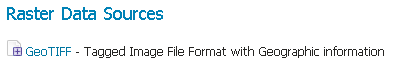

.. _data_geotiff:

GeoTIFF
=======

A GeoTIFF is a georeferenced TIFF (Tagged Image File Format) file.

Adding a GeoTIFF data store
---------------------------

By default, :guilabel:`GeoTIFF` will be an option in the :guilabel:`Raster Data Sources` list when creating a new data store.



   *GeoTIFF in the list of raster data stores*

Configuring a GeoTIFF data store
--------------------------------

.. figure:: images/geotiffconfigure.png
   :align: center

   *Configuring a GeoTIFF data store*

.. list-table::
   :widths: 20 80

   * - **Option**
     - **Description**
   * - ``Workspace``
     - Name of the workspace to contain the GeoTIFF store. This will also be the prefix of the raster layer created from the store.
   * - ``Data Source Name``
     - Name of the GeoTIFF as it will be known to GeoServer. This can be different from the filename. The combination of the workspace name and this name will be the full layer name (ex: world:landbase)
   * - ``Description``
     - A full free-form description of the GeoTIFF store.
   * - ``Enabled``
     -  If checked, it enables the store. If unchecked (disabled), no data in the GeoTIFF will be served from GeoServer.
   * - ``URL``
     - Location of the GeoTIFF file. This can be an absolute path (such as :file:`file:C:\\Data\\landbase.tif`) or a path relative to GeoServer's data directory (such as :file:`file:data/landbase.tif`).
     
.. note:: Notice that the GeoTiff plugin is able to handle internal/external overviews and internal/external masks.

Custom CRS definition
`````````````````````

Creating an auxiliary ``.prj`` file that contains coordinate reference system information as described in the :ref:`crs_custom` chapter will override internal CRS tags that are included in the original GeoTIFF file. This can be used to work-around problematic source files without making modifications to the file.
