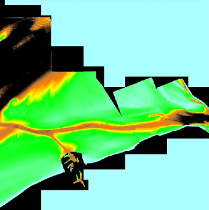
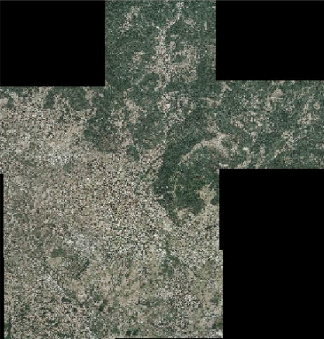
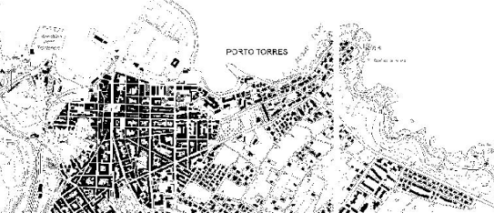
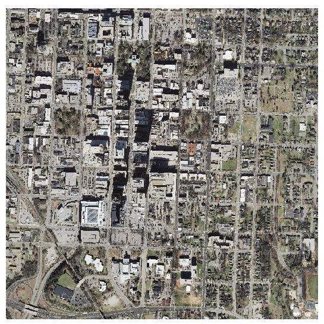

.. _data_imagemosaic_tutorial:

Using the ImageMosaic extension
===============================

This tutorial will show you how to configure and publish an ImageMosaic store and coverage, followed by some configuration examples.

Configuring a coverage in GeoServer
-----------------------------------

This is a process very similar to creating a featuretype. More specifically, one has to perform the steps highlighted in the sections below:

Create a new store
~~~~~~~~~~~~~~~~~~

#. Go to :menuselection:`Data Panel --> Stores` and click :guilabel:`Add new Store`.

#. Select :guilabel:`ImageMosaic` under :guilabel:`Raster Data Source`:

   .. figure:: images/imagemosaiccreate.png

      ImageMosaic in the list of raster data stores

#. In order to create a new mosaic it is necessary to choose a workspace and store name in the :guilabel:`Basic Store Info` section, as well as a URL in the :guilabel:`Connection Parameters` section. Valid URLs include:

     * The absolute path to the shapefile index, or a directory containing the shapefile index.

     * The absolute path to the configuration file (`*.properties``) or a directory containing the configuration file. If ``datastore.properties`` and ``indexer.properties`` exist, they should be in the same directory as this configuration file.

     * The absolute path of a directory where the files you want to mosaic reside. In this case GeoServer automatically creates the needed mosaic files (.dbf, .prj, .properties, .shp and .shx) by inspecting the data present in the given directory and any subdirectories.

#. Click :guilabel:`Save`:

   .. figure:: images/imagemosaicconfigure.png

      Configuring an ImageMosaic data store

Create a new coverage
~~~~~~~~~~~~~~~~~~~~~

#. Navigate to :menuselection:`Data Panel --> Layers` and click :guilabel:`Add a new resource`.

#. Choose the name of the store you just created:

   .. figure:: images/vito_newlayerchoser.png

      Layer Chooser

#. Click the layer you wish to configure and you will be presented with the Coverage Editor:

   .. figure:: images/vito_coverageeditor.png

      Coverage Editor

#. Make sure there is a value for :guilabel:`Native SRS`, then click the :guilabel:`Submit` button. If the :guilabel:`Native CRS` is ``UNKNOWN``, you must declare the SRS in the :guilabel:`Declared SRS` field.

#. Click :guilabel:`Save`.

#. Use the :guilabel:`Layer Preview` to view the mosaic.

.. warning:: If the created layer appears to be all black, it may be that GeoServer has not found any acceptable granules in the provided index. It is also possible that the shapefile index is empty (no granules were found in the provided directory) or it might be that the granules' paths in the shapefile index are not correct, which could happen if an existing index (using absolute paths) is moved to another place. If the shapefile index paths are not correct, then the DBF file can be opened and fixed with an editor. Alternately, you can delete the index and let GeoServer recreate it from the root directory.

Configuration examples
----------------------

Below are a few examples of mosaic configurations to demonstrate how we can make use of the ImageMosaic parameters.

DEM/Bathymetry
~~~~~~~~~~~~~~

Such a mosaic can be used to serve large amounts of data representing altitude or depth and therefore does not specify colors directly (it needs an SLD to generate pictures). In our case, we have a DEM dataset which consists of a set of raw GeoTIFF files.

The first operation is to create the CoverageStore specifying, for example, the path of the shapefile in the :guilabel:`URL` field.

Inside the Coverage Editor Publishing tab, you can specify the :guilabel:`dem` default style in order to represent the visualization style of the mosaic. The following is an example style:

.. code-block:: xml

  <?xml version="1.0" encoding="ISO-8859-1"?>
  <StyledLayerDescriptor version="1.0.0"
    xmlns="http://www.opengis.net/sld" xmlns:ogc="http://www.opengis.net/ogc"
    xmlns:xlink="http://www.w3.org/1999/xlink" xmlns:xsi="http://www.w3.org/2001/XMLSchema-instance"
    xsi:schemaLocation="http://www.opengis.net/sld 	http://schemas.opengis.net/sld/1.0.0/StyledLayerDescriptor.xsd">
    <NamedLayer>
      <Name>gtopo</Name>
      <UserStyle>
        <Name>dem</Name>
        <Title>Simple DEM style</Title>
        <Abstract>Classic elevation color progression</Abstract>
        <FeatureTypeStyle>
          <Rule>
            <RasterSymbolizer>
              <Opacity>1.0</Opacity>
              <ColorMap>
                <ColorMapEntry color="#000000" quantity="-9999" label="nodata" opacity="1.0" />
                <ColorMapEntry color="#AAFFAA" quantity="0" label="values" />
                <ColorMapEntry color="#00FF00" quantity="1000" label="values" />
                <ColorMapEntry color="#FFFF00" quantity="1200" label="values" />
                <ColorMapEntry color="#FF7F00" quantity="1400" label="values" />
                <ColorMapEntry color="#BF7F3F" quantity="1600" label="values" />
                <ColorMapEntry color="#000000" quantity="2000" label="values" />
              </ColorMap>
            </RasterSymbolizer>
          </Rule>
        </FeatureTypeStyle>
      </UserStyle>
    </NamedLayer>
  </StyledLayerDescriptor>

In this way you have a clear distinction between the different intervals of the dataset that compose the mosaic, like the background and the "nodata" area.

.. figure:: images/vito_config_1.png

.. note:: The "nodata" on the sample mosaic is -9999. The default background value is for mosaics is 0.0.

The result is the following:

   Basic configuration

By setting the other configuration parameters appropriately, it is possible to improve both the appearance of the mosaic as well as its performance. For instance, we could:

* Make the "nodata" areas transparent and coherent with the real data. To achieve this we need to change the opacity of the "nodata" ColorMapEntry in the ``dem`` style to ``0.0`` and set the ``BackgroundValues`` parameter to ``-9999`` so that empty areas will be filled with this value. The result is as follows:

  .. figure:: images/vito_2.png

     Advanced configuration

* Allow multithreaded granules loading. By setting the ``AllowMultiThreading`` parameter to ``true``, GeoServer will load the granules in parallel using multiple threads with a increase in performance on some architectures.

The configuration parameters are as follows:

.. list-table::
   :widths: 25 75
   :header-rows: 1
   :stub-columns: 1

   * - Parameter
     - Value
   * - MaxAllowedTiles
     - 2147483647
   * - BackgroundValues
     - -9999
   * - OutputTransparentColor
     - "no color"
   * - InputTransparentColor
     - "no color"
   * - AllowMultiThreading
     - True
   * - USE_JAI_IMAGEREAD
     - True
   * - SUGGESTED_TILE_SIZE
     - 512,512

Aerial imagery
~~~~~~~~~~~~~~

In this example we are going to create a mosaic that will serve aerial imagery, specifically RGB GeoTIFFs. Because this is visual data, in the Coverage Editor you can use the basic ``raster`` style, which is just a stub SLD to instruct the GeoServer raster renderer to not do anything particular in terms of color management:

.. code-block:: xml

  <?xml version="1.0" encoding="ISO-8859-1"?>
  <StyledLayerDescriptor version="1.0.0"
    xmlns="http://www.opengis.net/sld" xmlns:ogc="http://www.opengis.net/ogc"
    xmlns:xlink="http://www.w3.org/1999/xlink" xmlns:xsi="http://www.w3.org/2001/XMLSchema-instance"
    xsi:schemaLocation="http://www.opengis.net/sld 	http://schemas.opengis.net/sld/1.0.0/StyledLayerDescriptor.xsd">
    <NamedLayer>
      <Name>raster</Name>
      <UserStyle>
        <Name>raster</Name>
        <Title>Raster</Title>
        <Abstract>A sample style for rasters, good for displaying imagery	</Abstract>
        <FeatureTypeStyle>
          <FeatureTypeName>Feature</FeatureTypeName>
          <Rule>
            <RasterSymbolizer>
              <Opacity>1.0</Opacity>
            </RasterSymbolizer>
          </Rule>
        </FeatureTypeStyle>
      </UserStyle>
    </NamedLayer>
  </StyledLayerDescriptor>

The result is the following:

   Basic configuration

.. note:: Those ugly black areas are the result of applying the default mosaic parameters to a mosaic that does not entirely cover its bounding box. The areas within the BBOX that are not covered with data will default to a value of 0 on each band. Since this mosaic is RGB we can simply set the ``OutputTransparentColor`` to ``0,0,0`` in order to get transparent fills for the BBOX.

The various parameters can be set as follows:

.. list-table::
   :widths: 25 75
   :header-rows: 1
   :stub-columns: 1

   * - Parameter
     - Value
   * - MaxAllowedTiles
     - 2147483647
   * - BackgroundValues
     - (default)
   * - OutputTransparentColor
     - #000000
   * - InputTransparentColor
     - "no color"
   * - AllowMultiThreading
     - True
   * - USE_JAI_IMAGEREAD
     - True
   * - SUGGESTED_TILE_SIZE
     - 512,512

The result is the following:

.. figure:: images/prato_2.png

   Advanced configuration

Scanned maps
~~~~~~~~~~~~

In this case we want to show how to serve scanned maps (mostly B&W images) via a GeoServer mosaic.

In the Coverage Editor you can use the basic ``raster`` since there is no need to use any of the advanced RasterSymbolizer capabilities.

The result is the following.

   Basic configuration

This mosaic, formed by two single granules, shows a typical case where the "nodata" collar areas of the granules overlap, as shown in the picture above.
In this case we can use the ``InputTransparentColor`` parameter to make the collar areas disappear during the superimposition process — in this case, by using an ``InputTransparentColor`` of ``#FFFFFF``.

The final configuration parameters are the following:

.. list-table::
   :widths: 25 75
   :header-rows: 1
   :stub-columns: 1

   * - Parameter
     - Value
   * - MaxAllowedTiles
     - 2147483647
   * - BackgroundValues
     - (default)
   * - OutputTransparentColor
     - "no color"
   * - InputTransparentColor
     - #FFFFFF
   * - AllowMultiThreading
     - True
   * - USE_JAI_IMAGEREAD
     - True
   * - SUGGESTED_TILE_SIZE
     - 512,512

This is the result:

.. figure:: images/iacovella_2.png

   Advanced configuration

Dynamic imagery
~~~~~~~~~~~~~~~

A mosaic need not be static. It can contain granules which change, are added or deleted. In this example, we will create a mosaic that changes over time.

#. Create a mosaic in the standard way. (The specific configuration isn't important.)

.. figure:: images/tutorial_dynamic1.png

   This mosaic contains 5 granules. Note that ``InputTransparentColor`` is set to ``#FFFFFF`` here.

To add new granules, the index that was created when the mosaic was originally created needs to be regenerated. There are two ways to do this:

* Manually through the file system
* Through the :ref:`rest` interface

To update an ImageMosaic through the file system:

#. Update the contents of the mosaic by copying the new files into place. (Subdirectories are acceptable.)

#. Delete the index files. These files are contained in the top level directory containing the mosaic files and include (but are not limited to) the following:

   * :file:`<mosaic_name>.dbf`
   * :file:`<mosaic_name>.fix`
   * :file:`<mosaic_name>.prj`
   * :file:`<mosaic_name>.properties`
   * :file:`<mosaic_name>.shp`
   * :file:`<mosaic_name>.shx`

#. *(Optional but recommended)* Edit the layer definition in GeoServer, making to sure to update the bounding box information (if changed).

#. Save the layer. The index will be recreated.

   This mosaic contains 9 granules

.. note:: Please see the REST section for information on :ref:`rest_imagemosaic`.

.. _multi-crs-mosaic:

Multi-resolution imagery with reprojection
~~~~~~~~~~~~~~~~~~~~~~~~~~~~~~~~~~~~~~~~~~

As a general rule, we want to have the highest resolution granules shown "on top", with the lower-resolution granules filling in the gaps as necessary.

In this example, we will serve up overlapping granules that have varying resolutions. In addition, we will mix resolutions, such that the higher resolution granule is reprojected to match the resolution of the lower resolution granules.

#. In the Coverage Editor, use the basic ``raster`` style.

#. Create the mosaic in GeoServer.

#. One important configuration setting is the :guilabel:`SORTING` parameter of the layer. In order to see the highest resolution imagery on top (the typical case), it must be set to :kbd:`resolution A`. (For the case of lowest resolution on top, use :kbd:`resolution D` .)

#. Make any other configuration changes.

#. Also, in order to allow for multiple CRSs in a single mosaic, an :file:`indexer.properties` file will need to be created. Use the following ::

      GranuleAcceptors=org.geotools.gce.imagemosaic.acceptors.HeterogeneousCRSAcceptorFactory
      GranuleHandler=org.geotools.gce.imagemosaic.granulehandler.ReprojectingGranuleHandlerFactory
      HeterogeneousCRS=true
      MosaicCRS=EPSG\:4326
      PropertyCollectors=CRSExtractorSPI(crs),ResolutionExtractorSPI(resolution)
      Schema=*the_geom:Polygon,location:String,crs:String,resolution:String
      
   The MosaicCRS property is not mandatory, but it's a good idea to set a predictable target CRS that all granule footprints can be reprojected into,
   otherwise the mosaic machinery will use the CRS of the first indexed granule.

#. Save this file in the root of the mosaic directory (along with the index files). The result is the following:

   .. figure:: images/tutorial_reproj_artifact.png

      Closeup of granule overlap (high resolution granule on right)

#. To remove the reprojection artifact (shown in the above as a black area) edit the layer configuration to set ``InputTransparentColor`` to ``#000000``.

   .. figure:: images/tutorial_reproj_noartifact.png

      Closeup of granule overlap (high resolution granule on right)

Referring to a datastore configured in GeoServer
------------------------------------------------

It is possible to make the mosaic refer to an existing data store. The **``datastore.properties``** file in this case will
contain only one or two properties, referring to the store to be used via the ``StoreName`` property.
For simple cases, e.g., a PostGIS store, the following will be sufficient::

   StoreName=workspace:storename

For Oracle or H2, it's best to also specify the SPI in order to inform the mosaic that it needs to work around
specific limitations of the storage (e.g., forced uppercase attribute usage, limitation in attribute name length and the like)::

   StoreName=workspace:storename
   SPI=org.geotools.data.oracle.OracleNGDataStoreFactory

The above will be sufficient in case the image mosaic can create the index table and perform normal indexing, using 
the directory name as the table name.
In case a specific table name needs to be used, add an **``indexer.properties``** specifying the ``TypeName`` property,
e.g.:

   TypeName=myMosaicTypeName

In case the index "table" already exists instead, then a **``indexer.properties``** file will be required, with the following contents::

   UseExistingSchema=true
   TypeName=nameOfTheFeatureTypeContainingTheIndex
   AbsolutePath=true

The above assumes ``location`` attribute provides absolute paths to the mosaic granules, instead of paths relative to
the mosaic configuration files directory.

