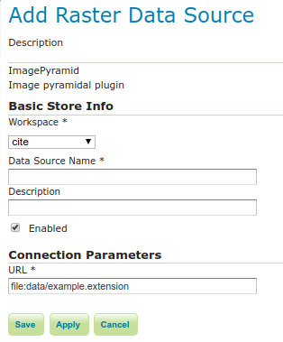

# ImagePyramid

!!! note

    GeoServer does not come built-in with support for Image Pyramid; it must be installed through an extension. Proceed to [Installing the ImagePyramid extension](imagepyramid.rst#imagepyramid_install) for installation details.

An image pyramid is several layers of an image rendered at various image sizes, to be shown at different zoom levels.

## Installing the ImagePyramid extension {#imagepyramid_install}

1.  Visit the [website download](https://geoserver.org/download) page, locate your release, and download: `pyramid`{.interpreted-text role="download_extension"}

    !!! warning

        Ensure to match plugin (example {{ release }} above) version to the version of the GeoServer instance.

2.  Extract the contents of the archive into the **`WEB-INF/lib`** directory of the GeoServer installation.

## Adding an ImagePyramid data store

Once the extension is properly installed **ImagePyramid** will be an option in the **Raster Data Sources** list when creating a new data store.

*ImagePyramid in the list of raster data stores*

## Configuring an ImagePyramid data store

*Configuring an ImagePyramid data store*

  -------------------- --------------------------------------------------------
  **Option**           **Description**

  `Workspace`          

  `Data Source Name`   

  `Description`        

  `Enabled`            

  `URL`                
  -------------------- --------------------------------------------------------
