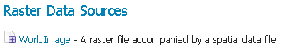
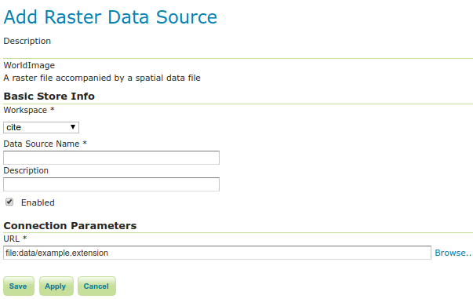

# WorldImage

!!! note

    GeoServer does not come built-in with support for WorldImage; it must be installed through an extension. Proceed to [Installing the WorldImage extension](#image_install) for installation details.

A world file is a plain text file used to georeference raster map images. This file (often with an extension of `.jgw` or `.tfw`) accompanies an associated image file (`.jpg` or `.tif`). Together, the world file and the corresponding image file is known as a WorldImage in GeoServer.

## Installing the WorldImage extension {: #image_install }

1.  Visit the [website download](https://geoserver.org/download) page, locate your release, and download:

    - {{ release }} [geoserver-{{ release }}-image-plugin.zip](https://sourceforge.net/projects/geoserver/files/GeoServer/{{ release }}/extensions/geoserver-{{ release }}-image-plugin.zip)
    - {{ snapshot }} [geoserver-{{ snapshot }}-image-plugin.zip](https://build.geoserver.org/geoserver/main/ext-latest/geoserver-{{ snapshot }}-image-plugin.zip)

    !!! warning

        Ensure to match plugin (example {{ release }} above) version to the version of the GeoServer instance.

2.  Extract the contents of the archive into the **`WEB-INF/lib`** directory of the GeoServer installation.

## Adding a WorldImage data store

Once the extension is properly installed **WorldImage** will be an option in the **Raster Data Sources** list when creating a new data store.

*WorldImage in the list of raster data stores*

## Configuring a WorldImage data store

*Configuring a WorldImage data store*

| **Option**         | **Description** |
|--------------------|-----------------|
| `Workspace`        |                 |
| `Data Source Name` |                 |
| `Description`      |                 |
| `Enabled`          |                 |
| `URL`              |                 |
