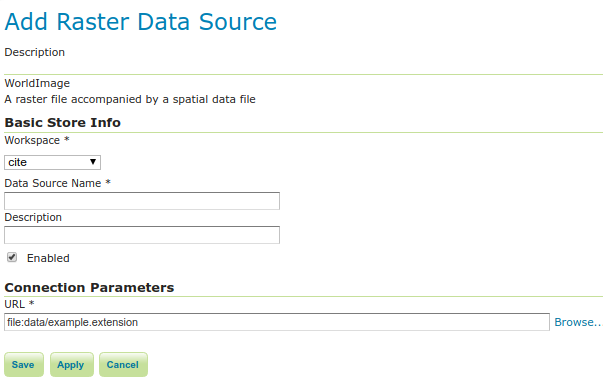

.. _data_worldimage:

WorldImage
==========

A world file is a plain text file used to georeference raster map images.  This file (often with an extension of ``.jgw`` or ``.tfw``) accompanies an associated image file (``.jpg`` or ``.tif``).  Together, the world file and the corresponding image file is known as a WorldImage in GeoServer.

Adding a WorldImage data store
------------------------------

By default, :guilabel:`WorldImage` will be an option in the :guilabel:`Raster Data Sources` list when creating a new data store.

.. figure:: images/worldimagecreate.png
   :align: center

   *WorldImage in the list of raster data stores*

Configuring a WorldImage data store
-----------------------------------

   *Configuring a WorldImage data store*

.. list-table::
   :widths: 20 80

   * - **Option**
     - **Description**
   * - ``Workspace``
     - 
   * - ``Data Source Name``
     - 
   * - ``Description``
     - 
   * - ``Enabled``
     -  
   * - ``URL``
     - 