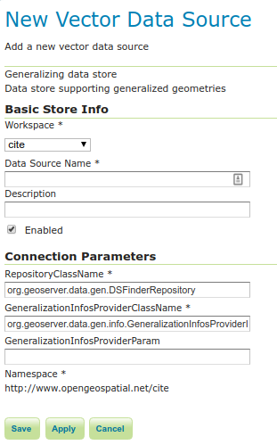

# Pregeneralized Features

!!! note

    GeoServer does not come built-in with support for Pregeneralized Features; it must be installed through an extension.

## Installing the Pregeneralized Features extension

1.  Visit the [website download](https://geoserver.org/download) page, locate your release, and download: `feature-pregeneralized`{.interpreted-text role="download_extension"}

    !!! warning

        Ensure to match plugin (example {{ release }} above) version to the version of the GeoServer instance.

2.  Extract the contents of the archive into the **`WEB-INF/lib`** directory of the GeoServer installation.

## Adding a Pregeneralized Features data store

If the extension is properly installed, **Generalized Data Store** will be listed as an option when creating a new data store.

*Generalized Data Store in the list of vector data stores*

## Configuring a Pregeneralized Features data store

*Configuring a Pregeneralized Features data store*

For a detailed description, look at the `Tutorial</tutorials/feature-pregeneralized/feature-pregeneralized_tutorial>`{.interpreted-text role="doc"}
