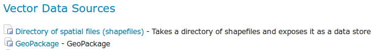
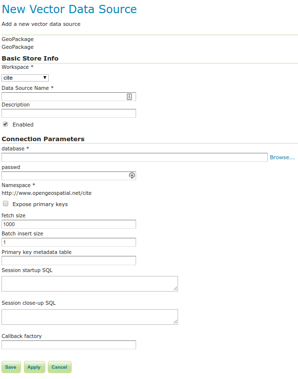

# GeoPackage

[GeoPackage](http://www.geopackage.org) is an SQLite based standard format that is able to hold multiple vector and raster data layers in a single file.

GeoPackage files can be used both as Raster Data Stores as well as Vector Data Stores (so that both kinds of layers can published).

## Adding a GeoPackage Vector Data Store

When the extension has been installed, **GeoPackage** will be an option in the **Vector Data Sources** list when creating a new data store.

*GeoPackage in the list of vector data stores*

*Configuring a GeoPackage Vector data store*

|                          |                                                                                                     |
|--------------------------|-----------------------------------------------------------------------------------------------------|
| **Option**               | **Description**                                                                                     |
| **database**             | URI specifying geopackage file.                                                                     |
| **user**                 | User to access database.                                                                            |
| **passwd**               | Password to access database.                                                                        |
| **namespace**            | Namespace to be associated with the database. This field is altered by changing the workspace name. |
| **max connections**      | Maximum amount of open connections to the database.                                                 |
| **min connections**      | Minimum number of pooled connections.                                                               |
| **fetch size**           | Number of records read with each interaction with the database.                                     |
| **Connection timeout**   | Time (in seconds) the connection pool will wait before timing out.                                  |
| **validate connections** | Checks the connection is alive before using it.                                                     |

When finished, click **Save**.
