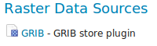
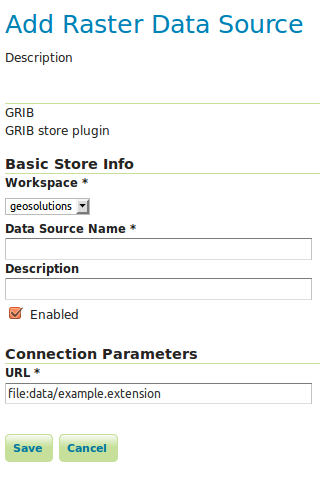

# GRIB

## Installing

1.  Login, and navigate to **About & Status > About GeoServer** and check **Build Information** to determine the exact version of GeoServer you are running.

2.  Visit the [website download](https://geoserver.org/download) page, change the **Archive** tab, and locate your release.

    From the list of **Coverage Formats** extensions download **GRIB**.

    - {{ release }} example: [grib](https://sourceforge.net/projects/geoserver/files/GeoServer/{{ release }}/extensions/geoserver-{{ release }}-grib-plugin.zip)
    - {{ version }} example: [grib](https://build.geoserver.org/geoserver/main/extensions/geoserver-{{ snapshot }}-grib-plugin.zip)

    Verify that the version number in the filename corresponds to the version of GeoServer you are running (for example {{ release }} above).

3.  Extract the files in the archive to the **`WEB-INF/lib`** directory of your GeoServer installation.

4.  Restart GeoServer

## Adding a GRIB data store

To add a GRIB data store the user must go to **Stores --> Add New Store --> GRIB**.

*GRIB in the list of raster data stores*

## Configuring a GRIB data store

*Configuring a GRIB data store*

| **Option**         | **Description** |
|--------------------|-----------------|
| `Workspace`        |                 |
| `Data Source Name` |                 |
| `Description`      |                 |
| `Enabled`          |                 |
| `URL`              |                 |

## Relationship with NetCDF

!!! note

    Note that internally the GRIB extension uses the NetCDF reader, which supports also GRIB data. See also the [NetCDF](../netcdf/netcdf.md) documentation page for further information.

## Current limitations

- Input coverages/slices should share the same bounding box (lon/lat coordinates are the same for the whole ND cube)
