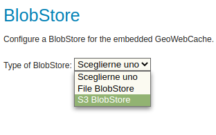

---
render_macros: true
---

# Installing the GWC S3 extension

The installation process is similar to other GeoServer extensions:

1.  Login, and navigate to **About & Status > About GeoServer** and check **Build Information** to determine the exact version of GeoServer you are running.

2.  Visit the [website download](https://geoserver.org/download) page, change the **Archive** tab, and locate your release.

    From the list of **Other** extensions download **GWC S3 tile storage**.

    - {{ release }} example: [gwc-s3](https://build.geoserver.org/geoserver/main/ext-latest/gwc-s3)
    - {{ version }} example: [gwc-s3](https://build.geoserver.org/geoserver/main/ext-latest/geoserver-{{ version }}-SNAPSHOT-gwc-s3-plugin.zip)

    Verify that the version number in the filename corresponds to the version of GeoServer you are running (for example {{ release }} above).

3.  Extract the contents of the archive into the **`WEB-INF/lib`** directory in GeoServer. Make sure you do not create any sub-directories during the extraction process.

4.  Restart GeoServer.

5.  To verify the installation was successful, to "Tile Caching", "Blobstores" and create a new blobstore, the S3 option show be available:

    
    *The S3 option showing while creating a new blobstore*
