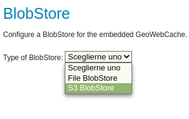

.. _gwc_s3_install:

Installing the GWC S3 extension
===============================

The GWC S3 extension is listed among the other extension downloads on the GeoServer download page.

The installation process is similar to other GeoServer extensions:

#. Visit the :website:`website download <download>` page, locate your release, and download:  :download_extension:`gwc-s3`
   
   Verify that the version number in the filename (for example |release| above) corresponds to the version of GeoServer you are running.

#. Extract the contents of the archive into the :file:`WEB-INF/lib` directory in GeoServer.
   Make sure you do not create any sub-directories during the extraction process.

#. Restart GeoServer.

To verify the installation was successful, to "Tile Caching", "Blobstores" and create
a new blobstore, the S3 option show be available: 

   The S3 option showing while creating a new blobstore  

