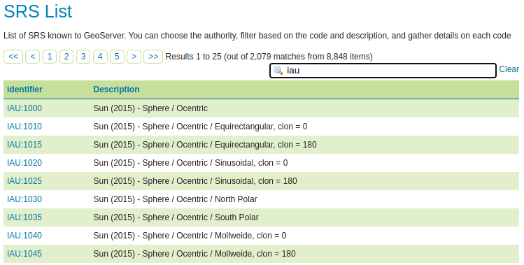

# Installing the IAU authority

The IAU authority is an official extension:

1.  Login, and navigate to **About & Status > About GeoServer** and check **Build Information** to determine the exact version of GeoServer you are running.

2.  Visit the [website download](https://geoserver.org/download) page, change the **Archive** tab, and locate your release.

    From the list of **Miscellaneous** extensions download **IAU**.

    - {{ release }} example: [iau](https://sourceforge.net/projects/geoserver/files/GeoServer/{{ release }}/extensions/geoserver-{{ release }}-iau-plugin.zip)
    - {{ snapshot }} example: [iau](https://build.geoserver.org/geoserver/main/ext-latest/geoserver-{{ snapshot }}-iau-plugin.zip)

    Verify that the version number in the filename corresponds to the version of GeoServer you are running (for example {{ release }} above).

3.  Extract the archive and copy the contents into the GeoServer **`WEB-INF/lib`** directory.

4.  Restart GeoServer.

## Verify Installation

To verify that the extension was installed successfully:

1.  On the left menu, get into **Demos** and then **SRS List**

2.  Go into the table filter text field, and type ``IAU``, then press enter

3.  A number of IAU codes should appear in the table

    {.align-center}
