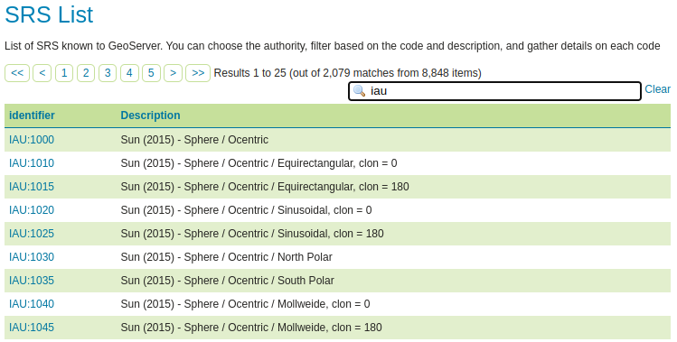

.. _iauwkt.install:

Installing the IAU authority
----------------------------

The IAU authority is an official extension.  Download the extension here - :download_extension:`iau`

#. Download the extension for your version of GeoServer. 

   .. warning:: Make sure to match the version of the extension to the version of GeoServer.

#. Extract the archive and copy the contents into the GeoServer :file:`WEB-INF/lib` directory.

#. Restart GeoServer.

Verify Installation
^^^^^^^^^^^^^^^^^^^

To verify that the extension was installed successfully:

#. On the left menu, get into :guilabel:`Demos` and then :guilabel:`SRS List`
#. Go into the table filter text field, and type `IAU`, then press enter
#. A number of IAU codes should appear in the table

