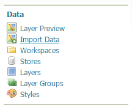

# Installing the Importer extension

1.  Login, and navigate to **About & Status > About GeoServer** and check **Build Information** to determine the exact version of GeoServer you are running.

2.  Visit the [website download](https://geoserver.org/download) page, change the **Archive** tab, and locate your release.

    From the list of **Other** extensions download **Importer (Core)**.

    - {{ release }} example: [importer](https://sourceforge.net/projects/geoserver/files/GeoServer/{{ release }}/extensions/geoserver-{{ release }}-importer-plugin.zip)
    - {{ snapshot }} example: [importer](https://build.geoserver.org/geoserver/main/ext-latest/geoserver-{{ snapshot }}-importer-plugin.zip)

    Verify that the version number in the filename corresponds to the version of GeoServer you are running (for example {{ release }} above).

    The optional importer download **Importer (BDB Backend)** is used in a clustered environment to share state importer progress between nodes.

    - {{ release }} example: [importer-bdb](https://sourceforge.net/projects/geoserver/files/GeoServer/{{ release }}/extensions/geoserver-{{ release }}-importer-bdb-plugin.zip)
    - {{ snapshot }} example: [importer-bdb](https://build.geoserver.org/geoserver/main/ext-latest/geoserver-{{ snapshot }}-importer-bdb-plugin.zip)

3.  Extract the archive and copy the contents into the GeoServer **`WEB-INF/lib`** directory.

4.  Restart GeoServer.

5.  To verify that the extension was installed successfully, open the [Web administration interface](../../webadmin/index.md) and look for an **Import Data** page in the **Data** section on the left-side navigation menu.

    
    *Importer extension successfully installed.*

For additional information please see the section on [Using the Importer extension](using.md).
