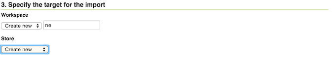
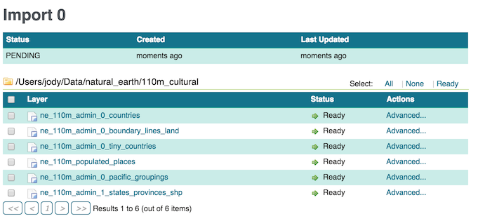

# Using the Importer extension

Here are step-by-step instructions to import multiple shapefiles in one operation. For more details on different types of operations, please see [Importer interface reference](guireference.md).

1.  Find a directory of shapefiles and copy into your [GeoServer data directory](../../datadirectory/index.md).

    !!! note

        You can always use the [Natural Earth Quickstart](http://www.naturalearthdata.com/downloads/) data for this task.

2.  Log in as an administrator and navigate to the **Data --> Import Data** page.

3.  For select **Spatial Files** as the data source.

    
    *Data source*

4.  Click **Browse** to navigate to the directory of shapefiles to be imported.

5.  The web-based file browser will show as options your home directory, data directory, and the root of your file system (or drive). In this case, select **Data directory**

    
    *Directory*

6.  Back on the main form, select **Create new** next to **Workspace**, and enter ``ne`` to denote the workspace.

    !!! note

        Make sure the **Store** field reads **Create new** as well.

    
    *Import target workspace*

7.  Click **Next** to start the import process.

8.  On the next screen, any layers available for import will be shown.

    !!! note

        Non-spatial files will be ignored.

    
    *Import layer list*

9.  In most cases, all files will be ready for import, but if the spatial reference system (SRS) is not recognized, you will need to manually input this but clicking **Advanced**

    !!! note

        You will need to manually input the SRS if you used the Natural Earth data above. For each layer click on **Advanced** and set reprojection to ``EPSG:4326``.
    
        
        *Advanced import settings*

10. Check the box next to each layer you wish to import.

    
    *Setting the layers to import*

11. When ready, click **Import**.

    !!! warning

        Don't click **Done** at this point, otherwise the import will be canceled.

12. The results of the import process will be shown next to each layer.

13. When finished, click **Done**.

    !!! note

        Recent import processes are listed at the bottom of the page. You may wish to visit these pages to check if any difficulties were encountered during the import process or import additional layers.

    
    *Recent imports*
