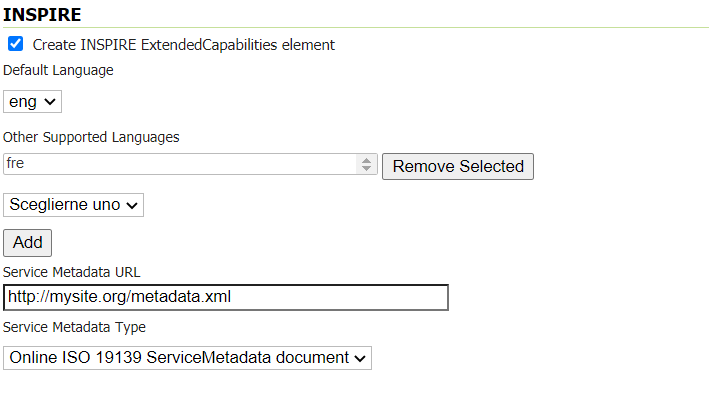
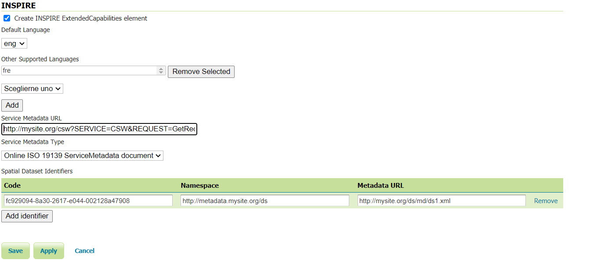

# Using the INSPIRE extension {: #inspire_using }

When the INSPIRE extension has been properly installed, the [WMS settings](../../services/wms/webadmin.md), [WFS settings](../../services/wfs/webadmin.md) and [WCS settings](../../services/wcs/webadmin.md) sections of the [Web administration interface](../../webadmin/index.md) will show an extra INSPIRE configuration section. If the data directory has not been configured with INSPIRE parameters before, this section will just contain a check box to enable the creation of an INSPIRE ExtendedCapabilities element.

!!! note

    If you do not see this content in the service configuration pages, the INSPIRE extension may not be installed properly. Reread the section on [Installing the INSPIRE extension](installing.md) and verify that the correct file was saved to the correct directory.

## Extended WMS and WMTS configuration

INSPIRE-specific configuration is accessed on the main [WMS settings](../../services/wms/webadmin.md) or WMTS settings page in the [Web administration interface](../../webadmin/index.md). This is accessed by clicking on the **WMS** or **WMTS** link on the sidebar.

!!! note

    You must be logged in as an administrator to edit WMS or WMTS configuration.

Once on the service configuration page, there will be a block titled **INSPIRE**. If you enable the checkbox shown above this section will have three additional settings:

-   **Default Language** combo box, for setting the Default
-   **Other Supported Languages** area for setting Supported Languages
-   **Service Metadata URL** field, a URL containing the location of the metadata associated with the service
-   **Service Metadata Type** combo box, for detailing whether the metadata came from a CSW (Catalog Service) or a standalone metadata file

*INSPIRE-related options*

After clicking **Submit** on this page, any changes will be immediately reflected in the services (WMS 1.3.0 or WMTS 1.0.0) capabilities document.

!!! note

    The **Service Metadata URL** field is mandatory so you will not be allowed to submit a blank value.

!!! note

    The **Service Metadata Type** combo box only allows to select the appropriate MIME type for a CSW response or standalone metadata file or to omit a value altogether. If you think other values would be useful you could raise the issue on the [GeoServer mailing list](../../introduction/gettinginvolved.md). In the meantime it is possible to manually edit the created configuration files as a workaround.

## Extended WMS and WMTS Capabilities

!!! note

    The INSPIRE extension only modifies the WMS 1.3.0 response, so please make sure that you are viewing the correct capabilities document.

The WMS 1.3.0 and WMTS 1.0.0 capabilities document will contain two additional entries in the `xsi:schemaLocation` of the root `<WMS_Capabilities>` tag once the INSPIRE extension is installed:

-   `http://inspire.ec.europa.eu/schemas/inspire_vs/1.0`
-   `https://inspire.ec.europa.eu/schemas/inspire_vs/1.0/inspire_vs.xsd`

If you have enabled the check box to create the INSPIRE ExtendedCapabilities element and entered the values described in the previous section then there will also be an additional ExtendedCapabilities block. This tag block shows up in between the tags for `<Exception>` and `<Layer>`. It contains the following information:

-   Metadata URL and MIME type
-   Supported Language(s)
-   Response Language

With the example values shown in the above configuration panel, this block would contain the following content:

    <inspire_vs:ExtendedCapabilities>
     <inspire_common:MetadataUrl>
      <inspire_common:URL>
       http://mysite.org/metadata.xml
      </inspire_common:URL>
      <inspire_common:MediaType>
       application/vnd.iso.19139+xml
      </inspire_common:MediaType>
     </inspire_common:MetadataUrl>
     <inspire_common:SupportedLanguages>
      <inspire_common:DefaultLanguage>
       <inspire_common:Language>eng</inspire_common:Language>
      </inspire_common:DefaultLanguage>
      <inspire_common:SupportedLanguage>fre</inspire_common:SupportedLanguage>
     </inspire_common:SupportedLanguages>
     <inspire_common:ResponseLanguage>
      <inspire_common:Language>eng</inspire_common:Language>
     </inspire_common:ResponseLanguage>
    </inspire_vs:ExtendedCapabilities>

ISNPIRE recommends that every layer offered by a INSPIRE WMTS should use the InspireCRS84Quad grid set which is already configured in GeoServer, but is up to the user to select it when publishing a INSPIRE WMTS layer.

## Extended WFS and WCS configuration

INSPIRE-specific configuration is accessed on the main [WFS settings](../../services/wfs/webadmin.md) and [WCS settings](../../services/wcs/webadmin.md) pages in the [Web administration interface](../../webadmin/index.md). These are accessed by clicking on the **WFS** and **WCS** links on the sidebar respectively.

!!! note

    You must be logged in as an administrator to edit WFS configuration.

Once on the WFS or WCS configuration page, there will be a block titled **INSPIRE**. If you enable the checkbox shown above this section will have the following additional settings:

-   **Language** combo box, for setting the Supported, Default, and Response languages
-   **Other Supported Languages** area for setting Supported Languages
-   **Service Metadata URL** field, a URL containing the location of the metadata associated with the WFS or WCS
-   **Service Metadata Type** combo box, for detailing whether the metadata came from a CSW (Catalog Service) or a standalone metadata file
-   **Spatial dataset identifiers** table, where you can specify a code (mandatory), a namespace (optional) and a metadata URL (optional) for each spatial data set the WFS or WCS is offering

*INSPIRE-related options*

After clicking **Submit** on this page, any changes will be immediately reflected in the WFS 1.1 and WFS 2.0 or WCS 2.0 capabilities documents as appropriate.

!!! note

    The **Service Metadata URL** field and at least one **Spatial dataset identifiers** entry are mandatory so you will not be allowed to submit the page without these.

!!! note

    The **Service Metadata Type** combo box only allows to select the appropriate MIME type for a CSW response or standalone metadata file or to omit a value altogether. If you think other values would be useful you could raise the issue on the [GeoServer mailing list](../../introduction/gettinginvolved.md). In the meantime it is possible to manually edit the created configuration files as a workaround.

## Extended WFS and WCS Capabilities

!!! note

    The INSPIRE directive is relevant to WFS 1.1 and 2.0 and WCS 2.0 only, so please make sure that you are viewing the correct capabilities document.

The WFS and WCS capabilities documents will contain two additional entries in the `xsi:schemaLocation` of the root element tag once the INSPIRE extension is installed:

-   `https://inspire.ec.europa.eu/schemas/common/1.0/common.xsd`
-   `https://inspire.ec.europa.eu/schemas/inspire_dls/1.0/inspire_dls.xsd`

If you have enabled the check box to create the INSPIRE ExtendedCapabilities element and entered the values described in the previous section then there will also be an additional ExtendedCapabilities block with the following information:

-   Metadata URL and MIME type
-   Supported Language(s)
-   Response Language
-   Spatial data identifier(s)

With the example values shown in the above configuration panel, this block would contain the following content:

    <inspire_dls:ExtendedCapabilities>
      <inspire_common:MetadataUrl>
        <inspire_common:URL>
          http://mysite.org/csw?SERVICE=CSW&REQUEST=GetRecord
        </inspire_common:URL>
        <inspire_common:MediaType>
          application/vnd.iso.19139+xml
        </inspire_common:MediaType>
      </inspire_common:MetadataUrl>
      <inspire_common:SupportedLanguages>
        <inspire_common:DefaultLanguage>
         <inspire_common:Language>eng</inspire_common:Language>
        </inspire_common:DefaultLanguage>
        <inspire_common:SupportedLanguage>fre</inspire_common:SupportedLanguage>
      </inspire_common:SupportedLanguages>
      <inspire_common:ResponseLanguage>
        <inspire_common:Language>eng</inspire_common:Language>
      </inspire_common:ResponseLanguage>
      <inspire_dls:SpatialDataSetIdentifier metadataURL="http://mysite.org/ds/md/ds1.xml">
        <inspire_common:Code>
         fc929094-8a30-2617-e044-002128a47908
        </inspire_common:Code>
      <inspire_common:Namespace>
         http://metadata.mysite.org/ds
      </inspire_common:Namespace>
     </inspire_dls:SpatialDataSetIdentifier>
    </inspire_dls:ExtendedCapabilities>

The spatial data identifiers section is mandatory, but cannot be filled by default, it is your duty to provide at least one spatial dataset identifier (see the INSPIRE download service technical guidelines for more information).

## Internationalization support

GeoServer offers the ability to configure GetCapabilities response in multiple languages. Content in different languages can be requested by using the request parameter `ge`, e.g. ``Language=eng``. At the time of writing, the following services support the parameter: WFS 2.0, WMS 1.1 and 1.3, WCS 2.0.

At the time of writing the [INSPIRE Schemas](https://inspire.ec.europa.eu/schemas/common/1.0/common.xsd) only allow 23 choices for **DefaultLanguage**. The GeoServer INSPIRE extension allows some other languages to be chosen. If you choose one of these your capabilities document won't be Schema valid but, as discussed in [issue 7388](https://osgeo-org.atlassian.net/browse/GEOS-7388), the INSPIRE Schemas seem to be at fault.

The language list available from the UI is define in a classpath file named `available_languages.properties` with the following content:

    bul=bg
    cze=cs
    dan=da
    dut=nl
    eng=en
    est=et
    fin=fi
    fre=fr
    hrv=hr
    ice=is
    ger=de
    gle=ga
    gre=el
    gsw=de-CH
    hun=hu
    ita=it
    lav=lv
    lit=lt
    mlt=mt
    nor=nb
    pol=pl
    por=pt
    rum=ro
    slo=sk
    slv=sl
    spa=es
    swe=sv 

The entries of the above list represent the available INSPIRE language code matched with the corresponding `ISO 639-1` code. The GeoServer internationalization support is based on OWS 2.0, and thus using ISO codes internally. The INSPIRE module maps on the fly the INSPIRE names to ISO codes based on the above property file. The property file can be overridden by placing a properties file named `available_languages.properties` in the `inspire` directory inside the GeoServer data directory.
