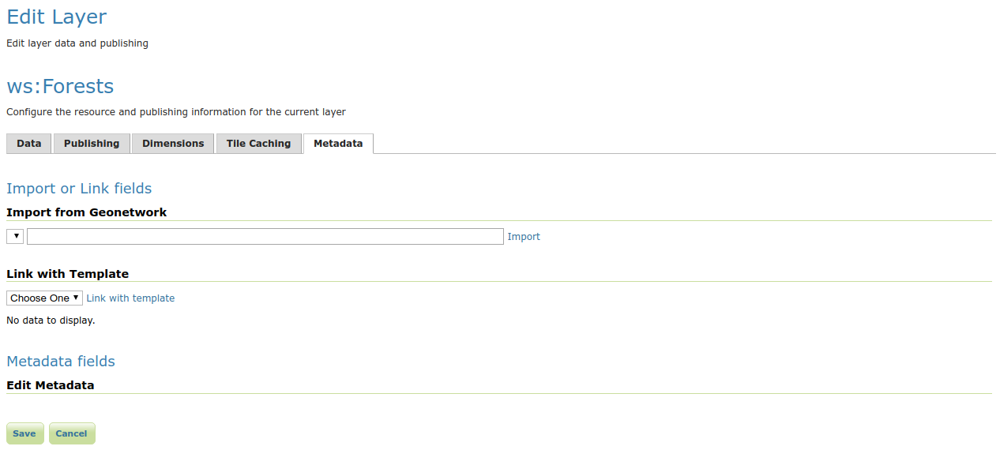

# Getting Started

## Installation

To install the GeoServer Metadata extension:

-   Visit the GeoServer [download](https://geoserver.org/download) page and navigate to the download page for the version of GeoServer your are using. The **metadata** download is listed under extensions. The file name is called **`geoserver-*-metadata-plugin.zip`**, where `*` matches the version number of GeoServer you are using.
-   Extract this file and place the JARs in **`WEB-INF/lib`**.
-   Perform any configuration required by your servlet container, and then restart. On startup, Metadata module will create a configuration directory `metadata` in the GeoServer Data Directory. The module will scan all [yaml](https://yaml.org/) files in the `metadata` directory.

## Basic configuration

By default the metadata module will add an extra tab to the edit layer page. Open the layer: navigate to **Layers --> Choose the layer --> Metadata tab**.


*The initial UI. Note the **Metadata fields** panel is still empty*

The content of the **Metadata fields** is configured by placing one or multiple [yaml](https://yaml.org/) files describing the UI components in the metadata configuration folder, see [INSPIRE metadata configuration using metadata and CSW](../../tutorials/metadata/index.md) for a real life example.

Example UI configuration:

``` YAML
attributes:
  - key: metadata-identifier
    fieldType: UUID
  - key: metadata-datestamp
    label: Date
    fieldType: DATETIME
  - key: data-language
    fieldType: DROPDOWN
    values:
          - dut
          - eng
          - fre
          - ger
  - key: topic-category
    fieldType: SUGGESTBOX
    occurrence: REPEAT
    values:
          - farming
          - biota
          - boundaries
          - climatologyMeteorologyAtmosphere
          - economy
          - elevation 
  - key: data-date
    fieldType: COMPLEX
    typename: data-identification-date
    occurrence: REPEAT   
types:    
   - typename: data-identification-date
     attributes:
      - key: date
        fieldType: DATE
      - key: date-type
        fieldType: DROPDOWN
        values:
          - creation
          - publication
          - revision  
```

This configuration results in the following GUI:


There are 3 main parts in the [yaml](https://yaml.org/):

> -   **attributes:** a list of GUI components that will be rendered in the tab. They can be a basic type or a complex type, a complex type is a collection of basic types.
> -   **types:** a list that defines the fields in each complex type.
> -   **tabs** optionally, attributes may be displayed on separate tabs.

[Fields configuration](uiconfiguration.md) gives an overview of all supported types and advanced features.
