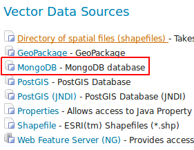
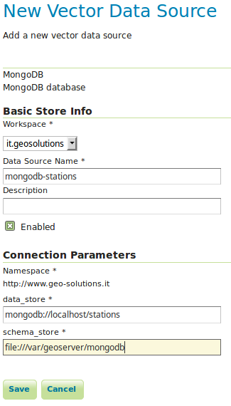

# MongoDB Data Store

This module provides support for MongoDB data store. This extension is build on top of [GeoTools MongoDB plugin
<library/data/mongodb.html>](https://docs.geotools.org/GeoTools MongoDB plugin
<library/data/mongodb.html>).

## Installation

1.  Login, and navigate to **About & Status > About GeoServer** and check **Build Information** to determine the exact version of GeoServer you are running.

2.  Visit the [website download](https://geoserver.org/download) page, change the **Archive** tab, and locate your release.

    From the list of **Vector Formats** extensions download **MongoDB**.

    - {{ release }} example: [mongodb](https://build.geoserver.org/geoserver/main/ext-latest/mongodb)
    - {{ version }} example: [mongodb](https://build.geoserver.org/geoserver/main/ext-latest/geoserver-{{ version }}-SNAPSHOT-mongodb-plugin.zip)

    Verify that the version number in the filename corresponds to the version of GeoServer you are running (for example {{ release }} above).

3.  Extract the files in this archive to the **`WEB-INF/lib`** directory of your GeoServer installation.

4.  Restart GeoServer

## Usage

If the extension was successfully installed a new type of data store named `MongoDB` should be available:

*MongoDB data store.*

Configuring a new MongoDB data store requires providing:

1.  The URL of a MongoDB database.
2.  The absolute path to a data directory where GeoServer will store the schema produced for the published collections.

*Configuring a MongoDB data store.*

For more details about the usage of this data store please check the [GeoTools MongoDB plugin documentation
<library/data/mongodb.html>](https://docs.geotools.org/GeoTools MongoDB plugin documentation
<library/data/mongodb.html>).
