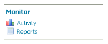

---
render_macros: true
---

# Installing the Monitor Extension

The monitor extension is not part of the GeoServer core and must be installed as a plug-in. To install:

1.  Login, and navigate to **About & Status > About GeoServer** and check **Build Information** to determine the exact version of GeoServer you are running.

2.  Visit the [website download](https://geoserver.org/download) page, change the **Archive** tab, and locate your release.

    From the list of **Miscellaneous** extensions download **Monitor (Core)**.

    - {{ release }} example: [monitor](https://build.geoserver.org/geoserver/main/ext-latest/monitor)
    - {{ version }} example: [monitor](https://build.geoserver.org/geoserver/main/ext-latest/geoserver-{{ version }}-SNAPSHOT-monitor-plugin.zip)

    Verify that the version number in the filename corresponds to the version of GeoServer you are running (for example {{ release }} above).

3.  Extract the files in this archive to the **`WEB-INF/lib`** directory of your GeoServer installation.

4.  Restart GeoServer

## Verifying the Installation

There are two ways to verify that the monitoring extension has been properly installed.

1.  Start GeoServer and open the [Web administration interface](../../webadmin/index.md). Log in using the administration account. If successfully installed, there will be a **Monitor** section on the left column of the home page.

> 
> *Monitoring section in the web admin interface*

1.  Start GeoServer and navigate to the current [GeoServer data directory](../../datadirectory/index.md). If successfully installed, a new directory named `monitoring` will be created in the data directory.
