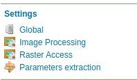

# Installing the Parameter Extractor extension

The Parameter Extractor extension is listed among the other extension downloads on the GeoServer download page.

The installation process is similar to other GeoServer extensions:

1.  Login, and navigate to **About & Status > About GeoServer** and check **Build Information** to determine the exact version of GeoServer you are running.

2.  Visit the [website download](https://geoserver.org/download) page, change the **Archive** tab, and locate your release.

    From the list of **Miscellaneous** extensions download **Request parameters extractor**.

    - {{ release }} example: [params-extractor](https://build.geoserver.org/geoserver/main/ext-latest/params-extractor)
    - {{ version }} example: [params-extractor](https://build.geoserver.org/geoserver/main/ext-latest/geoserver-{{ version }}-SNAPSHOT-params-extractor-plugin.zip)

    Verify that the version number in the filename corresponds to the version of GeoServer you are running (for example {{ release }} above).

3.  Extract the contents of the archive into the **`WEB-INF/lib`** directory in GeoServer. Make sure you do not create any sub-directories during the extraction process.

4.  Restart GeoServer.

If installation was successful, you will see a new Params-Extractor entry in the left menu, under "Settings".

*The Parameter Extractor menu entry*
