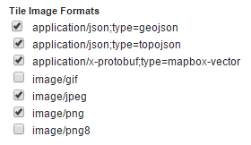

# Installing the Vector Tiles Extension

1.  Login, and navigate to **About & Status > About GeoServer** and check **Build Information** to determine the exact version of GeoServer you are running.

2.  Visit the [website download](https://geoserver.org/download) page, change the **Archive** tab, and locate your release.

    From the list of **Output Formats** extensions download **Vector Tiles**.

    - {{ release }} example: [vectortiles](https://sourceforge.net/projects/geoserver/files/GeoServer/{{ release }}/extensions/geoserver-{{ release }}-vectortiles-plugin.zip)
    - {{ version }} example: [vectortiles](https://build.geoserver.org/geoserver/main/extensions/geoserver-{{ snapshot }}-vectortiles-plugin.zip)

    Verify that the version number in the filename corresponds to the version of GeoServer you are running (for example {{ release }} above).

3.  Extract the archive and copy the contents into the GeoServer library **`WEB-INF/lib`** directory located in:

> - GeoServer binary Jetty: **`<GEOSERVER_ROOT>/webapps/geoserver/WEB-INF/lib`**
> - Default Tomcat deployment: **`<CATALINA_BASE>/webapps/geoserver/WEB-INF/lib`**

1.  Restart GeoServer.

To verify that the extension was installed successfully

1.  Open the [Web administration interface](../../webadmin/index.md)

2.  Click **Layers** and select a vector layer

3.  Click the **Tile Caching** tab

4.  Scroll down to the section on **Tile Formats**. In addition to the standard GIF/PNG/JPEG formats, you should see the following:

    - `application/json;type=geojson`
    - `application/json;type=topojson`
    - `application/vnd.mapbox-vector-tile`

    
    *Vector tiles tile formats*

    If you don't see these options, the extension did not install correctly.
