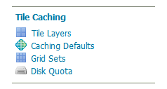

# GeoWebCache settings

This section of the [Web administration interface](../../webadmin/index.md) describes how to configure the tile caching options for GeoServer. GeoServer uses GeoWebCache to provide direct and integrated tile caching, and can dramatically increase your server's responsiveness and reliability.

The pages in this menu can be accessed on the left side of the screen under the heading **Tile Caching**.

*Tile Caching menu*

-   [Tile Layers](layers.md)
-   [Demo page](demopage.md)
-   [Caching defaults](defaults.md)
-   [Gridsets](gridsets.md)
-   [Disk Quotas](diskquotas.md)
-   [BlobStores](blobstores.md)

