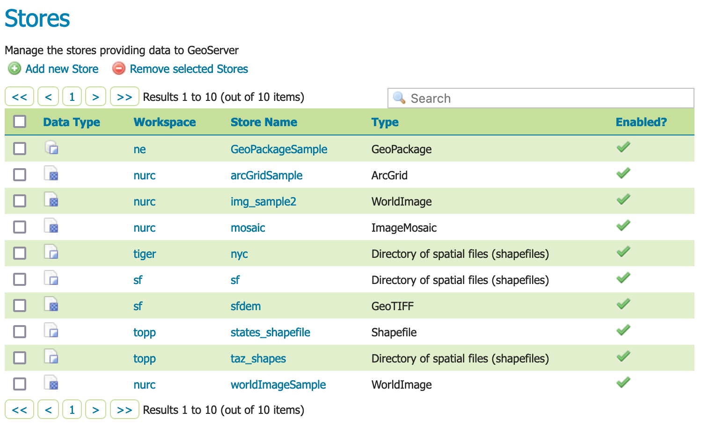
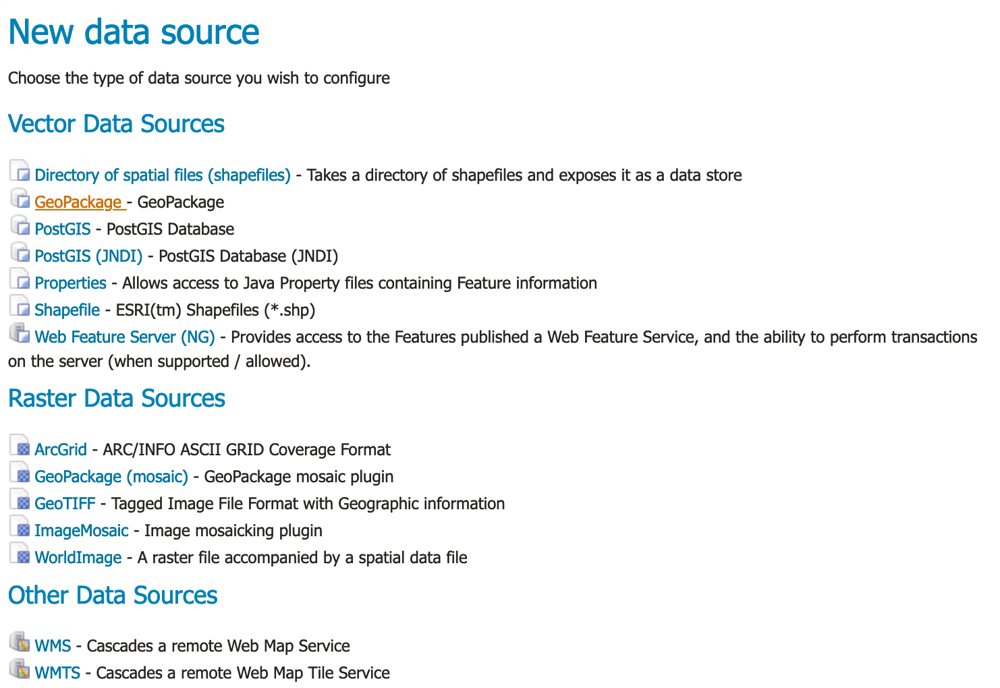
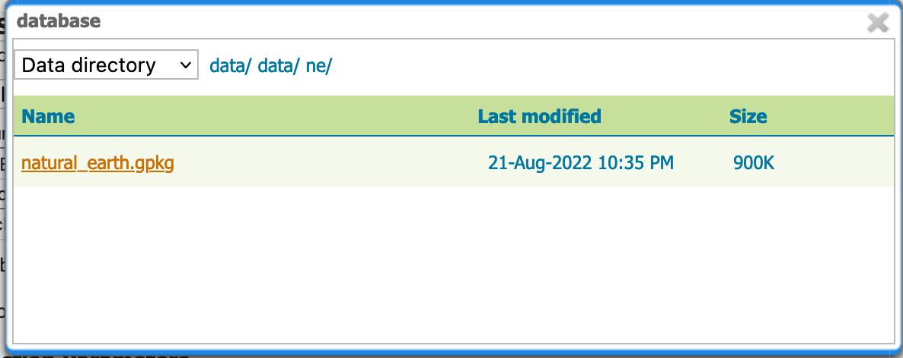
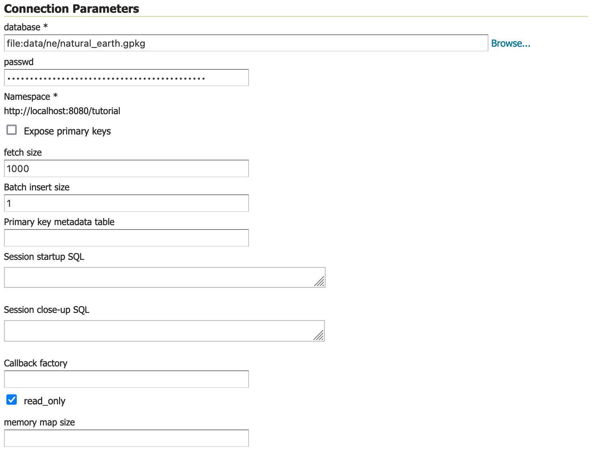
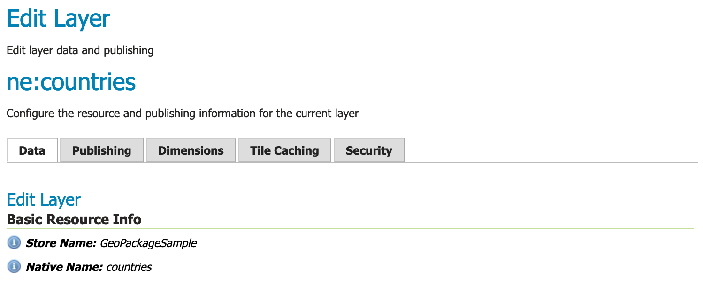
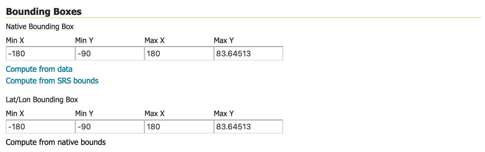
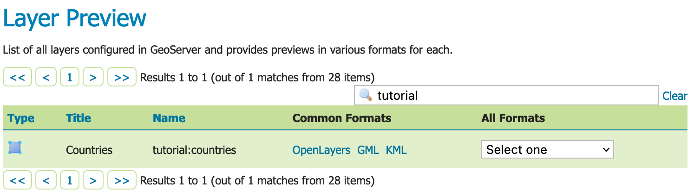

# Publishing a GeoPackage {: #geopkg_quickstart }

This tutorial walks through the steps of publishing a GeoPackage with GeoServer.

!!! note

    This tutorial assumes that GeoServer is running at `http://localhost:8080/geoserver`.

## Data preparation

First let's gather that the data that we'll be publishing.

1.  The sample data folder includes **`data/ne/natural_earth.gpkg`**
2.  This file contains small scale 1:110m data:
    -   [coastlines](https://www.naturalearthdata.com/downloads/110m-physical-vectors/110m-coastline/)
    -   [countries](https://www.naturalearthdata.com/downloads/110m-cultural-vectors/110m-admin-0-countries/)
    -   [boundary lines](https://www.naturalearthdata.com/downloads/110m-cultural-vectors/110m-admin-0-boundary-lines/)
    -   [populated places](https://www.naturalearthdata.com/downloads/110m-cultural-vectors/110m-populated-places/)

!!! note

    This **`data/ne/natural_earth.gpkg`** file has been processed from <https://www.naturalearthdata.com/downloads/> page, to download the original (much larger) file visit the above page and download [GeoPackage](https://naciscdn.org/naturalearth/packages/natural_earth_vector.gpkg.zip) link.

## Creating a new workspace

The next step is to create a workspace for the geopackage. A workspace is a folder used to group similar layers together.

!!! note

    This step is optional if you'd like to use an existing workspace. Usually, a workspace is created for each project, which can include stores and layers that are related to each other.

1.  In a web browser, navigate to `http://localhost:8080/geoserver`.

2.  Log into GeoServer as described in the [Logging In](../web-admin-quickstart/index.md#logging_in) section.

3.  Navigate to **Data --> Workspaces**.

    
    *Workspaces page*

4.  Click the **Add new workspace** button to display the **New Workspace** page.

5.  You will be prompted to enter a workspace **Name** and **Namespace URI**.

      --------------------- --------------------------------------------------------
      Name:                 `al`

      Namespace URI         ``http://localhost:8080/geoserver/tutorial``
      --------------------- --------------------------------------------------------

    !!! note

        A workspace name is an identifier describing your project. It must not exceed ten characters or contain spaces.

    !!! note

        A Namespace URI (Uniform Resource Identifier) can usually be a URL associated with your project with an added trailing identifier indicating the workspace. The Namespace URI filed does not need to resolve to an actual valid web address.

6.  Press the **Submit** button.

    
    *New workspace*

7.  The `tutorial` workspace will be added to the **Workspaces** list.

## Create a store

Once the workspace is created, we are ready to add a new store. The store tells GeoServer how to connect to the geopackage.

1.  Navigate to **Data-->Stores**.

    
    *Stores page*

2.  This page displays a list of stores, including the type of store and the workspace that the store belongs to.

3.  In order to add the geopackage, you need to create a new store. Click the **Add new Store** button. You will be redirected to a list of the data sources supported by GeoServer. Note that the data sources are extensible, so your list may look slightly different.

    
    *New data source*

4.  From the list of **Vector Data Sources** locate and click the **GeoPackage** link.

    The **New Vector Data Source** page will display.

5.  Begin by configuring the **Basic Store Info**.

      --------------------- -------------------------------------------------
      workspace             `tutorial`

      Data Source Name      `th`

      Description           `ta`
      --------------------- -------------------------------------------------

    This information is internal to GeoServer and is not used as part of the web service protocols. We recommend keeping the **Data Source Name** simple as they will be used to form folders in the data directory (so keep any operating system restrictions on character use in mind).

    
    *Basic Store info*

6.  Connection parameters are used to establish the connection with your database. As GeoPackage is a file based database this will primarily consist of the geopackage location.

7.  Under **Connection Parameters**, browse to the location **URL** of the geopackage, in our example **`data/ne.shp`**.

    
    *Browse database location*

8.  The **Connection Parameters** for our geopackage are:

      --------------------- -------------------------------------------------
      database              ``file:data/ne/natural_earth.gpkg``

      read_only             checked
      --------------------- -------------------------------------------------

    The use of **read_only** above indicates that we will not be writing to this GeoPackage, allowing GeoServer to avoid managing write locks when accessing this content for greater performance.

    
    *Connection Parameters*

9.  Press **Save**.

10. You will be redirected to the **New Layer** page (as this is the most common next step when adding a new data store).

## Creating a layer

Now that we have connected to the GeoPackage, we can publish the layer.

1.  On the **New Layer** page, click **Publish** beside the `countries` **layer name**.

    
    *New Layer*

2.  The **Edit Layer** page defines the data and publishing parameters for a layer.

    
    *Edit Layer Data tab*

3.  There are three critical pieces of information required on the **Data** tab before we can even save.

    -   **Basic Resource Info** - describes how the layer is presented to others
    -   **Coordinate Reference System** - establishes how the spatial data is to be interpreted or drawn on the world
    -   **Bounding Boxes** - establishes where the dataset is located in the world

4.  Locate **Basic Resource Info** and define the layer:

      --------------------- -------------------------------------------------
      Name                  `es`

      Title                 `es`

      Abstract              `es`
      --------------------- -------------------------------------------------

    The naming of a layer is important, and while GeoServer does not offer restrictions many of the individual protocols will only work with very simple names.

    
    *Basic Resource Info*

5.  Double check the **Coordiante Reference Systems** information is correct.

      --------------------- -------------------------------------------------
      Native SRS            ``EPSG:4326``

      Declaired SRS         ``EPSG:4326``

      SRS Handling          `Force declared`
      --------------------- -------------------------------------------------

    
    *Coordinate Reference Systems*

6.  Locate **Bounding Boxes** and generate the layer's bounding boxes by clicking the **Compute from data** and then **Compute from native bounds** links.

    
    *Generating bounding boxes*

7.  Press **Apply** to save your work thus far without closing the page.

    This is a good way to check that your information has been entered correctly, GeoServer will provide a warning if any required information is incomplete.

8.  Scroll to the top of the page and navigate to the **Publishing** tab.

9.  Locate the **WMS Settings** heading, where we can set the style.Ensure that the **Default Style** is set to `polygon``.

    
    *WMS Settings*

10. Press **Save** to complete your layer edits.

## Previewing the layer

In order to verify that the `tutorial:countries` layer is published correctly, we can preview the layer.

1.  Navigate to the **Data > Layer Preview** page and find the `tutorial:countries` layer.

    !!! note

        Use the **Search** field with `al` as shown to limit the number of layers to page through.

    
    *Layer Preview*

2.  Click the **OpenLayers** link in the **Common Formats** column.

3.  An OpenLayers map will load in a new tab and display the shapefile data with the default line style.

    You can use this preview map to zoom and pan around the dataset, as well as display the attributes of features.

    
    *Preview map of countries*
