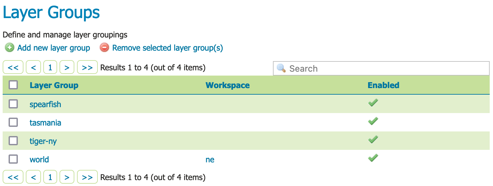
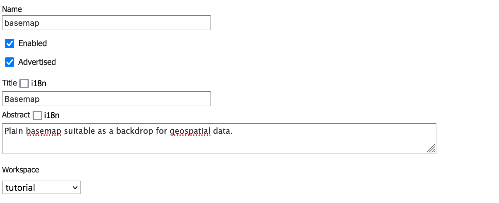

# Publishing a Layer Group {: #group_quickstart }

This tutorial walks through the steps of publishing a layer group combing several layers into a basemap.

!!! note

    This tutorial assumes that GeoServer is running at `http://localhost:8080/geoserver`.

## Data preparation

First let's gather that the data that we'll be publishing.

1.  Complete the previous tutorials:
    -   [Publishing a GeoPackage](../geopkg-quickstart/index.md) defining the ``tutorial:countries`` layer
    -   [Publishing a Image](../image-quickstart/index.md) defining the ``tutorial:shaded`` layer

## Create a layer group

1.  Navigate to **Data > Layer Group** page.

    
    *Layer Groups*

2.  This page displays a list of layer groups, workspace that the group belongs to.

    !!! note

        Layer groups are allowed to be "global" allowing a map to be created combing layers from several workspaces into a single visual.

3.  At the top of the list **Layer Groups** locate and click the **Add new layer group** link.

4.  The **Layer group** editor defines

    -   **Basic Resource Info** - describes how the layer is presented to others
    -   **Coordinate Reference System** - establishes how the spatial data is to be interpreted or drawn on the world
    -   **Bounding Boxes** - establishes where the dataset is located in the world
    -   **Layers** - the layers to be drawn (listed in draw order)

5.  Locate **Basic Resource Info** and define the layer:

      --------------------- -------------------------------------------------
      Name                  `ap`

      Title                 `ap`

      Abstract              `a.`

      Workspace             `tutorial`
      --------------------- -------------------------------------------------

    
    *Basic resource information*

6.  Scroll down to the **Layers** list which is presently empty.

7.  Click **Add Layer** link, select the `tutorial:shaded` layer first.

    The raster should be drawn first, as other content will be shown over top of it.

8.  Click **Add Layer** link, select the `tutorial:countries` layer second.

    This polygon layer will be drawn second.

9.  Locate the `tutorial:countries` layer in the list and click the **Style** entry to change `polygon` to `line`.

    By drawing only the outline of the countries the shaded relief can show through.

    
    *Layer group layers in drawing order*

10. Locate the **Coordiante Reference Systems** and press **Generate Bounds**.

    Now that layers are listed we they can be used to determine the corodinate reference system and bounds of the layer group.

    
    *Coordinate Reference Systems*

11. Press **Save** complete your layer group.

## Previewing the layer

In order to verify that the `tutorial:basemap` layer is published correctly, we can preview the layer.

1.  Navigate to the **Data > Layer Preview** page and find the `tutorial:basemap` layer.

    !!! note

        Use the **Search** field with `al` as shown to limit the number of layers to page through.

2.  Click the **OpenLayers** link in the **Common Formats** column.

3.  An OpenLayers map will load in a new tab. This preview is used to zoom and pan around the dataset, as well as display the attributes of features.

    
    *Preview basemap*
