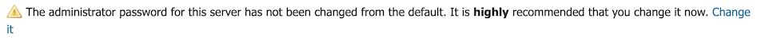
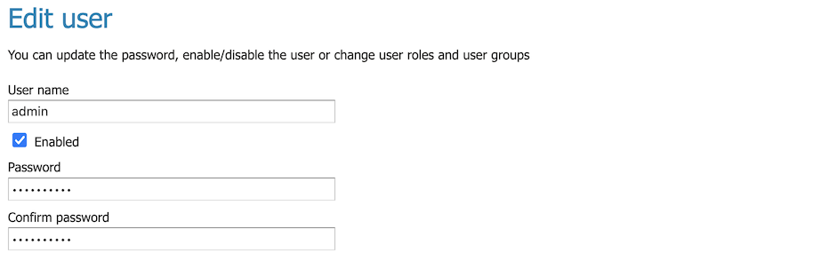
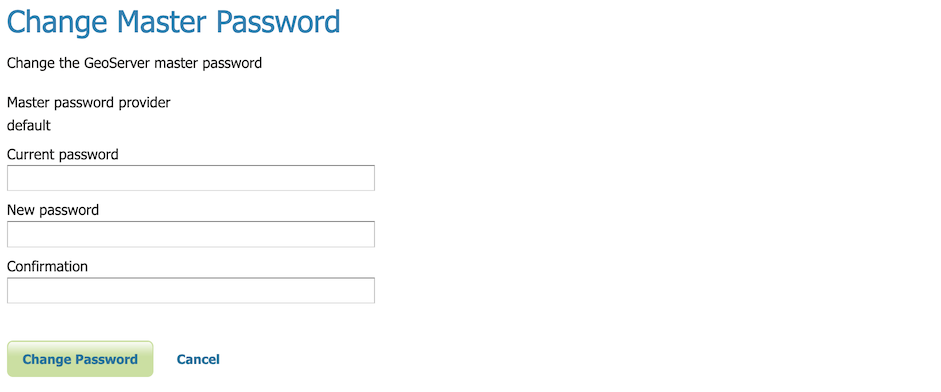
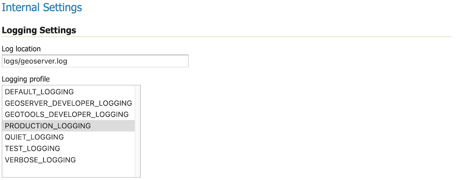

# Preflight Checklist

This quickstart walks through common configuration steps before sharing your GeoServer publicly.

!!! note

    This tutorial assumes that GeoServer is running at `http://localhost:8080/geoserver`.

Reference:

- [Running in a production environment](../../production/index.md)

## Security

There are several warnings shown when we first start up GeoServer and login as admin:

1.  Change the default login from **admin/geoserver**.

    
    *Default admin password warning*

    Click on the **change it** to open **Edit user** for the `admin` user. You may also reach this screen by navigate to **Security > Users, Groups, and Roles**. Changing the the **Users/Groups** tag, and selecting the `admin` user.

    
    *Change Master Password*

    User this screen to change the ``admin`` user password from the default:

|-------------------|--------------------------|
| User name         | ``admin``      |
| Password          | (make up a new password) |
| Confirm password: | (confirm new password)   |

<!-- mkdocs-translate: removed 3 spaces indentation -->

3.  Change master password:

    
    *Master password warning*

    Click on the **change it** to open **Change Master Password**. You may also reach this screen by navigate to **Security > Passwords**, and pressing **Change password**.

    
    *Change Master Password*

    Use this screen to change the master or keystore password.

|------------------|--------------------------|
| Current password | ``geoserver``  |
| New password     | (make up a new password) |
| Confirmation:    | (confirm new password)   |

<!-- mkdocs-translate: removed 3 spaces indentation -->

> If you do not know the current password, navigate to **Security > Passwords** and there is an option to recover the password (either to a local file or via REST API).
>
> For more information see [Keystore password](../../security/passwd.md#security_master_passwd).
>
> :::: note
> ::: title
> Note
> :::
>
> What is the keystore password or master password?
>
> - The keystore password used to [store security credentials and encryption keys](../../security/passwd.md#security_passwd_keystore).
> - Optional: When experimenting with security configuration, you can enable use of the [root account](../../security/passwd.md#security_master_passwd).
> ::::

## Global Settings

1.  By default GeoServer logs provide a record of every interaction.

    This is useful when initially configuring GeoServer, however once you are comfortable everything is working correctly you can configure GeoServer to only record warnings and errors.

    Navigate to **Settings > Global**. Locate the heading **Internal Settings** and adjust **Logging profile** to `PRODUCTION_LOGGING`.

    
    *PRODUCTION_LOGGING profile*

    For more information see [Logging Profile](../../configuration/globalsettings.md#config_globalsettings_log_profile).

## Contact Information

1.  Navigate to **About & Status > Contact Information**.

    - Filling in this information is shown initial Welcome page.
    - This informaiton is included in web service description information.
    - Contact information may be provided for each workspace.

    For more information [Contact Information](../../configuration/contact.md).
