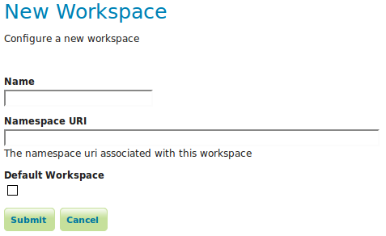
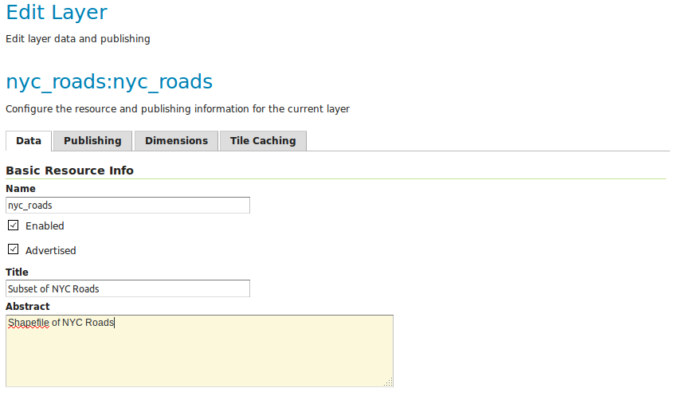
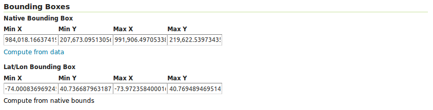
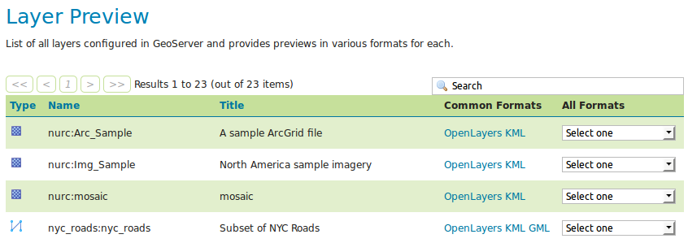
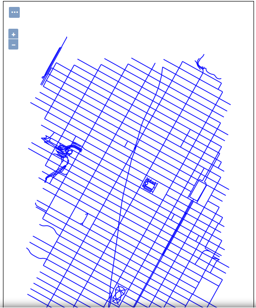

# Publishing a shapefile {: #shapefile_quickstart }

This tutorial walks through the steps of publishing a Shapefile with GeoServer.

!!! note

    This tutorial assumes that GeoServer is running at `http://localhost:8080/geoserver`.

## Data preparation

First let's gather that the data that we'll be publishing.

1.  Download the file [nyc_roads.zip](nyc_roads.zip). This archive contains a shapefile of roads from New York City that will be used during in this tutorial.

2.  Unzip the **`nyc_roads.zip`** into a new directory named **`nyc_roads`**. The archive contains the following four files:

        nyc_roads.shp
        nyc_roads.shx
        nyc_roads.dbf
        nyc_roads.prj

3.  Move the `nyc_roads` directory into `<GEOSERVER_DATA_DIR>/data`, where `<GEOSERVER_DATA_DIR>` is the root of the [GeoServer data directory](../../datadirectory/index.md). If no changes have been made to the GeoServer file structure, the path is `geoserver/data_dir/data/nyc_roads`.

## Creating a new workspace

The next step is to create a workspace for the shapefile. A workspace is a container used to group similar layers together.

!!! note

    This step is optional if you'd like to use an existing workspace. Usually, a workspace is created for each project, which can include stores and layers that are related to each other.

1.  In a web browser, navigate to `http://localhost:8080/geoserver`.

2.  Log into GeoServer as described in the [Logging In](../web-admin-quickstart/index.md#logging_in) section.

3.  Navigate to **Data --> Workspaces**.

    
    *Workspaces page*

4.  Click the **Add new workspace** button.

5.  You will be prompted to enter a workspace **Name** and **Namespace URI**.

    
    *Configure a new workspace*

6.  Enter the **Name** as `nyc` and the **Namespace URI** as `http://geoserver.org/nyc`.

    !!! note

        A workspace name is an identifier describing your project. It must not exceed ten characters or contain spaces. A Namespace URI (Uniform Resource Identifier) can usually be a URL associated with your project with an added trailing identifier indicating the workspace. The Namespace URI filed does not need to resolve to an actual valid web address.

    
    *nyc workspace*

7.  Click the **Submit** button. The `nyc` workspace will be added to the **Workspaces** list.

## Create a store

Once the workspace is created, we are ready to add a new store. The store tells GeoServer how to connect to the shapefile.

1.  Navigate to **Data-->Stores**.

2.  You should see a list of stores, including the type of store and the workspace that the store belongs to.

3.  In order to add the shapefile, you need to create a new store. Click the **Add new Store** button. You will be redirected to a list of the data sources supported by GeoServer. Note that the data sources are extensible, so your list may look slightly different.

    
    *Stores*

4.  Click **Shapefile**. The **New Vector Data Source** page will display.

5.  Begin by configuring the **Basic Store Info**.

    -   Select the workspace `nyc` from the drop down menu.
    -   Enter the **Data Source Name** as `NYC Roads`
    -   Enter a brief **Description** (such as "Roads in New York City").

6.  Under **Connection Parameters**, browse to the location **URL** of the shapefile, typically **`nyc_roads/nyc_roads.shp`**.

    
    *Basic Store Info and Connection Parameters*

7.  Click **Save**. You will be redirected to the **New Layer** page in order to configure the `nyc_roads` layer.

## Creating a layer

Now that the store is loaded, we can publish the layer.

1.  On the **New Layer** page, click **Publish** beside the `nyc_roads` layer name.

    
    *New layer*

2.  The **Edit Layer** page defines the data and publishing parameters for a layer. Enter a short **Title** and an **Abstract** for the `nyc_roads` layer.

    
    *Basic Resource Information*

3.  Generate the layer's bounding boxes by clicking the **Compute from data** and then **Compute from native bounds** links.

    
    *Generating bounding boxes*

4.  Click the **Publishing** tab at the top of the page.

5.  We can set the layer's style here. Under **WMS Settings**, ensure that the **Default Style** is set to **line**.

    
    *Select Default Style*

6.  Finalize the layer configuration by scrolling to the bottom of the page and clicking **Save**.

## Previewing the layer

In order to verify that the `nyc_roads` layer is published correctly, we can preview the layer.

1.  Navigate to the **Layer Preview** screen and find the `nyc:nyc_roads` layer.

    
    *Layer Preview*

2.  Click the **OpenLayers** link in the **Common Formats** column.

3.  An OpenLayers map will load in a new tab and display the shapefile data with the default line style. You can use this preview map to zoom and pan around the dataset, as well as display the attributes of features.

    
    *Preview map of nyc_roads*
