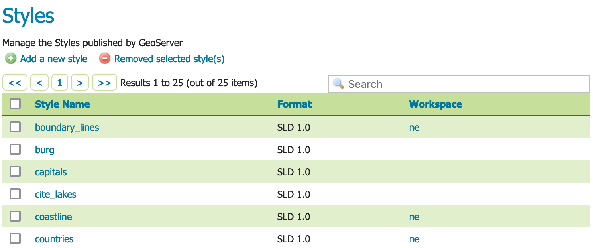
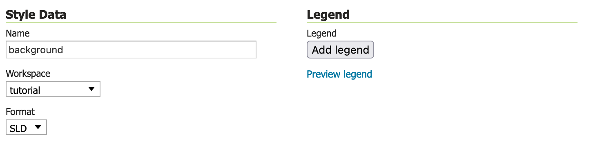
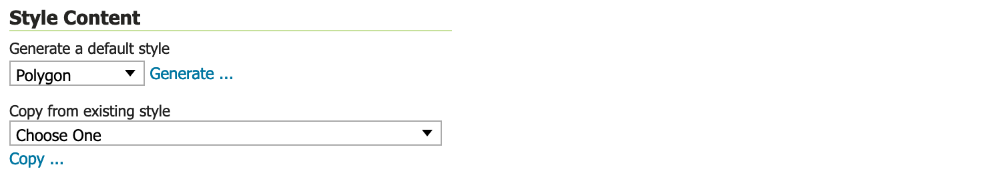
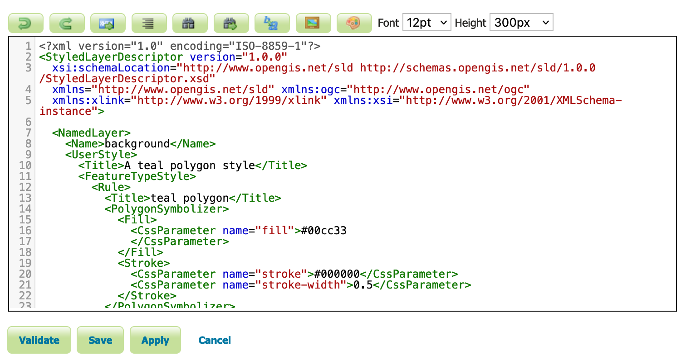
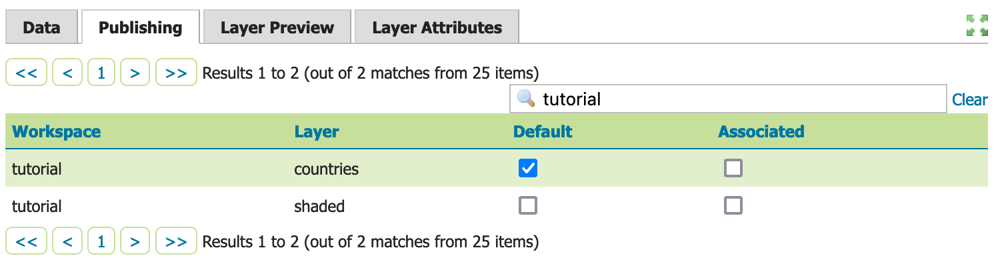
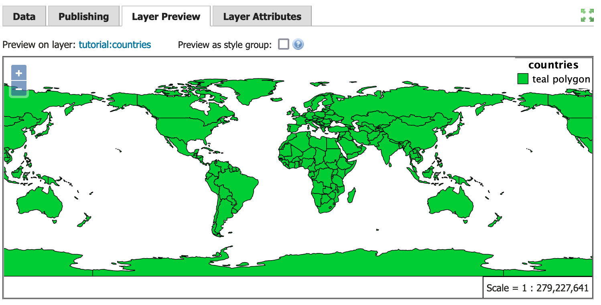
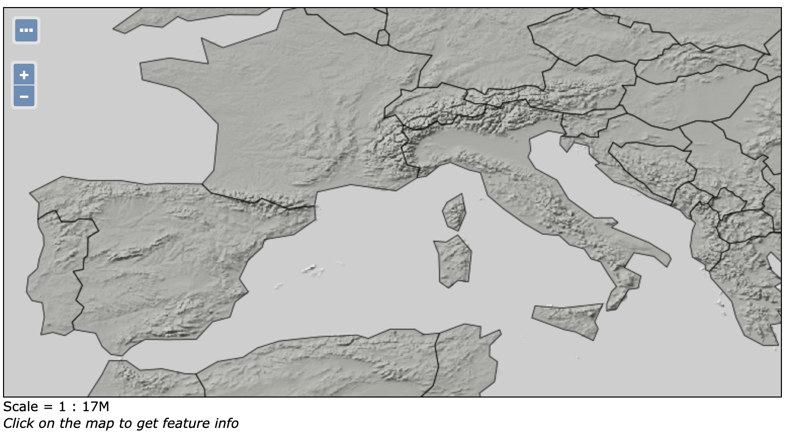

# Publishing a style

This tutorial walks through the steps of defining a style and associating it with a layer for use.

!!! note

    This tutorial assumes that GeoServer is running at `http://localhost:8080/geoserver`.

## Data preparation

First let's gather that the data that we'll be publishing.

1.  Complete the previous tutorials:
    -   [Publishing a GeoPackage](../geopkg-quickstart/index.md) defining the ``tutorial:countries`` layer
    -   [Publishing a Image](../image-quickstart/index.md) defining the ``tutorial:shaded`` layer
    -   [Publishing a Layer Group](../group-quickstart/index.md) defining the ``tutorial:basemap`` layer

## Create a style

1.  Navigate to **Data > Style** page.

    
    *Styles*

2.  This page displays a list of styles, including the workspace the style belongs to.

    !!! note

        Styles groups are allowed to be "global" allowing a style to be defined that can be used by any layer.

3.  At the top of the list **Styles** list, locate and click the **Add a new style** link.

4.  Locate **Style Data** and define the style:

    ||
    ||

    -   -   Name
        -   ``background``

    -   -   Workspace
        -   `tutorial`

    -   -   Format
        -   `SLD`

    
    *Style data*

5.  Locate **Style Content** and carefully:

    -   Under **Generate a default style** select `Polygon`

    
    *Style Content configured to generate a polygon default style.*

6.  Under **Generate a default style** locate and click the **Generate** link to populate the style editor with a generated outline of a polygion style.

    

7.  Press the **Apply** button to define this style.

    Now that the style is defined there are more options for interactively working with the style.

8.  Change to **Publishing** tab.

    -   Use the search to filter with `tutorial` to locate `tutorial:countries`.
    -   Select the **Default** checkbox for `tutorial:countries` to use the `tutorial:background` style the default for this layer.

    
    *Style publish*

9.  Next to **Publishing** navigate to the **Layer Preview** tab.

    -   Locate the **Preview on layer** and click on the link to select `tutorial:countries` as a dataset to use when editing the style.

    
    *Styled editor Layer Preview tab*

10. Edit your style by inserting `fill-opacity` value of `0.25`.

    ~~~xml
    
    ~~~

11. Press **Apply** to edit your style and check the resulting visual change in the layer preview.

12. Experiment with:

    -   Updating the title information, watching the displayed legend change
    -   Full screen mode for side-by-side editing

    
    *Full screen mode*

13. When this style is used as part of the `tutorial::basemap` the `fill-opacity` allows the shaded relief detail to be shown.

    
    *Basemap with background style applied to countries*
