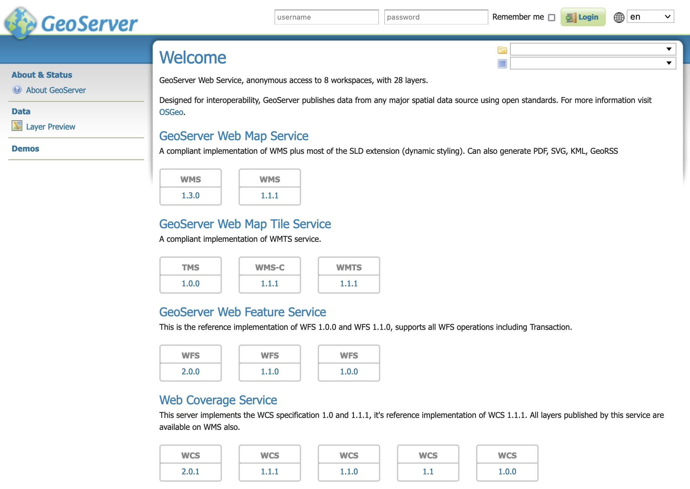

---
render_macros: true
---

# Linux binary

The platform-independent binary is a GeoServer web application bundled with [Jetty](https://eclipse.org/jetty/), a scalable and memory-efficient web server and Servlet container. Jerry has the advantages of working very similarly across all operating systems and is straightfoward to set up.

!!! note

    For installing on Linux with an existing application server such as Tomcat, please see the [Web archive](war.md) section.

## Installation

1.  Make sure you have a Java Runtime Environment (JRE) installed on your system. GeoServer requires a **Java 17** or **Java 21** environment.

    

    !!! note

        For more information about Java and GeoServer compatibility, please see the section on [Java Considerations](../production/java.md).

2.  Navigate to the [GeoServer Download page](https://geoserver.org/download).

3.  Select the version of GeoServer that you wish to download.

    - If you're not sure, select [Stable](https://geoserver.org/release/stable) release.

      Examples provided for GeoServer {{ release }}.

    - Testing a Nightly release is a great way to try out new features, and test community modules. Nightly releases change on an ongoing basis and are not suitable for a production environment.

      Examples are provided for GeoServer {{ version }}, which is provided as a [Nightly](https://geoserver.org/release/main) release.

4.  Select **Platform Independent Binary** on the download page:

    - [bin](https://sourceforge.net/projects/geoserver/files/GeoServer/bin)
    - [bin](https://build.geoserver.org/geoserver/main/release/bin)

5.  Download the **`zip`** archive and unpack to the directory where you would like the program to be located.

    !!! note

        A suggested location would be **`/usr/share/geoserver`**.

6.  Add an environment variable to save the location of GeoServer by typing the following command:

    ``` bash
    echo "export GEOSERVER_HOME=/usr/share/geoserver" >> ~/.profile
    . ~/.profile
    ```

7.  Optionally, set the environment variable `JETTY_OPTS` to tweak the jetty configuration upfront:

    ``` bash
    echo "export JETTY_OPTS='jetty.http.port=1234'" >> ~/.profile
    . ~/.profile
    ```

8.  Make yourself the owner of the `geoserver` folder. Type the following command in the terminal window, replacing `USER_NAME` with your own username :

    ``` bash
    sudo chown -R USER_NAME /usr/share/geoserver/
    ```

9.  Start GeoServer by changing into the directory **`geoserver/bin`** and executing the **`startup.sh`** script:

    ``` bash
    cd geoserver/bin
    sh startup.sh
    ```

10. In a web browser, navigate to `http://localhost:8080/geoserver`.

    If you see the GeoServer Welcome page, then GeoServer is successfully installed.

    
    *GeoServer Welcome Page*

11. To shut down GeoServer, either close the persistent command-line window, or run the **`shutdown.sh`** file inside the **`bin`** directory.

## Uninstallation

1.  Stop GeoServer (if it is running).
2.  Delete the directory where GeoServer is installed.
