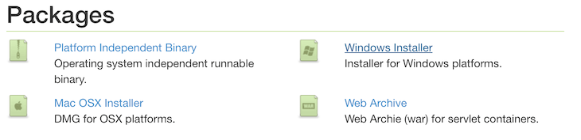
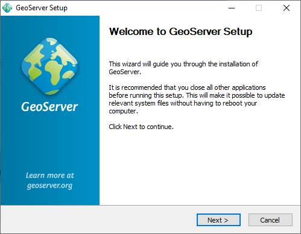
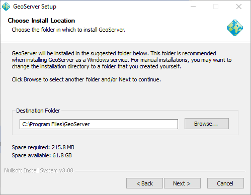
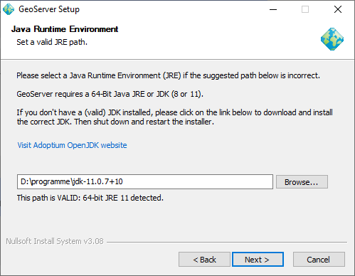
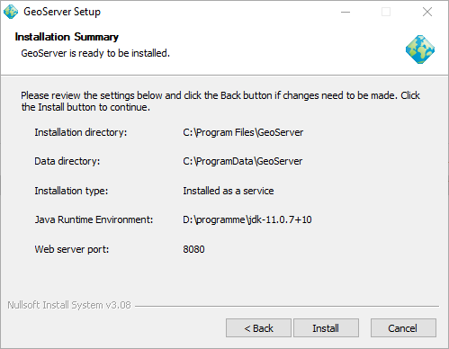

# Windows installer

The Windows installer provides an easy way to set up GeoServer on your system, as it requires no configuration files to be edited or command line settings.

1.  Make sure you have a Java Runtime Environment (JRE) installed on your system. GeoServer requires a **Java 11** or **Java 17** environment, as provided by [Adoptium](https://adoptium.net) Windows installers.

    !!! note

        For more information about Java and GeoServer, please see the section on [Java Considerations](../production/java.md).

2.  Navigate to the `GeoServer Download page <download>`{.interpreted-text role="website"}.

3.  Select the version of GeoServer that you wish to download. If you're not sure, select `Stable <release/stable>`{.interpreted-text role="website"} release.

    !!! abstract "Nightly Build"

        This documentation covers GeoServer {{ version }}-SNAPSHOT which is under development and is available as a `Nightly <release/main>`{.interpreted-text role="website"} release.
    
        Nightly releases are used to test out try out new features and test community modules and do not provide a windows installer. When GeoServer {{ version }}.0 is released a windows installer will be provided.

    !!! abstract "Release"

        These instructions are for GeoServer {{ release }}.

4.  Click the link for the :**Windows Installer**.

    
    *Downloading the Windows installer*

5.  After downloading, double-click the file to launch.

6.  At the Welcome screen, click :**Next**.

    
    *Welcome screen*

7.  Read the [License](../introduction/license.md) and click :**I Agree**.

    
    *GeoServer license*

8.  Select the directory of the installation, then click :**Next**.

    
    *GeoServer install directory*

9.  Select the Start Menu directory name and location, then click :**Next**.

    
    *Start menu location*

10. Enter the path to a **valid Java Runtime Environment (JRE)**. GeoServer requires a valid JRE in order to run, so this step is required. The installer will inspect your system and attempt to automatically populate this box with a JRE if it is found, but otherwise you will have to enter this path manually. When finished, click :**Next**.

    !!! note

        A typical path on Windows would be **`C:\\Program Files\\Java\\jre8`**.

    !!! note

        Don't include the **`\\bin`** in the JRE path. So if **`java.exe`** is located at **`C:\\Program Files (x86)\\Java\\jre8\\bin\\java.exe`**, set the path to be **`C:\\Program Files (x86)\\Java\\jre8`**.

    !!! note

        For more information about Java and GeoServer, please see the section on [Java Considerations](../production/java.md).

    
    *Selecting a valid JRE*

11. Enter the path to your GeoServer data directory or select the default. If this is your first time using GeoServer, select the :**Default data directory`. When finished, click :guilabel:`Next**.

    
    *Setting a GeoServer data directory*

12. Enter the username and password for administration of GeoServer. GeoServer's [Web administration interface](../webadmin/index.md) requires authentication for management, and what is entered here will become those administrator credentials. The defaults are :**admin / geoserver`. It is recommended to change these from the defaults. When finished, click :guilabel:`Next**.

    
    *Setting the username and password for GeoServer administration*

13. Enter the port that GeoServer will respond on. This affects the location of the GeoServer [Web administration interface](../webadmin/index.md), as well as the endpoints of the GeoServer services such as [Web Map Service (WMS)](../services/wms/index.md) and [Web Feature Service (WFS)](../services/wfs/index.md). The default port is :**8080`, though any valid and unused port will work. When finished, click :guilabel:`Next**.

    
    *Setting the GeoServer port*

14. Select whether GeoServer should be run manually or installed as a service. When run manually, GeoServer is run like a standard application under the current user. When installed as a service, GeoServer is integrated into Windows Services, and thus is easier to administer. If running on a server, or to manage GeoServer as a service, select :**Install as a service`. Otherwise, select :guilabel:`Run manually`. When finished, click :guilabel:`Next**.

    
    *Installing GeoServer as a service*

15. Review your selections and click the :**Back` button if any changes need to be made. Otherwise, click :guilabel:`Install**.

    
    *Verifying settings*

16. GeoServer will install on your system.

    
    *Install progress*

17. When finished, click :**Finish** to close the installer.

    
    *Completing*

18. If you installed GeoServer as a service, it is already running. Otherwise, you can start GeoServer by going to the Start Menu, and clicking :**Start GeoServer** in the GeoServer folder.

19. Navigate to `http://localhost:8080/geoserver` (or wherever you installed GeoServer) to access the GeoServer [Web administration interface](../webadmin/index.md).

    If you see the GeoServer Welcome page, then GeoServer is successfully installed.

    
    *GeoServer Welcome Page*

## Uninstallation

GeoServer can be uninstalled in two ways: by running the **`uninstall.exe`** file in the directory where GeoServer was installed, or by standard Windows program removal.
