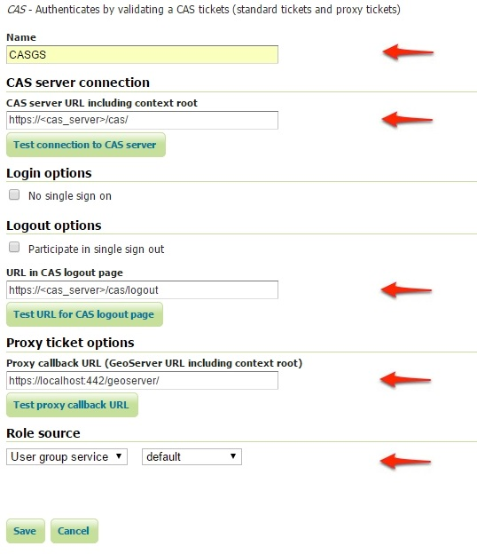
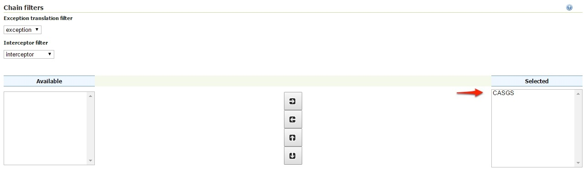

# Authentication with CAS

This tutorial introduces GeoServer CAS support and walks through the process of setting up authentication against a CAS server. It is recommended that the [Authentication chain](../../auth/chain.md) section be read before proceeding. Reference information on cas setup is also available [CAS integration](../../../extensions/cas/index.md).

## CAS server certificates

A running [CAS server](https://apereo.github.io/cas/5.3.x/index.html) is needed.

The first step is to import the server certificates into the GeoServer JVM.

If you need to export the ``CRT`` from the CAS server, you must execute the following command on the server JVM:

    keytool -export -alias <server_name> -keystore <cas_jvm_keystore_path> -file server.crt

Once you have the ``server.crt`` file, the procedure to import the certificate into the JVM is the following one:

    keytool -import -trustcacerts -alias <server_name> -file server.crt -keystore <path_to_JRE_cacerts>

Enter the keystore password and confirm the certificate to be trustable.

## Configure the CAS authentication provider

1.  Start GeoServer and login to the web admin interface as the `admin` user.

2.  Click the `Authentication` link located under the `Security` section of the navigation sidebar.

    > 

3.  Scroll down to the `Authentication Filters` panel and click the `Add new` link.

    > 

4.  Click the `CAS` link.

    > 

5.  Fill in the fields of the settings form as follows:

    > 

6.  Update the filter chains by adding the new CAS filter.

    

7.  Select the CAS Filter for each filter chain you want to protect with CAS.

    

    Be sure to select and order correctly the CAS Filter.

8.  Save.

## Test a CAS login

1.  Navigate to the GeoServer home page and log out of the admin account.

2.  Try to login again, you should be able now to see the external CAS login form.

    
