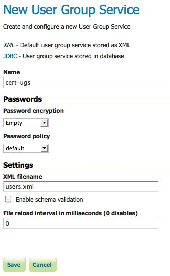
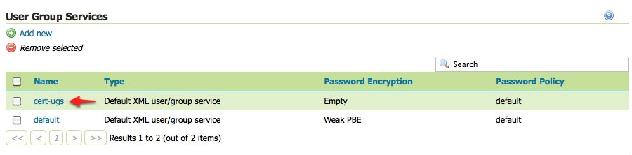
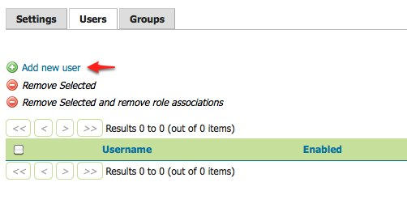
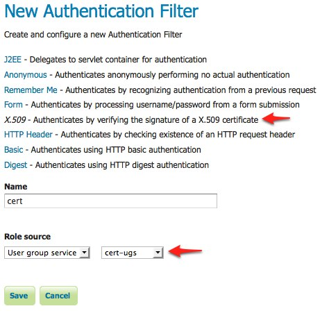
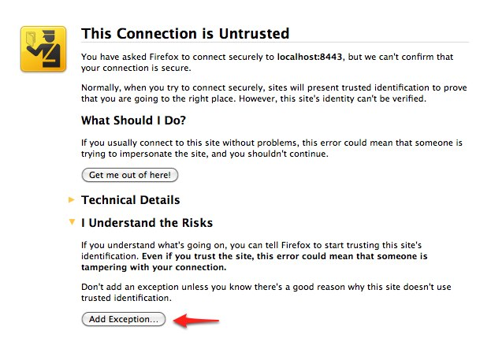

# Configuring X.509 Certificate Authentication

Certificate authentication involves the usage of public/private keys to identify oneself. This represents a much more secure alternative to basic username and password schemes.

[X.509](http://en.wikipedia.org/wiki/X.509) is a well defined standard for the format of public key certificates. This tutorial walks through the process of setting up X.509 certificate authentication.

## Prerequisites

This tutorial assumes the following:

-   A web browser that supports the usage of client certificates for authentication, also referred to as "two-way SSL". This tutorial uses **Firefox**.
-   An SSL-capable servlet container. This tutorial uses **Tomcat**.
-   GeoServer is deployed in Tomcat.

## Configure the user/group service

Users authenticated via a X.509 certificate must be configured in GeoServer. For this a new user/group service will be added.

1.  Login to the web admin interface as the `admin` user.

2.  Click the `Users, Groups, and Roles` link located under the `Security` section of the navigation sidebar.

    

3.  Scroll down to the `User Group Services` panel and click the `Add new` link.

4.  Create a new user/group service named ``cert-ugs`` and fill out the settings form as follows:

    -   Set **Password encryption** to ``Empty`` since users will not authenticate via password.
    -   Set **Password policy** to ``default``.

    

5.  Click **Save**.

6.  Back on the `Users, Groups, and Roles` page, click the **cert-ugs** link.

    

7.  Select the **Users** tab and click the **Add new user** link.

    

8.  Add a new user named ``rod`` the and assign the `ADMIN` role.

    

9.  Click **Save**.

10. Click the **Authentication** link located under the **Security** section of the navigation sidebar.

    > 

11. Scroll down to the **Authentication Filters** panel and click the **Add new** link.

    > 

12. Click the **X.509** link and fill out form as follows:

    -   Set **Name** to "cert"
    -   Set **Role source** to ``User group service`` and set the associated drop-down to ``cert-ugs``

    

13. Click **Save**.

14. Back on the authentication page, scroll down to the **Filter Chains** panel.

15. Click **web** in the **Name** column.

16. Select the **cert** filter and position it after the **rememberme** filter.

    

17. Click **Close**.

18. You will be returned to the previous page. Click **Save**.

    !!! warning

        This last change requires both **Close** and then **Save** to be clicked. You may wish to return to the **web** dialog to verify that the change was made.

## Download sample certificate files

Rather than demonstrate how to create or obtain valid certificates, which is beyond the scope of this tutorial, sample files available as part of the spring security [sample applications](https://github.com/SpringSource/spring-security/tree/master/samples/certificates) will be used.

Download and unpack the [sample certificate files](sample_certs.zip). This archive contains the following files:

-   **`ca.pem`** is the certificate authority (CA) certificate issued by the "Spring Security Test CA" certificate authority. This file is used to sign the server and client certificates.
-   **`server.jks`** is the Java keystore containing the server certificate and private key used by Tomcat and presented to the user during the setup of the SSL connection.
-   **`rod.p12`** contains the client certificate / key combination used to perform client authentication via the web browser.

## Configure Tomcat for SSL

1.  Copy the **`server.jks`** file into the **`conf`** directory under the root of the Tomcat installation.

2.  Edit the Tomcat **`conf/server.xml`** and add an SSL connector:

    ``` xml
    <Connector port="8443" protocol="HTTP/1.1" SSLEnabled="true" scheme="https" secure="true"
         clientAuth="true" sslProtocol="TLS" 
         keystoreFile="${catalina.home}/conf/server.jks"
         keystoreType="JKS" keystorePass="password"
         truststoreFile="${catalina.home}/conf/server.jks"
         truststoreType="JKS" truststorePass="password" />
    ```

    This enables SSL on port 8443.

3.  By default, Tomcat has APR enabled. To disable it so the above configuration can work, remove or comment out the following line in the server.xml configuration file

    > ``` xml
    > ```

> <Listener className="org.apache.catalina.core.AprLifecycleListener" SSLEngine="on" />

1.  Restart Tomcat.

## Install the client certificate

1.  In Firefox, select **Preferences** (or **Tools --> Options**) and navigate to the **Advanced** panel.

2.  Select the **Encryption** tab (or the **Certificates** tab, depending on your version) and click the **View Certificates** button.

    > 

3.  On the **Your Certificates** panel click the **Import** button and select the **`rod.p12`** file.

4.  When prompted enter in the password ``password``.

    > 

5.  Click **OK** and close the Firefox Preferences.

## Test certificate login

1.  Navigate to the GeoServer admin on port "8443" using HTTPS: <https://localhost:8443/geoserver/web>

2.  You will be prompted for a certificate. Select the **rod** certificate for identification.

    > 

#\. When warned about the self-signed server certificate, click **Add Exception** to add a security exception.

> 

The result is that the user `rod` is now logged into the GeoServer admin interface.

> 

!!! note

    Starting with version 31, Firefox implements a new mechanism for using certificates, which will cause a *Issuer certificate is invalid error (sec_error_ca_cert_invalid)* error when trying to use a self-signed repository such as the one proposed. To avoid that, you can disable this mechanism by browsing to **about:config** and setting the **security.use_mozillapkix_verification** parameter to **false**.
    
    > 
