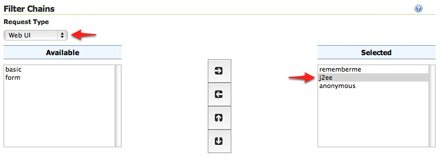
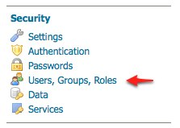
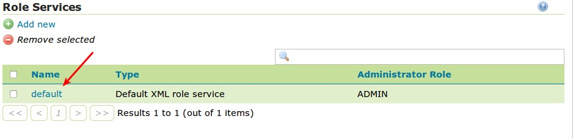
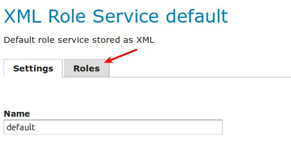
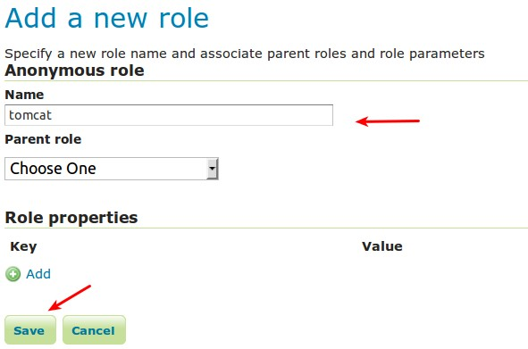

# Configuring J2EE Authentication {: #security_tutorials_j2ee }

Servlet containers such as Tomcat and Jetty offer their own options for authentication. Often it is desirable for an application such as GeoServer to use that existing authentication mechanisms rather than require its own authentication configuration.

J2EE authentication allows GeoServer to delegate to the servlet container for authentication. This tutorial walks through the process of setting up J2EE authentication.

## Prerequisites

This tutorial requires a servlet container capable of doing its own authentication. This tutorial uses Tomcat.

Deploy GeoServer in tomcat before proceeding.

## Configure the J2EE authentication filter

In order to delegate to the container for authentication a filter must first be configured to recognize the container authentication.

1.  Login to the GeoServer web admin interface as the `admin` user.

2.  Click the `Authentication` link located under the `Security` section of the navigation sidebar.

    

3.  Scroll down to the `Authentication Filter` panel and click the `Add new` link.

4.  Create a new filter named "j2ee" and fill out the settings form as follows:

    -   Set the `Role service` to "default"

    

5.  Save

6.  Back on the authentication page scroll down to the `Filter Chains` panel.

7.  Select "Web UI" from the `Request type` drop down.

8.  Select the `j2ee` filter and position it after the `anonymous` filter.

    

9.  Save.

## Configure the role service

Since it is not possible to ask a J2EE container for the roles of a principal it is necessary to have all J2EE roles enlisted in a role service. The only J2EE API GeoServer can use is:

    class: javax.servlet.http.HttpServletRequest
    method: boolean isUserInRole(String role)

The idea is to query all roles from the role service and test each role with the "isUserInRole" method.

This tutorial assumes a user named "admin" with password "password" and a J2EE role named "tomcat".

1.  Click the `Users, Groups, and Roles` link located under the `Security` section of the navigation sidebar.

    

2.  Click on `default` to work with the role service named "default".

    

3.  Click on the `Roles` tab.

    

4.  Click on the `Add new role` link.

    

    -   Set the `Name` to "tomcat"

    

5.  Save

## Configure Tomcat for authentication

By default Tomcat does not require authentication for web applications. In this section Tomcat will be configured to secure GeoServer requiring a basic authentication login.

1.  Shut down Tomcat.

2.  Edit the `conf/tomcat-users.xml` under the Tomcat root directory and add a user named "admin":

        <user username="admin" password="password" roles="tomcat"/>

3.  Edit the GeoServer `web.xml` file located at `webapps/geoserver/WEB-INF/web.xml` under the Tomcat root directory and add the following at the end of the file directly before the closing `</web-app>` element:

        <security-constraint>
          <web-resource-collection>
            <url-pattern>/*</url-pattern>
             <http-method>GET</http-method>
             <http-method>POST</http-method>
          </web-resource-collection>
          <auth-constraint>
            <role-name>tomcat</role-name>
          </auth-constraint>
        </security-constraint>

        <login-config>
          <auth-method>BASIC</auth-method>
        </login-config>

4.  Save `web.xml` and restart Tomcat.

!!! note

    It is necessary to add all the role names specified in the `web.xml` to the configured role service. This is duplicate work but there is currently no other solution.

## Test J2EE login

1.  Navigate to the GeoServer web admin interface. The result should be a prompt to authenticate.

#\. Enter in the username "admin" and password "password"

> 

The result should be the admin user logged into the GeoServer web admin.
