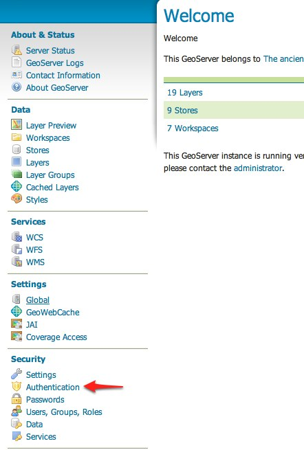
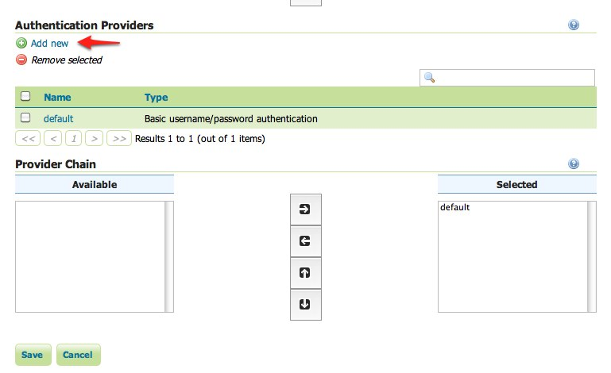
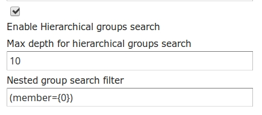

# Authentication with LDAP {: #security_tutorials_ldap }

This tutorial introduces GeoServer LDAP support and walks through the process of setting up authentication against an LDAP server. It is recommended that the [LDAP authentication](../../auth/providers.md#security_auth_provider_ldap) section be read before proceeding.

## LDAP server setup

A mock LDAP server will be used for this tutorial. Download and run the [acme-ldap](https://geoserver.org/acme-ldap/acme-ldap-1.0.jar) jar:

    java -jar acme-ldap.jar

The output of which should look like the following:

    Directory contents:
      ou=people,dc=acme,dc=org
        uid=bob,ou=people,dc=acme,dc=org
        uid=alice,ou=people,dc=acme,dc=org
        uid=bill,ou=people,dc=acme,dc=org
      ou=groups,dc=acme,dc=org
      cn=users,ou=groups,dc=acme,dc=org
        member: uid=bob,ou=people,dc=acme,dc=org
        member: uid=alice,ou=people,dc=acme,dc=org
      cn=admins,ou=groups,dc=acme,dc=org
        member: uid=bill,ou=people,dc=acme,dc=org

      Server running on port 10389

The following diagram illustrates the hierarchy of the LDAP datatabse:

> 

The LDAP tree consists of:

-   The root domain component, `dc=acme,dc=org`
-   Two organizational units (groups) named `user` and `admin`
-   Two users named `bob` and `alice` who are members of the `user` group
-   One user named `bill` who is a member of the `admin` group

## Configure the LDAP authentication provider

1.  Start GeoServer and login to the web admin interface as the `admin` user.

2.  Click the `Authentication` link located under the `Security` section of the navigation sidebar.

    > 

3.  Scroll down to the `Authentication Providers` panel and click the `Add new` link.

    > 

4.  Click the `LDAP` link.

    > 

5.  Fill in the fields of the settings form as follows:

    -   Set `Name` to "acme-ldap"
    -   Set `Server URL` to "<ldap://localhost:10389/dc=acme,dc=org>"
    -   Set `User lookup pattern` to "uid={0},ou=people"

6.  Test the LDAP connection by entering the username "bob" and password "secret" in the connection test form located on the right and click the `Test Connection` button.

    

    A successful connection should be reported at the top of the page.

7.  Save.

8.  Back on the authentication page scroll down to the `Provider Chain` panel and move the `acme-ldap` provider from `Available` to `Selected`.

    

9.  Save.

## Test a LDAP login

1.  Navigate to the GeoServer home page and log out of the admin account.

#\. Login as the user "bob" with the password "secret".

> 

Logging in as bob doesn't yield any administrative functionality because the bobaccount has not been mapped to the administrator role. In the next section GeoServer will be configured to map groups from the LDAP database to roles.

## Map LDAP groups to GeoServer roles

When using LDAP for authentication GeoServer maps LDAP groups to GeoServer roles by prefixing the group name with `ROLE_` and converting the result to uppercase. For example bob and alice are members of the `user` group so after authentication they would be assigned a role named `ROLE_USER`. Similarly bill is a member of the `admin` group so he would be assigned a role named `ROLE_ADMIN`.

1.  Log out of the web admin and log back in as the admin user.

2.  Navigate to the `Authentication` page.

3.  Scroll to the `Authentication Providers` panel and click the `acme-ldap` link.

    

4.  On the settings page fill in the following form fields:

    -   Set `Group search base` to "ou=groups"
    -   Set `Group search filter` to "member={0}"

    The first field specifies the node of the LDAP directory tree at which groups are located. In this case the organizational unit named `groups`. The second field specifies the LDAP query filter to use in order to locate those groups that a specific user is a member of. The `{0}` is a placeholder which is replaced with the `uid` of the user.

    -   Set `Group to use as ADMIN` to "ADMIN"
    -   Set `Group to use as GROUP_ADMIN` to "ADMIN"

    If you want support for hierarchical LDAP groups:

    -   Check **Enable Hierarchical groups search** box.
    -   Set `Max depth for hierarchical groups search` to 10 (-1 for infinite depth, or the depth number you want to support).
    -   Set `Nested group search filter` to "member={0}"

    

    These settings let users in the LDAP admin group to be recognized as GeoServer administrators.

5.  Save.

At this point the LDAP provider will populate an authenticated user with roles based on the groups the user is a member of.

At this point members of the `admin` LDAP group should be given full administrative privileges once authenticated. Log out of the admin account and log in as "bill" with the password "hello". Once logged in full administrative functionality should be available.

## Configure the LDAP role service

An additional step permits to configure a role service to get GeoServer roles from the LDAP repository and allow access rights to be assigned to those roles.

1.  Click the `Users,Group,Roles` link located under the `Security` section of the navigation sidebar.

2.  Click the `Add new link` under the `Role Services` section.

3.  Click the `LDAP` option under the `New Role Service` section.

    

4.  Enter `ldaprs` in the `Name` text field.

5.  Enter `ldap://localhost:10389/dc=acme,dc=org` in the `Server URL` text field.

6.  Enter `ou=groups` in the `Group search base` text field.

7.  Enter `member=uid={0},ou=people,dc=acme,dc=org` in the `Group user membership search filter` text field.

8.  Enter `cn=*` in the `All groups search filter` text field.

Then we need to a choose a user to authenticate on the server (many LDAP server don't allow anonymous data lookup).

1.  Check the `Authenticate to extract roles` checkbox.
2.  Enter `uid=bill,ou=people,dc=acme,dc=org` in the `Username` text field.
3.  Enter `hello` in the `Password` text field.

If we want Hierarchical groups working we need:

1.  Check the `Enable Hierarchical groups search` checkbox.
2.  Enter `10` in the `Max depth for hierarchical groups search` text field.
3.  Enter `member={1}` in the `Nested group search filter` text field.
4.  Save.
5.  Click the `ldaprs` role service item under the `Role Services` section.
6.  Select `ROLE_ADMIN` from the `Administrator role` combo-box.
7.  Select `ROLE_ADMIN` from the `Group administrator role` combo-box.
8.  Save again.

You should now be able to see and assign the new `ROLE_ADMIN` and `ROLE_USER` roles wherever an `Available Roles` list is shown (for example in the `Data` and `Services` rules sections.
