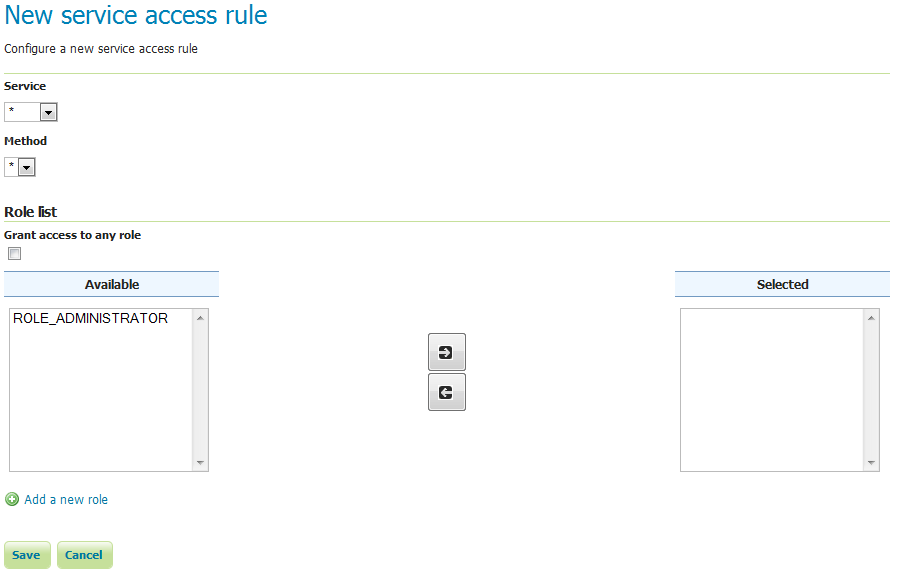

.. _security_webadmin_services:

Services
========

This section provides access to the settings for :ref:`security_service`. GeoServer can limit access based on OWS services (WFS, WMS, etc.) and their specific operations (GetCapabilities, GetMap, and so on).

By default, no service-based security is in effect in GeoServer. However rules can be added, removed, or edited here.

.. figure:: images/services.png

   Service access rules list

Clicking the :guilabel:`Add a new rule` link will create a new rule.

   New service rule

.. list-table:: 
   :widths: 40 60 
   :header-rows: 1

   * - Option
     - Description
   * - Service
     - Sets the OWS service for this rule. Options are ``*``, meaning all services, ``wcs``, ``wfs``, or ``wms``.
   * - Method
     - Sets the specific operation for this rule. Options depend on the *Service*, but include ``*``, meaning all operations, as well as every service operation known to GeoServer, such as Capabilities, Transaction, GetMap, and more.
   * - Grant access to any role
     - If selected, the rule will apply to all roles (no need to specify which ones)
   * - Role list
     - Full list of roles, including a list of roles to which the rule is associated. Association can be switched here via the arrow buttons. This option is not applied if :guilabel:`Grant access to any role` is checked.
   * - Add a new role
     - Shortcut to adding a new role
