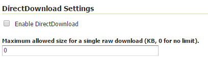

.. _csw_directdownload:

DirectDownload
==============

DirectDownload is a new operation (since GeoServer 2.9.x) supported by the CSW service.

In the Meteorology, Oceanography and Earth Observation domains, layers are usually based on complex
NetCDF/GRIB files. Protocols such as WCS are set up to allow slice, rescale and reprojection of
data, but not to preserve the original data as is.

This new operation allows direct download of the raw data for that layer.
If the DirectDownload capability is enabled for a Coverage layer, the CSW record will be updated to
contain links pointing back to the CSW service, using the DirectDownload vendor operation that will
assemble the files for the requested resource, zip them, and send the result back to the requester.

The download links (one for each data file composing the layer plus a link to get all the files
composing the layer) are added as new entries in CSW records:

* as additional **term-references** element for a Dublin Core schema 
* as additional **OnlineResource** for ISO Metadata

Those links also contain the validity domain for the file such as envelope/time/elevation/custom
dimensions (when present) for multidimensional layers.

Configuration
-------------

DirectDownload capability can be activated as default for all layers, as global CSW configuration.
Go into the CSW service panel and click on the *enable DirectDownload* checkbox if you want it enabled for all layers:

   *DirectDownload configuration (Service level)*

From this section you can also set a download size limit value (0 means no limit). The specified
value represents the maximum size (in kilobytes) of the sum of the sizes of the raw data referred
to by a single download link. (You can think about the case of a download link referring to the
whole layer data which may contain a wide set of files).

Note that the size check is performed on the raw data files prior to any compression.

Per Layer configuration
-----------------------

DirectDownload capability can also be enabled/disabled for a specific layer, which will override the
global CSW configuration.

Go to the *publishing* tab of the layer. 

.. figure:: images/layerConfig.png
   :align: center

   *Layer publishing section*

Look for the *DirectDownload settings* section. 

.. figure:: images/layerConfig2.png
   :align: center

   *DirectDownload configuration (Layer level)*
      
The configuration of this parameter follows the same rules as shown for the CSW configuration panel.

GetRecords example
^^^^^^^^^^^^^^^^^^

A GetRecords response containing a layer with DirectDownload enabled, may result having a piece
like this (using :ref:`ISO Metadata output schema<csw_iso>`)::

    ...
    <gmd:CI_OnlineResource>
      <gmd:linkage>
        <gmd:URL>
        http://localhost:8080/geoserver/ows?service=CSW&version=2.0.2&request=DirectDownload&resourceId=geosolutions:Reflectivity_height_above_ground&file=82643c5bf682f67ef8b7de737b90ada759965cd8-samplefile.grib2&ENVELOPE=-2699073.2421875,-1588806.0302734375,2697926.7578125,1588193.9697265625&TIME=2015-06-23T00:00:00.000Z/2015-06-23T00:00:00.000Z&HEIGHT_ABOVE_GROUND=1000.0/4000.0
        </gmd:URL>
      </gmd:linkage>
    </gmd:CI_OnlineResource>
    ...

That URL allows the direct download of the indicated file. Note that the filename has a SHA-1 header
to avoid publishing the underlying file system structure paths.

