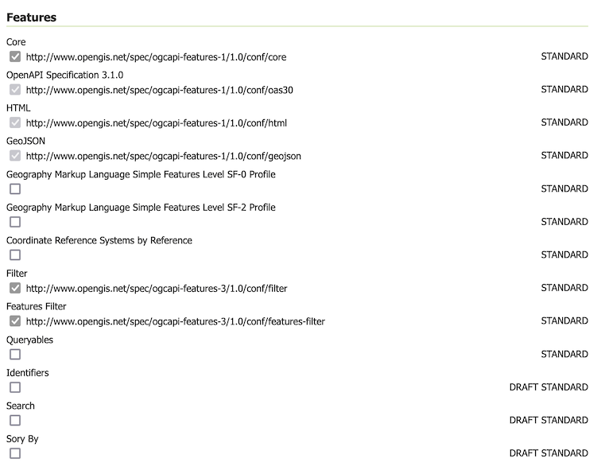
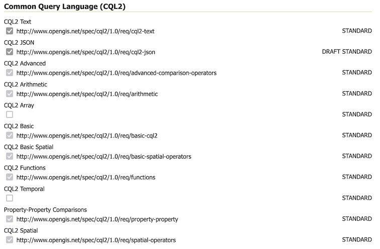
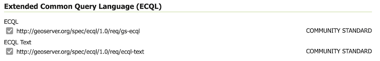

# Configuration of OGC API - Features module

The service operates as an additional protocol for sharing vector data along side Web Feature Service.

## Service configuration

The service is configured using:

- The existing [Web Feature Service (WFS)](../wfs/index.md) settings to define title, abstract, and output formats.

  This is why the service page is titled `GeoServer Web Feature Service` by default.

- Contact information defined in [Contact Information](../../configuration/contact.md).

- Extra links can be added on a per-service or per-collection basis as indicated in [OGC API Service Configuration](../../configuration/ogc-api-services/index.md).

## Feature Service conformances

The OGC API Feature Service is modular, allowing you to enable/disable the functionality you wish to include.

- By default stable Standards and Community Standards are enabled. If WFS is strict, only official Standards are enabled and community standards are disabled

- The OpenAPI service description is mandatory and may not be disabled.

- The HTML and GeoJSON output formats are built-in and may not be disabled.

  
  *Feature Service Configuration*

- CQL2 Filter conformances.

  Both the Text and JSON formats for CQL2 are available and may be enabled or disabled.

  The remaining conformances reflect the built-in CQL2 implementation and may not be edited. The conformances marked enabled have been implemented, and the disabled conformances have not yet been implemented.

  
  *CQL2 Filter configuration*

- Control of ECQL Filter conformances

  
  *ECQL Filter configuration*

For more information see [Status](status.md).
