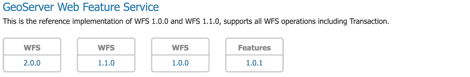

# OGC API Features Installation

## Installing OGC API Features extension

1.  Download the OGC API Features zip:

    - {{ release }} [ogcapi-features](https://build.geoserver.org/geoserver/main/ext-latest/ogcapi-features)
    - {{ version }} [ogcapi-features](https://build.geoserver.org/geoserver/main/ext-latest/geoserver-{{ version }}-SNAPSHOT-ogcapi-features-plugin.zip)

    !!! warning

        Verify that the version number in the filename corresponds to the version of GeoServer you are running (for example geoserver-{{ release }}-ogcapi-features-plugin.zip above).

2.  Extract the contents of the archive into the `WEB-INF/lib` directory of the GeoServer installation.

3.  On restart the feature services is listed on the welcome page: <http://localhost:8080/geoserver/>

    
    *GeoServer Welcome Page OGC API - Features*

4.  The feature service is available at: <http://localhost:8080/geoserver/ogc/features/v1>

## Docker use of OGC API Features extension

1.  The Docker image supports the use of OGC API Feature:

    !!! abstract "Release"


    ``` text
    docker pull docker.osgeo.org/geoserver:{{ release }}
    ```

    !!! abstract "Nightly Build"


    ``` text
    docker pull docker.osgeo.org/geoserver:{{ version }}.x
    ```

2.  To run with OGC API Features:

    !!! abstract "Release"


    ``` text
    docker run -it -p 8080:8080 \
      --env INSTALL_EXTENSIONS=true \
      --env STABLE_EXTENSIONS="ogcapi-features" \
      docker.osgeo.org/geoserver:{{ release }}
    ```

    !!! abstract "Nightly Build"


    ``` text
    docker run -it -p 8080:8080 \
      --env INSTALL_EXTENSIONS=true \
      --env STABLE_EXTENSIONS="ogcapi-features" \
      docker.osgeo.org/geoserver:{{ version }}.x
    ```

3.  The feature service is listed on the welcome page: <http://localhost:8080/geoserver/>

    
    *GeoServer Welcome Page OGC API - Features*

4.  The feature service is available at: <http://localhost:8080/geoserver/ogc/features/v1>
