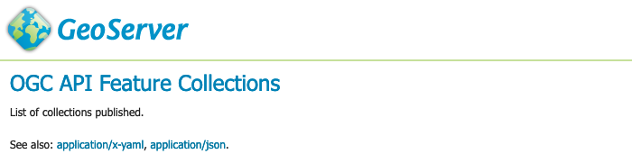

# HTML Templates

Built-in templates are used for html generation.

## Template override

To override an OGC API Features template:

1.  Create a directory **`ogc/features`** in the location you wish to override:

    - **`GEOSERVER_DATA_DIR/templates/ogc/features/v1`**
    - **`GEOSERVER_DATA_DIR/workspace/{workspace}/ogc/features/v1`**
    - **`GEOSERVER_DATA_DIR/workspace/{workspace}/{datastore}/ogc/features/v1`**
    - **`GEOSERVER_DATA_DIR/workspace/{workspace}/{datastore}/{featuretype}/ogc/features/v1`**

2.  Create a file in this location, using the GeoServer {{ release }} examples below:

    - [ogc/features/v1/landingPage.ftl](https://github.com/geoserver/geoserver/blob/main/src/extension/ogcapi/ogcapi-features/src/main/resources/org/geoserver/ogcapi/v1/features/landingPage.ftl)
    - [ogc/features/v1/collection.ftl](https://github.com/geoserver/geoserver/blob/main/src/extension/ogcapi/ogcapi-features/src/main/resources/org/geoserver/ogcapi/v1/features/collection.ftl)
    - [ogc/features/v1/collection_include.ftl](https://github.com/geoserver/geoserver/blob/main/src/extension/ogcapi/ogcapi-features/src/main/resources/org/geoserver/ogcapi/v1/features/collection_include.ftl)
    - [ogc/features/v1/collections.ftl](https://github.com/geoserver/geoserver/blob/main/src/extension/ogcapi/ogcapi-features/src/main/resources/org/geoserver/ogcapi/v1/features/collections.ftl)
    - [ogc/features/v1/queryables.ftl](https://github.com/geoserver/geoserver/blob/main/src/extension/ogcapi/ogcapi-core/src/main/resources/org/geoserver/ogcapi/queryables.ftl)
    - [ogc/features/v1/functions.ftl](https://github.com/geoserver/geoserver/blob/main/src/extension/ogcapi/ogcapi-features/src/main/resources/org/geoserver/ogcapi/v1/features/functions.ftl)

    The above built-in examples are for GeoServer {{ release }}, please check for any changes when upgrading GeoServer.

## Writing templates

For details on how to write templates see [Freemarker Templates](../../tutorials/freemarker.md) tutorial.

The following functions are specific to OGC API templates:

- `serviceLink(path*, format)` generates a link back to the same service. The first argument, mandatory, is the extra path after the service landing page, the second argument, optional, is the format to use for the link.
- `genericServiceLink(path*, k1, v1, k2, v2, ....)` generates a link back to any GeoServer OGC service, with additional query parameters. The first argument, mandatory, is the extra path after the GeoServer context path (usually `/geoserver`), the following arguments are key-value pairs to be added as query parameters to the link.
- `resourceLink(path)` links to a static resource, such as a CSS file or an image. The argument is the path to the resource, relative to the GeoServer context path (usually `/geoserver`).

## List features

To override a template used to list features:

1.  Use the directory in the location you wish to override (can be general, specific to a workspace, datastore, or feature type):

    - **`GEOSERVER_DATA_DIR/templates`**
    - **`GEOSERVER_DATA_DIR/workspace/{workspace}`**
    - **`GEOSERVER_DATA_DIR/workspace/{workspace}/{datastore}`**
    - **`GEOSERVER_DATA_DIR/workspace/{workspace}/{datastore}/{featuretype}`**

2.  Create a file in this location, using the GeoServer {{ release }} examples below:

    - [ogc/features/getfeature-complex-content.ftl](https://github.com/geoserver/geoserver/blob/main/src/extension/ogcapi/ogcapi-features/src/main/resources/org/geoserver/ogcapi/v1/features/getfeature-complex-content.ftl)
    - [ogc/features/getfeature-content.ftl](https://github.com/geoserver/geoserver/blob/main/src/extension/ogcapi/ogcapi-features/src/main/resources/org/geoserver/ogcapi/v1/features/getfeature-content.ftl)
    - [ogc/features/getfeature-empty.ftl](https://github.com/geoserver/geoserver/blob/main/src/extension/ogcapi/ogcapi-features/src/main/resources/org/geoserver/ogcapi/v1/features/getfeature-empty.ftl)
    - [ogc/features/getfeature-footer.ftl](https://github.com/geoserver/geoserver/blob/main/src/extension/ogcapi/ogcapi-features/src/main/resources/org/geoserver/ogcapi/v1/features/getfeature-footer.ftl)
    - [ogc/features/getfeature-header.ftl](https://github.com/geoserver/geoserver/blob/main/src/extension/ogcapi/ogcapi-features/src/main/resources/org/geoserver/ogcapi/v1/features/getfeature-header.ftl)

    The above built-in examples are for GeoServer {{ release }}, please check for any changes when upgrading GeoServer.

## Collection Example

Example showing how to customize a collections being listed:

1.  The file **`ogc/features/collections.ftl`** lists published collection:

    ```
    <!-- Include path goes outside docs directory: ../../../../src/extension/ogcapi/ogcapi-features/src/main/resources/org/geoserver/ogcapi/v1/features/collections.ftl -->
<!-- TODO: Copy file to docs directory or use alternative approach -->
    ```

2.  Save file to **`GEOSERVER_DATA_DIR/workspace/templates/ogc/collections.ftl`**, and rewrite as:

    ``` 
    <#include "common-header.ftl">
           <h2>OGC API Feature Collections</h2>
           <p>List of collections published.</p>
           <p>See also: <#list model.getLinksExcept(null, "text/html") as link>
              <a href="${link.href}">${link.type}</a><#if link_has_next>, </#if></#list>.</p>

         <#list model.collections as collection>
           <h2><a href="${serviceLink("collections/${collection.id}")}">${collection.id}</a></h2>
           <#include "collection_include.ftl">
         </#list>
    <#include "common-footer.ftl">
    ```

3.  Many templates are constructed using `#include`, for example **`collection.ftl`** above uses `<#include "common-header.ftl">` located next to **`collections.ftl`**.

    Presently each family of templates manages its own **`common-header.ftl`** (as shown in the difference between **`ogc/features`** service templates, and getfeature templates above).

4.  A restart is not required, the system will notice when the template is updated and apply the changes automatically.

    
    *Template collections.ftl override applied*

5.  Language codes are appended for internationalization. For French create the file **`GEOSERVER_DATA_DIR/workspace/{workspace}/ogc/collections_fr.ftl`** and translate contents:

    ``` 
    <#include "common-header.ftl">
           <h2>OGC API Feature Service</h2>
           <p>Liste des collections publiées.</p>
           <p>Voir également: <#list model.getLinksExcept(null, "text/html") as link>
              <a href="${link.href}">${link.type}</a><#if link_has_next>, </#if></#list>.</p>

         <#list model.collections as collection>
           <h2><a href="${serviceLink("collections/${collection.id}")}">${collection.id}</a></h2>
           <#include "collection_include.ftl">
         </#list>
    <#include "common-footer.ftl">
    ```
