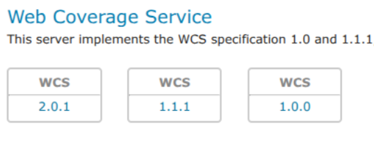

# Installing the WCS 1.0 and 1.1 extensions

GeoServer includes WCS 2.0 support in its core installation. However, WCS 1.0 and 1.1 support has been moved to an optional extension and must be installed separately if you need WCS 1.0 and 1.1.

To install the WCS 1.0 and 1.1 extensions:

1.  Navigate to the [GeoServer download page](https://geoserver.org/download).

2.  Find the page that matches the exact version of GeoServer you are running.

    !!! warning

        Be sure to match the version of the extension with that of GeoServer, otherwise errors will occur.

3.  Download the needed extension:

    **WCS 1.0**:

    - {{ release }} [geoserver-{{ release }}-wcs1_0-plugin.zip](https://sourceforge.net/projects/geoserver/files/GeoServer/{{ release }}/extensions/geoserver-{{ release }}-wcs1_0-plugin.zip)
    - {{ snapshot }} [geoserver-{{ snapshot }}-wcs1_0-plugin.zip](https://build.geoserver.org/geoserver/main/ext-latest/geoserver-{{ snapshot }}-wcs1_0-plugin.zip)

    **WCS 1.1**:

    - {{ release }} [geoserver-{{ release }}-wcs1_1-plugin.zip](https://sourceforge.net/projects/geoserver/files/GeoServer/{{ release }}/extensions/geoserver-{{ release }}-wcs1_1-plugin.zip)
    - {{ snapshot }} [geoserver-{{ snapshot }}-wcs1_1-plugin.zip](https://build.geoserver.org/geoserver/main/ext-latest/geoserver-{{ snapshot }}-wcs1_1-plugin.zip)

    The download link for **WCS 1.0** or **WCS 1.1** will be in the **Extensions** section under **Other**.

4.  Extract the files in these archives to the **`WEB-INF/lib`** directory of your GeoServer installation.

5.  Restart GeoServer.

After restarting, load the [Web administration interface](../../webadmin/index.md). If the extensions loaded properly, WCS 1.0 and 1.1 support will be available alongside the core WCS 2.0 functionality. If you encounter any issues, check the logs for errors.

