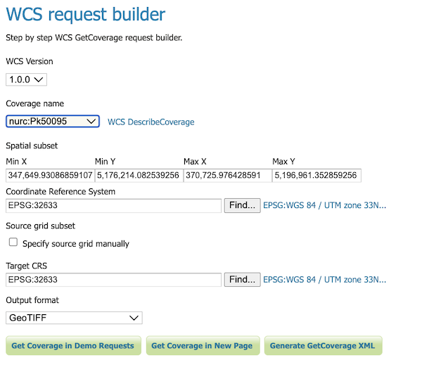
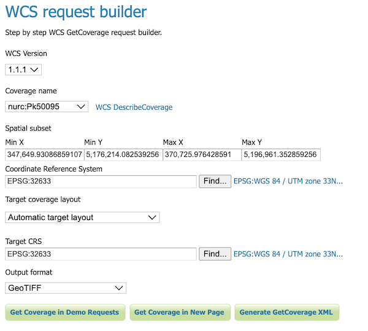

.. _wcs_request_builder:

WCS Request Builder
===================

GeoServer includes a request builder for building and testing out WCS requests. Since WCS requests can be cumbersome to author, this tool can make working with WCS much easier.

Accessing the WCS Request Builder
---------------------------------

To access the WCS Request Builder:

#. Navigate to the :ref:`web_admin`.

#. Click the :ref:`demos` link on the left side.

#. Select :guilabel:`WCS Request Builder` from the list of demos.

.. figure:: img/demos_wcsrequestbuilder.png

   WCS request builder in the list of demos

Using the WCS Request Builder
-----------------------------

The WCS Request Builder consists of a form which can be used to generate a number of different types of requests.

When first opened, the form is short, only including the following options:

* :guilabel:`WCS Version`—Version of WCS to use when crafting the request. Options are :guilabel:`1.0.0` and :guilabel:`1.1.1`.

* :guilabel:`Coverage name`—Coverage to use in the request. Any published (raster) layer in GeoServer can be selected.

  .. note:: All other options displayed will be non-functional until :guilabel:`Coverage name` is selected.

.. figure:: img/wcsrequestbuilder.png

   WCS request builder in its initial form

Once selected, the remainder of the form will be displayed. The following options are available:

* :guilabel:`Spatial subset`—Sets the extent of the GetCoverage request in units of the layer CRS. Defaults to the full extent of the layer.

* :guilabel:`Coordinate reference system`—Source CRS of the layer. Default is the CRS of the layer in GeoServer.

* :guilabel:`Specify source grid manually` *(1.0.0 only)*—If checked, allows for determining the grid of pixels for the output.

* :guilabel:`Target coverage layout` *(1.1.1 only)*—Specifies how the dimensions of the output grid will be determined:

  * :guilabel:`Automatic target layout`—Sets that the output grid will be determined automatically.

  * :guilabel:`Specify grid resolutions`—Sets the resolution of the output grid. X and Y resolutions can be set differently.

  * :guilabel:`Specify "grid to world" transformation`—Sets the output using latitude/longitude, as well as X and Y scale and shear values.

* :guilabel:`Target CRS`—CRS of the result (output) of the GetCoverage request. If different from the :guilabel:`Coordinate reference system`, the result will be a reprojection into the target CRS.

* :guilabel:`Output format`—Format of the result (output) of the GetCoverage request. Any valid WCS output format is allowed. Default is :guilabel:`GeoTIFF`.

   WCS request builder form (WCS version 1.0.0)

   WCS request builder form (WCS version 1.1.1)

There is also a link for :guilabel:`Describe coverage` next to the :guilabel:`Coverage name` which will execute a :ref:`WCS DescribeCoverage <wcs_describecoverage>` request for the particular layer.

At the bottom of the form are two buttons for form submission:

* :guilabel:`Get Coverage`—Executes a GetCoverage request using the parameters in the form. This will usually result in a file which can be downloaded.

* :guilabel:`Generate GetCoverage XML`—Generates the GetCoverage request using the parameters in the form and then, instead of executing it, outputs the request itself to the screen.

.. figure:: img/wcsrequestbuilder_xml.png

   WCS request builder showing GetCoverage XML
