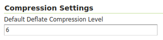

# WCS settings {: #services_webadmin_wcs }

This page details the configuration options for WCS in the web administration interface.

The Web Coverage Service (WCS) provides few options for changing coverage functionality. While various elements can be configured for WFS and WMS requests, WCS allows only metadata information to be edited. This metadata information, entitled **Service Metadata**, is common to WCS, WFS and WMS requests.

*WCS Configuration page*

## Workspace

Select **workspace** empty to configure global WCS settings.

See section on [Workspace Services](../../data/webadmin/workspaces.md#workspace_services) to override settings used by WCS [Virtual Services](../../configuration/virtual-services.md).

## WCS Service Metadata

For a description of WCS settings, see the section on [Service Metadata](../../configuration/service-metadata/index.md).

## i18n Settings

Select the default language for the WCS Service.

*Default language*

See the [Internationalization (i18n)](../../configuration/internationalization/index.md) section for a description of how this setting is used.

## Compression Settings

Specify the default level for Deflate compression when requesting a coverage in TIFF format with Deflate compression.

*Default Deflate compression level*
