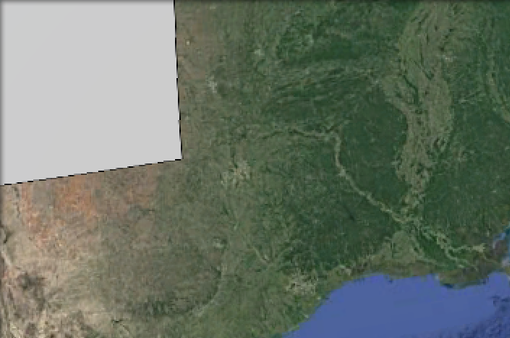
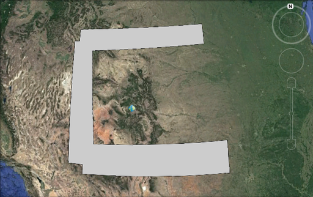
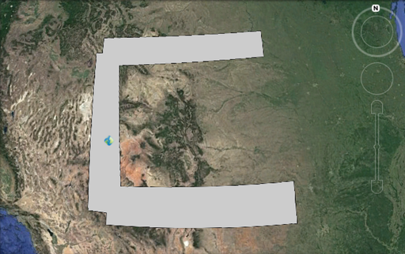

# KML Placemark Placement {: #ge_feature_kml_centroids }

The placemark "placement" (also referred to as the "centroid") refers to the location of the placemark icon with respect to the feature geometry itself. Historically this placement has been chosen to be simply the centroid of the feature geometry. This section describes options for controlling placement were introduced.

## Clipping

The `KMCENTROID_CLIP` option determines whether the feature geometry should be clipped to the viewport before the centroid is calculated. This will ensure that the placemark icon always falls within the viewport, even in cases part of a geometry falls outside of it.

The option is set to either `true` or `false`. The default value is`false`.

As an example consider the following square polygon with its placemark icon. When the polygon is entirely in the viewport the placement is good.

When the polygon moves out of the viewport the icon is lost as in the following figure:

When `KMCENTROID_CLIP` set to `true` only the part of the geometry intersecting the viewport is considered.

## Sampling for internal point

The `KMCENTROID_CONTAIN` option determines whether point chosen for the centroid must fall within the feature geometry. For irregularly shaped geometries (like a "C" shaped polygon) the default centroid calculation will fall outside of the geometry. The option is set to either `true` or `false`. The default value is `false`.

In order to find a contained point of a polygon a sampling tequnique is used where a number of points are chosen until one is found that falls within the polygon. The `KMCENTROID_SAMPLE` option determines how many samples to attempt. The value is an integer with a default value is 5. Note that this option only applies when `KMCENTROID_CONTAIN` is set to `true`.

As an example consider the following "c" shaped polygon with its placemark icon. By default the icon falls outside of the polygon.

When `KMCENTROID_CONTAIN` set to `true` a point within the polygon is chosen.

!!! note

    The sampling tequnique may not always be able to find a suitable point. You can try to increase the number of samples but it is still not a guarantee. Care also must be taken when increasing the sample count since it adds overhead to the overall KML rendering process.
