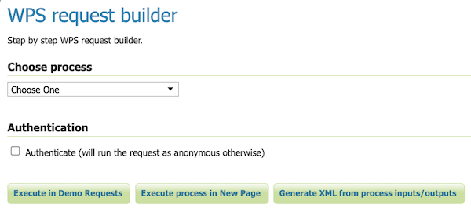
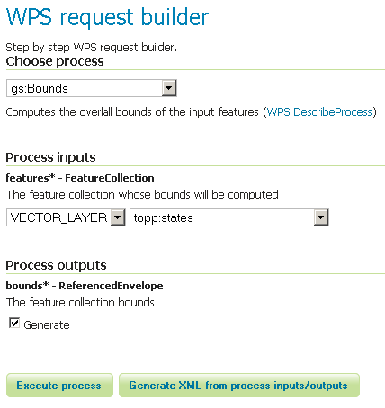
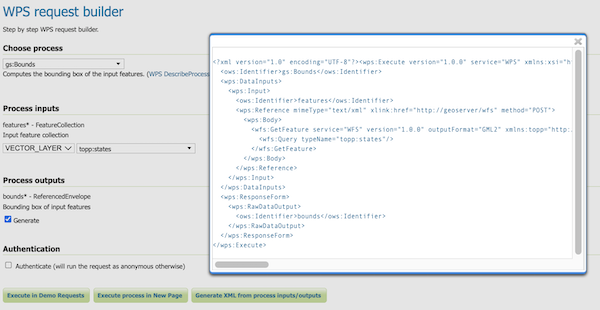

# WPS Request Builder {: #wps_request_builder }

The GeoServer WPS extension includes a request builder for testing out WPS processes through the [Web administration interface](../../webadmin/index.md). This tool can also be used to demonstrate processes, and construct your own examples.

## Accessing the request builder

To access the WPS Request Builder:

1.  Navigate to the main [Web administration interface](../../webadmin/index.md).
2.  Click on the **Demos** link on the left side.
3.  Select **WPS Request Builder** from the list of demos.

*WPS request builder in the list of demos*

## Using the request builder

The WPS Request Builder primarily consists of a selection box listing all of the available processes, and two buttons, one to submit the WPS request, and another to display what the POST request looks like.

*Blank WPS request builder form*

The display changes depending on the process and input selected. JTS processes have available as inputs any of a GML/WKT-based feature collection, URL reference, or subprocess. GeoServer-specific processes have all these as options and also includes the ability to choose a GeoServer layer as input.

For each process, a form will display based on the required and optional parameters associated with that process, if any.

*WPS request builder form to determine the bounds of topp:states*

To see the process as a POST request, click the **Generate XML from process inputs/outputs** button.

*Raw WPS POST request for the above process*

To execute the process, click the **Execute Process** button. The response will be displayed in a window or

*WPS server response*
