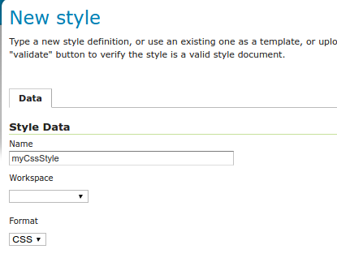

.. _css_install:

Installing the GeoServer CSS extension
======================================

The CSS extension is listed among the other extension downloads on the GeoServer download page.

The installation process is similar to other GeoServer extensions:

#. Download the :download_extension:`css`
   
   Verify that the version number in the filename corresponds to the version of GeoServer you are running (for example |release| above).

#. Extract the contents of the archive into the :file:`WEB-INF/lib` directory in GeoServer.
   Make sure you do not create any sub-directories during the extraction process.

#. Restart GeoServer.

If installation was successful, you will see a new CSS entry in the :ref:`styling_webadmin` editor. 

   CSS format in the new style page

After installation, you may wish to read the tutorial: :ref:`Styling data with CSS <css_tutorial>`.
