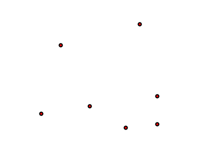

.. _mbstyle_cookbook.points:

Points
======

Points are seemingly the simplest type of shape, possessing only position and no other dimensions. MBStyle has a ``circle`` type that can be styled to represent a point.

.. _mbstyle_cookbook_points_attributes:

Example points layer
--------------------

The :download:`points layer <artifacts/mbstyle_cookbook_point.zip>` used for the examples below contains name and population information for the major cities of a fictional country. For reference, the attribute table for the points in this layer is included below.

.. list-table::
   :widths: 30 40 30
   :header-rows: 1

   * - ``fid`` (Feature ID)
     - ``name`` (City name)
     - ``pop`` (Population)
   * - point.1
     - Borfin
     - 157860
   * - point.2
     - Supox City
     - 578231
   * - point.3
     - Ruckis
     - 98159
   * - point.4
     - Thisland
     - 34879
   * - point.5
     - Synopolis
     - 24567
   * - point.6
     - San Glissando
     - 76024
   * - point.7
     - Detrania
     - 205609

:download:`Download the points shapefile <artifacts/mbstyle_cookbook_point.zip>`

.. _mbstyle_cookbook_points_simplepoint:

Simple point
------------

This example specifies points be styled as red circles with a diameter of 6 pixels.

.. figure:: ../../sld/cookbook/images/point_simplepoint.png

   Simple point

Code
~~~~

:download:`Download the "Simple point" MBStyle JSON <artifacts/mbstyle_simple_point_circle.json>`

.. code-block:: json
  :linenos:

  {
    "version": 8,
    "name": "point-circle-test",
    "layers": [
      {
        "id": "point",
        "type": "circle",
        "paint": {
          "circle-radius": 3,
          "circle-color": "#FF0000",
          "circle-pitch-scale": "map"
        }
      }
    ]
  }

Details
~~~~~~~

There is one layer in this MBStyle, which is the simplest possible situation. The "version" must always be set to 8. Layers is required for any MBStyle as an array. "id" is required and is a unique name for that layer. For our examples we will be setting the "type" to "circle".

.. _mbstyle_cookbook_points_simplepointwithstroke:

Simple point with stroke
------------------------

This example adds a stroke (or border) around the :ref:`mbstyle_cookbook_points_simplepoint`, with the stroke colored black and given a thickness of 2 pixels.

   Simple point with stroke

Code
~~~~

:download:`Download the "Simple point with stroke" MBStyle JSON <artifacts/mbstyle_simple_point_circle_stroke.json>`

.. code-block:: json
  :linenos:

  {
    "version": 8,
    "name": "point-circle-test",
    "layers": [
      {
        "id": "point",
        "type": "circle",
        "paint": {
          "circle-radius": 3,
          "circle-color": "#FF0000",
          "circle-pitch-scale": "map",
          "circle-stroke-color": "#000000",
          "circle-stroke-width": 2
        }
      }
    ]
  }

Details
~~~~~~~

This example is similar to the :ref:`mbstyle_cookbook_points_simplepoint` example. **Lines 12-13** specify the stroke,
with **line 12** setting the color to black (``'#000000'``) and **line 13** setting the width to 2 pixels.
