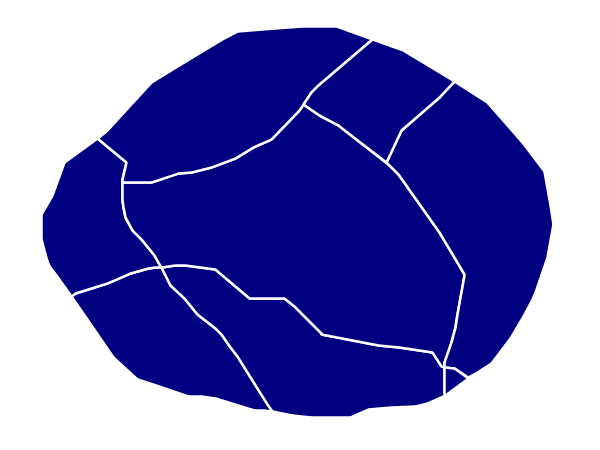
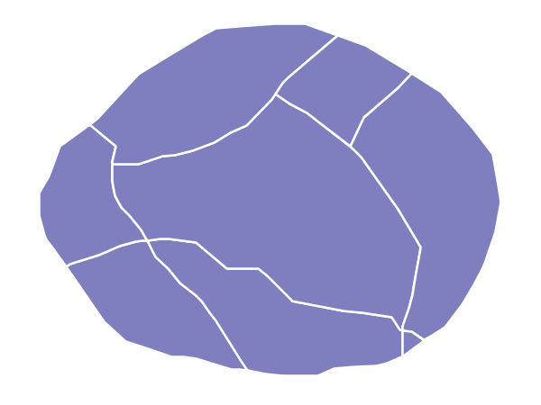

# Polygons

Polygons are two dimensional shapes that contain both an outer stroke (or "outline") and an inside (or "fill"). A polygon can be thought of as an irregularly-shaped point and is styled in similar ways to circles.

## Example polygons layer {: #mbstyle_cookbook_polygons_attributes }

The [polygons layer](artifacts/mbstyle_cookbook_polygon.zip) used below contains county information for a fictional country. For reference, the attribute table for the polygons is included below.

  ------------------------------------------------------------------------
  `fid` (Feature ID)    `name` (County name)         `pop` (Population)
  --------------------- ---------------------------- ---------------------
  polygon.1             Irony County                 412234

  polygon.2             Tracker County               235421

  polygon.3             Dracula County               135022

  polygon.4             Poly County                  1567879

  polygon.5             Bearing County               201989

  polygon.6             Monte Cristo County          152734

  polygon.7             Massive County               67123

  polygon.8             Rhombus County               198029
  ------------------------------------------------------------------------

[Download the polygons shapefile](artifacts/mbstyle_cookbook_polygon.zip)

## Simple polygon {: #mbstyle_cookbook_polygons_simplepolygon }

This example shows a polygon filled in blue.


*Simple polygon*

### Code

[Download the "Simple polygon" MBStyle](artifacts/mbstyle_cookbook_polygons_simplepolygon.json)

``` {.json linenos=""}
{
  "version": 8,
  "name": "simple-polygon",
  "layers": [
    {
      "id": "polygon",
      "type": "fill",
      "paint": {
        "fill-color": "#000080"
      }
    }
  ]
}
```

### Details

There is one layer for this style, which is the simplest possible situation. Styling polygons is accomplished via the fill type (**line 7**). **Line 9** specifies dark blue (`'#000080'`) as the polygon's fill color.

!!! note

    The light-colored outlines around the polygons in the figure are artifacts of the renderer caused by the polygons being adjacent. There is no outline in this style.

## Simple polygon with stroke {: #mbstyle_cookbook_polygons_simplepolygonwithstroke }

This example adds a 1 pixel white outline to the [Simple polygon](polygons.md#mbstyle_cookbook_polygons_simplepolygon) example.


*Simple polygon with stroke*

### Code

[Download the "Simple polygon with stroke" MBStyle](artifacts/mbstyle_cookbook_polygons_simplepolygonwithstroke.json)

``` {.json linenos=""}
{
  "version": 8,
  "name": "simple-polygon-outline",
  "layers": [
    {
      "id": "polygon-outline",
      "type": "fill",
      "paint": {
        "fill-outline-color": "#FFFFFF",
        "fill-color": "#000080"
      }
    }
  ]
}
```

### Details

This example is similar to the [Simple polygon](polygons.md#mbstyle_cookbook_polygons_simplepolygon) example above, with the addition of `fill-outline` paint parameter (**line 9**). **Line 9** also sets the color of stroke to white (`'#FFFFFF'`), the `"fill-outline-color"` can only be 1 pixel, a limitation of MBStyle.

## Transparent polygon

This example builds on the [Simple polygon with stroke](polygons.md#mbstyle_cookbook_polygons_simplepolygonwithstroke) example and makes the fill partially transparent by setting the opacity to 50%.


*Transparent polygon*

### Code

[Download the "Transparent polygon" MBStyle](artifacts/mbstyle_polygon_transparentpolygon.json)

``` {.json linenos=""}
{
  "version": 8,
  "name": "simple-polygon-transparent",
  "layers": [
    {
      "id": "polygon-transparent",
      "type": "fill",
      "paint": {
        "fill-outline-color": "#FFFFFF",
        "fill-color": "#000080",
        "fill-opacity": 0.5
      }
    }
  ]
}
```

### Details

This example is similar to the [Simple polygon with stroke](polygons.md#mbstyle_cookbook_polygons_simplepolygonwithstroke) example, save for defining the fill's opacity in **line 11**. The value of 0.5 results in partially transparent fill that is 50% opaque. An opacity value of 1 would draw the fill as 100% opaque, while an opacity value of 0 would result in a completely transparent (0% opaque) fill. In this example, since the background is white, the dark blue looks lighter. Were the fill imposed on a dark background, the resulting color would be darker.
