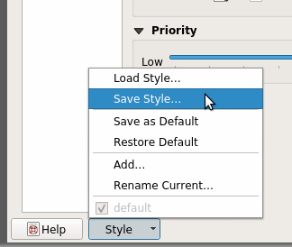
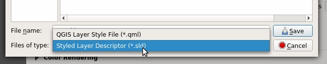
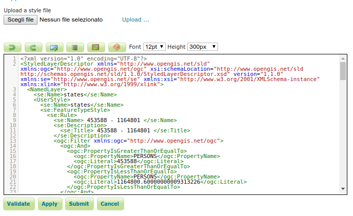
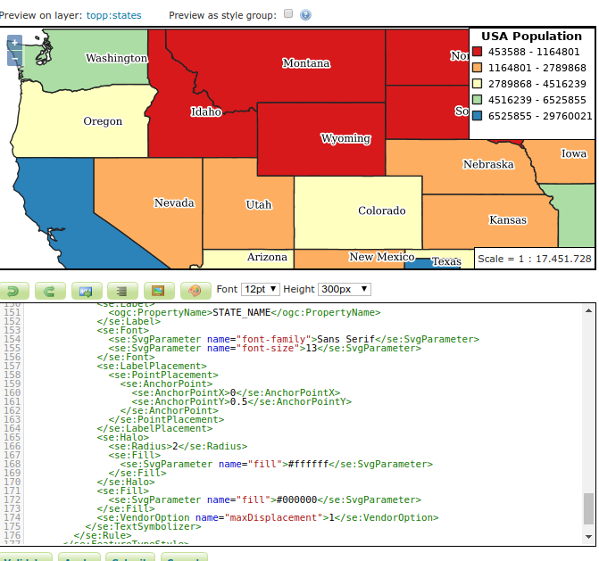
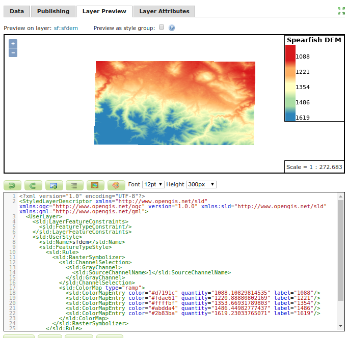
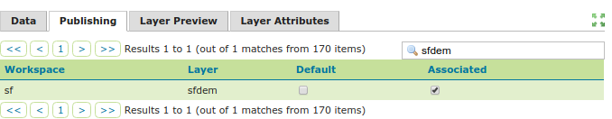
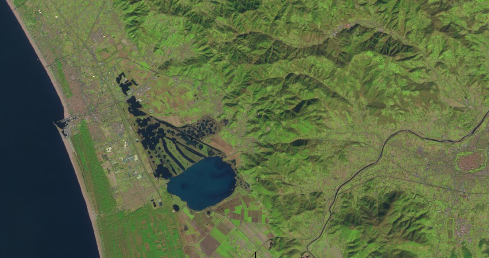
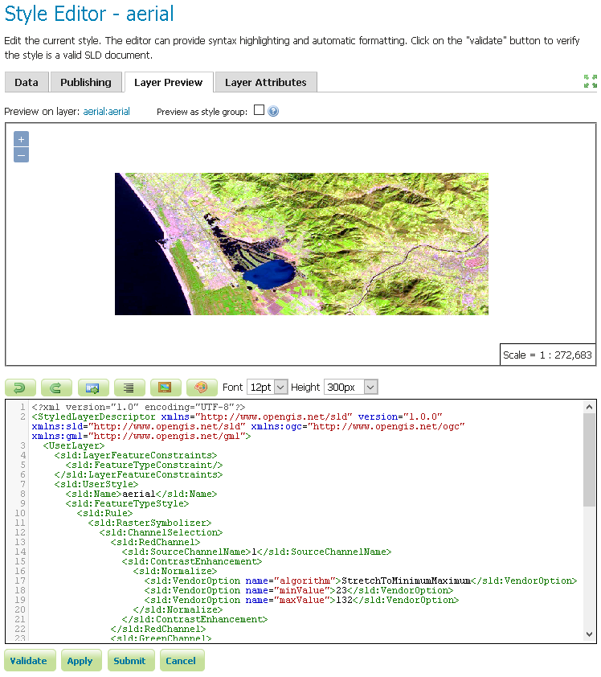

# Generating SLD styles with QGIS

QGIS includes a sophisticated style editor with many map rendering possibilities. Styles generated with QGIS can then be exported (with limitations) to SLD for usage with GeoServer.

QGIS style exporting abilities have been evolving over time, as a reference:

-   For vector data QGIS exports SLD 1.1 styles that can be read by GeoServer. In order to get the suitable results it's important to use QGIS 3.0 or newer, and GeoServer 2.13.x or newer.
-   Raster data styling export is new in QGIS 3.4.5 (yet to be released at the time of writing). This new version exports SLD 1.0 styles with vendor extensions to support contrast stretching that most recent GeoServer versions support properly. For older QGIS versions limited export functionality is available using the SLD4Raster plugin.

For the export it is advised to use the **Save As** functionality available in the style dialog, as indicated below in this guide. Other plugins exist that streamline the export process, but they may ruin the style trying to adapt it to older GeoServer versions (e.g., translating it down to SLD 1.0 by simple text processing means), or rewrite it entirely.

!!! warning

    Despite the progress in the last years, it is known that not all QGIS rendering options are supported by SLD and/or by GeoServer (e.g. shapeburst symbology), and that support for exporting some parts is simply missing (e.g.. expression based symbology is supported in SLD, but QGIS won't export it). If you are interested, both projects would welcome sponsoring to improve the situation.

## Exporting vector symbology

This is a step by step guide to style a GeoServer demo layer, `sfdem`.

1.  Open ***QGIS*** (minimum version 3.0)

2.  Load the **`states.shp`** dataset from the GeoServer data directory, **`<GEOSERVER_DATA_DIR>/data/shapefiles/states.shp`**

3.  Double click the layer to open the **Properties** dialog and switch to the **Symbology** page.

4.  Choose a ``Graduated`` rendering, on the `PERSONS` column, and click on **Classify** button to generate ``1.5`` standard deviations, select the ``spectral`` color ramp, switch mode to ``Quantile`` and finally and click on the **Classify** button to generate a 5 classes map, as shown in figure.

    
    *QGIS vector styling*

5.  Switch to the **Labels** page, choose ``Single labels````, label with the ````STATE NAME``\` attribute and choose your preferred text rendering options, as shown in figure

    ``` raw_markdown
    
    *QGIS labelling*
    ```

6.  The layer renders as follows:

    ``` raw_markdown
    
    *QGIS raster styling*
    ```

7.  Go back At the **Properties** dialog, from the bottom of the **Styles** page, choose **Style \--\> Save Style**.

    ``` raw_markdown
    
    *Export using Save As...*
    ```

8.  Choose export in the SLD format, placing the file in the desired location.

    ``` raw_markdown
    
    *Choosing export format...*
    ```

9.  Go in GeoServer, create a new style, use the **Upload a new style** dialog to choose the exported file, and click on ``upload`` link.

    ``` raw_markdown
    
    *Uploading style in GeoServer...*
    ```

10. Click on guilabel:``Apply``.

11. Change to the **Layer preview** tab, click on the **Preview on Layer** link to choose `topp:states` to verify proper rendering.

    ``` raw_markdown
    
    *Previewing style in GeoServer...*
    ```

12. Eventually switch to the **Publishing** tab, search for `states`, and select **Default** or **Associated** checkbox to publish the layer to use the new style permanently.

    ``` raw_markdown
    
    *Associating style in GeoServer...*
    ```

## Exporting raster symbology

The following are a couple of examples on how to export raster layers\' symbology in QGIS and how to use the resulting SLD to style layers in GeoServer.

!!! warning

    As mentioned above, this functionality has some limitations:
    
    -   **Hillshading** vendor options are not fully supported by GeoServer so you can\'t choose the ``Band`` and the position of the sun (``Altitude`` and ``Azimuth``), the ``Multidirectional`` option is not supported too
    -   GeoServer is not able to interpret the **Color Rendering** options yet

This is a step by step guide to style a GeoServer demo layer, `sfdem`.

1.  Open QGIS (minimum version 3.4.5)

2.  Load the **\`sfdem.tif\`** raster from the GeoServer data directory, **\`\<GEOSERVER_DATA_DIR\>/data/sf/sfdem.tif\`**

3.  Double click the layer to open the **Properties** dialog and switch to the **Symbology** page.

4.  Choose a ``Singleband pseudocolor`` rendering, Generate **Min / Max Value Settings** using **Mean +/- standard deviation** with using `1.5` standard deviations. Generate a 5 classes **Linear** interpolated map, as shown in figure.

    ``` raw_markdown
    
    *QGIS raster styling*
    ```

5.  The layer renders as follows:

    ``` raw_markdown
    
    *QGIS raster styling*
    ```

6.  Return to the layer\'s **Properties** dialog **Symbology** page, at the bottom of the page choose **Style \--\> Save Style**.

    ``` raw_markdown
    
    *Export using Save As...*
    ```

7.  Choose export in the SLD format, placing the file in the desired location

    ``` raw_markdown
    
    *Choosing export format...*
    ```

8.  Go in GeoServer, create a new style, use the **Upload a new style** dialog to choose the exported file, and click on ``upload`` link.

    ``` raw_markdown
    
    *Uploading style in GeoServer...*
    ```

9.  Click on guilabel:``Apply`` then change to the **Layer preview** tab. Click on the **Preview on Layer** link to choose `sfdem` to verify proper rendering.

    ``` raw_markdown
    
    *Previewing style in GeoServer...*
    ```

10. Finally switch to the **Publishing** tab, search for `sfdem` layer, and select **Default** or **Associated** checkbox to publish `sfdem` with the new style.

    ``` raw_markdown
    
    *Associating style in GeoServer...*
    ```

The next example shows how to style an aerial image instead.

1.  Download an aerial image (for example from [USGS Landsat image archives](https://landsatlook.usgs.gov/sentinel2/viewer.html)) if you do not already have one. Give it a name (`aerial` in this example) and **save it as GeoTIFF**

    ``` raw_markdown
    
    *aerial.tiff*
    ```

2.  Open GeoServer, **create a new Store** (see [Add a Store](../../data/webadmin/stores.rst#data_webadmin_stores_add_a_store)), **add a GeoTIFF Raster Data Source** to the Store and **connect** it to your `aerial.tif` file

3.  In GeoServer, **create a new Layer** (see [Add a Layer](../../data/webadmin/layers.rst#data_webadmin_layers_add_a_layer)) choosing the Store you have created in the previous step

4.  Open QGIS (minimum version 3.4.5)

5.  Load the `aerial.tif` raster

6.  Double click the layer to open the **Properties** dialog and switch to the **Symbology** page

7.  Choose a ``Multiband color`` rendering, set the **bands** (Red band == Band 1 (red), Green band == Band 2 (Green), Blue band == Band 3 (Blue)), generate **Min / Max Value Settings** using `5,0 - 95,0 % range` of **Cumulative count cut** and select `Stretch to MinMax` as **Contrast enhancement** option, as shown in the picture below

    ``` raw_markdown
    
    *QGIS layer properties - Symbology*
    ```

8.  The layer renders as follows:

    ``` raw_markdown
    
    *QGIS layer rendering*
    ```

9.  **Save the Style** as SLD

10. Go in GeoServer, use the generated SLD to **create a new style**, choose the `aerial` layer through the **Preview on Layer** link and verify if the layer is properly rendered (see the previous example for further details)

    ``` raw_markdown
    
    *GeoServer layer rendering*
    ```

11. Finally **Publish** the `aerial` layer with the new style as described in the previous example.
