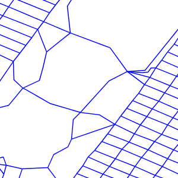
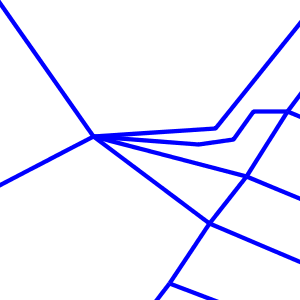

.. _unit_of_measure:

Specifying symbolizer sizes in ground units
=============================================

The SLD 1.0 specification allows giving symbolizer sizes in a single unit of measure: pixels.  
This means that the size of symbolizers is the same at all zoom levels (which is usually the desired behaviour).

The Symbology Encoding 1.1 specification provides a ``uom`` attribute on ``Symbolizer`` elements.  
This allows specifying styling parameter sizes in ground units of metres or feet, as well as the default which is screen pixels. 
When ground units are used, the screen size of styled elements increases as the map is zoomed in to larger scales.  
GeoServer supports the SE 1.1 ``uom`` attribute in its extended SLD 1.0 support.  

.. note:: This extended feature is officially supported in GeoServer 2.1.0.  It is available in GeoServer 2.0.3 if the ``-DenableDpiUomRescaling=true`` system variable is specified for the JVM.

The value of the ``uom`` attribute is a URI indicating the desired unit.  The units of measure supported are those given in the SE 1.1 specification::

   http://www.opengeospatial.org/se/units/metre
   http://www.opengeospatial.org/se/units/foot
   http://www.opengeospatial.org/se/units/pixel

.. note:: The ``px`` override modifier for parameters values is not currently supported. 

Example
-------

The following SLD shows the ``uom`` attribute used to specify the width of a ``LineSymbolizer`` in metres: 

.. code-block:: xml

	<?xml version="1.0" encoding="ISO-8859-1"?>
	<StyledLayerDescriptor version="1.0.0" xmlns="http://www.opengis.net/sld" xmlns:ogc="http://www.opengis.net/ogc"
	  xmlns:xlink="http://www.w3.org/1999/xlink" xmlns:xsi="http://www.w3.org/2001/XMLSchema-instance">
	  <NamedLayer>
	    <Name>5m blue line</Name>
	    <UserStyle>
	      <Title>tm blue line</Title>
	      <Abstract>Default line style, 5m wide blue</Abstract>
	      
	      <FeatureTypeStyle>
	        <Rule>
	          <Title>Blue Line, 5m large</Title>
	          <LineSymbolizer uom="http://www.opengeospatial.org/se/units/metre">
	            <Stroke>
	              <CssParameter name="stroke">#0000FF</CssParameter>
	              <CssParameter name="stroke-width">5</CssParameter>
	            </Stroke>
	          </LineSymbolizer>
	        </Rule>
	
	      </FeatureTypeStyle>
	    </UserStyle>
	  </NamedLayer>
	</StyledLayerDescriptor>

Applying the style to the ``tiger:tiger_roads`` dataset shows how the line widths increase as the map is zoomed in:

.. figure:: images/roads_uom1.png

   
