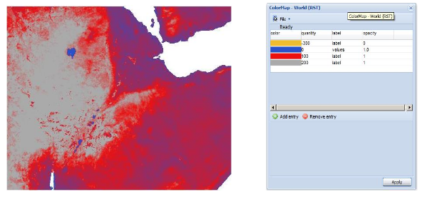
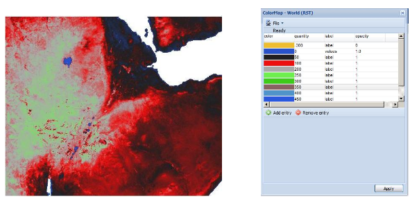
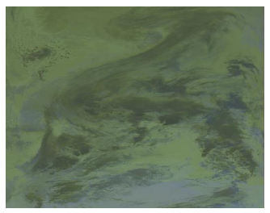
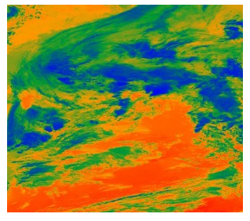
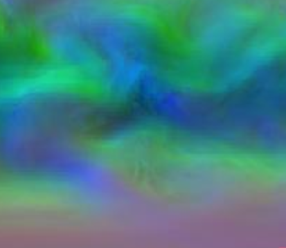
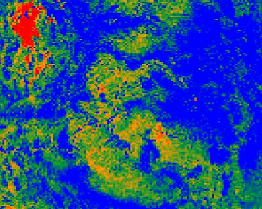

.. _sld_reference_rastersymbolizer:

RasterSymbolizer
================

GeoServer supports the ability to display raster data in addition to vector data.

Raster data is not merely a picture, rather it can be thought of as a grid of georeferenced information, much like a graphic is a grid of visual information (with combination of reds, greens, and blues). 
Unlike graphics, which only contain visual data, each point/pixel in a raster grid can have many different attributes (bands), with possibly none of them having an inherently visual component.

With the above in mind, one needs to choose how to visualize the data, and this, like in all other cases, is done by using an SLD. 
The analogy to vector data is evident in the naming of the tags used. 
Vectors, consisting of points, line, and polygons, are styled by using the ``<PointSymbolizer>``, ``<LineSymbolizer>``, and ``<PolygonSymbolizer>`` tags. 
It is therefore not very surprising that raster data is styled with the tag <RasterSymbolizer>.

Syntax
-------------------

The following elements can be used inside the ``<RasterSymbolizer>`` element.

    - <Opacity>
    - <ColorMap>
    - <ChannelSelection>
    - <ContrastEnhancement>
    - <ShadedRelief> *
    - <OverlapBehavior> *
    - <ImageOutline> *

.. warning::  The starred (*) elements are not yet implemented in GeoServer.

Opacity
^^^^^^^

The ``<Opacity>`` element sets the transparency level for the entire rendered image. 
As is standard, the values range from zero (0) to one (1), 
with zero being transparent, and one being opaque. 
The syntax is:

.. code-block:: xml

	<Opacity>0.5</Opacity>

where, in this case, the raster is rendered at 50% opacity.

ColorMap
^^^^^^^^

The ``<ColorMap>`` element defines the color values for the pixels 
of a raster image, as either color gradients,
or a mapping of specific values to fixed colors.

A color map is defined by a sequence of ``<ColorMapEntry>`` elements.
Each ``<ColorMapEntry>`` element specifies a ``color`` and a ``quantity`` attribute. 
The quantity refers to the value of a raster pixel. 
The ``color`` value is denoted in standard hexadecimal RGB format (#RRGGBB).
``<ColorMapEntry>`` elements can also have ``opacity`` and ``label`` attributes.
The ``opacity`` attribute overrides the global ``<Opacity>`` value.
The ``label`` attribute is used to provide text for legends.
A color map can contain up to 255 ``<ColorMapEntry>`` elements.

The simplest ``<ColorMap>`` has two color map entries. 
One specifyies a color for the "bottom" of the dataset, 
and the other specifyies a color for the "top" of the dataset. 
Pixels with values equal to or less than the minimum value
are rendered with the bottom color (and opacity).
Pixels with values equal to or great than the maximum value
are rendered with the top color and opacity.
The colors for values in between are automatically interpolated, 
making creating color gradients easy. 

A color map can be refined by adding additional intermediate entries. 
This is useful if the dataset has discrete values rather than a gradient,
or if a multi-colored gradient is desired. 
One entry is added for each different color to be used,
along with the corresponding quantity value. 

For example, a simple ColorMap can define a color gradient from color #323232 to color #BBBBBB over quantity values from -300 to 200:

.. code-block:: xml

	<ColorMap>
   		<ColorMapEntry color="#323232" quantity="-300" label="label1" opacity="1"/>
   		<ColorMapEntry color="#BBBBBB" quantity="200" label="label2" opacity="1"/>
	</ColorMap>

.. figure:: img/colormap1.png
   :align: left

A more refined example defines a color gradient from color #FFCC32 through color #BBBBBB, 
running through color #3645CC and color #CC3636. 
The bottom color #FFCC32 is defined to be transparent
This simulates an alpha channel, since
pixels with values of -300 and below will not be rendered.
Notice that the default opacity is 1 (opaque) when not specified.

.. code-block:: xml

	<ColorMap>
   		<ColorMapEntry color="#FFCC32" quantity="-300" label="label1" opacity="0"/>
   		<ColorMapEntry color="#3645CC" quantity="0" label="label2" opacity="1"/>
   		<ColorMapEntry color="#CC3636" quantity="100" label="label3" opacity="1"/>
   		<ColorMapEntry color="#BBBBBB" quantity="200" label="label4" opacity="1"/>
	</ColorMap>

GeoServer extends the ``<ColorMap>`` element to allow two attributes: ``type`` and ``extended``.

type
""""

The ``<ColorMap>`` ``type`` attribute specifies the kind of ColorMap to use. 
There are three different types of ColorMaps that can be specified: ``ramp``, ``intervals`` and ``values``.

``type="ramp"`` is the default ColorMap type.  
It specifies that colors should be interpolated for values between the color map entries.
The result is shown in the following example.   

.. code-block:: xml

	<ColorMap type="ramp">
    		<ColorMapEntry color="#EEBE2F" quantity="-300" label="label" opacity="0"/>
    		<ColorMapEntry color="#2851CC" quantity="0" label="values" opacity="1"/>
    		<ColorMapEntry color="#211F1F" quantity="50" label="label" opacity="1"/>
    		<ColorMapEntry color="#EE0F0F" quantity="100" label="label" opacity="1"/>
    		<ColorMapEntry color="#AAAAAA" quantity="200" label="label" opacity="1"/>
    		<ColorMapEntry color="#6FEE4F" quantity="250" label="label" opacity="1"/>
    		<ColorMapEntry color="#3ECC1B" quantity="300" label="label" opacity="1"/>
    		<ColorMapEntry color="#886363" quantity="350" label="label" opacity="1"/>
    		<ColorMapEntry color="#5194CC" quantity="400" label="label" opacity="1"/>
    		<ColorMapEntry color="#2C58DD" quantity="450" label="label" opacity="1"/>
    		<ColorMapEntry color="#DDB02C" quantity="600" label="label" opacity="1"/>
	</ColorMap>

``type="values"`` means that only pixels with the specified entry quantity values are rendered.
Pixels with other values are not rendered.
Using the example set of color map entries:

.. code-block:: xml

	<ColorMap type="values">
    		<ColorMapEntry color="#EEBE2F" quantity="-300" label="label" opacity="0"/>
    		...
    		<ColorMapEntry color="#DDB02C" quantity="600" label="label" opacity="1"/>
	</ColorMap>

The result image is:

.. figure:: img/colormap4.png
   :align: left

``type="intervals"`` value means that each interval defined by two entries is rendered using the color of the first (lowest-value) entry.
No color interpolation is applied across the intervals.
Using the example set of color map entries:
	
.. code-block:: xml

	<ColorMap type="intervals" extended="true">
    		<ColorMapEntry color="#EEBE2F" quantity="-300" label="label" opacity="0"/>
    		...
    		<ColorMapEntry color="#DDB02C" quantity="600" label="label" opacity="1"/>
	</ColorMap>   

The result image is:

.. figure:: img/colormap5.png
   :align: left

The color map type is also reflected in the legend graphic. 
A typical request for a raster legend is 
(using the ``forceRule:true`` option to force output of the color map)::

	http://localhost:8080/geoserver/wms?REQUEST=GetLegendGraphic&VERSION=1.0.0&&STYLE=raster100&FORMAT=image/png&WIDTH=50&HEIGHT=20&LEGEND_OPTIONS=forceRule:true&LAYER=it.geosolutions:di08032_da

The legends returned for the different types are:

.. figure:: img/rasterlegend.png
   :align: left

extended
""""""""

The ``extended`` attribute specifies whether the color map gradient uses 256 (8-bit) or 65536 (16-bit) colors. 
The value ``false`` (the default) specifies that the color scale is calculated using 8-bit color, and ``true`` specifies using 16-bit color.  

.. _sld_reference_rastersymbolizer_colormap_cql:

CQL Expressions
"""""""""""""""

All of the ColorMapEntry attributes (color, quantity, label and opacity) can be defined using ``cql expressions``, with the ${...expression...} syntax.

CQL expressions are useful to make the color map dynamic, using values taken from the client:    

.. code-block:: xml

    <ColorMapEntry color="#00FF00" quantity="${env('low',3)}" label="Low" opacity="1"/>
    <ColorMapEntry color="#FFFF00" quantity="${env('medium',10)}" label="Medium" opacity="1"/>
    <ColorMapEntry color="#FF0000" quantity="${env('high',1000)}" label="High" opacity="1"/>

In this example quantity values are not fixed, but can be specified by the client using the ENV request parameter:
    
    http://localhost:8080/geoserver/wms?REQUEST=GetMap&VERSION=1.0.0&...&ENV=low:10;medium:100;high:500

For a complete reference of CQL capabilities, see :ref:`here <filter_ecql_reference>`
   
ChannelSelection
^^^^^^^^^^^^^^^^

The ``<ChannelSelection>`` element specifies how dataset bands are mapped to image color channels. 
Named dataset bands may be mapped to red, green and blue channels, or a single named band may be mapped to a grayscale channel.

The following example maps source channels 1, 2 and 3 to the red, green, and blue color channels.

.. code-block:: xml

	<ChannelSelection>
   	  <RedChannel>
      	    <SourceChannelName>1</SourceChannelName>
   	  </RedChannel>
   	  <GreenChannel>
      	    <SourceChannelName>2</SourceChannelName>
   	  </GreenChannel>
   	  <BlueChannel>
      	    <SourceChannelName>3</SourceChannelName>
   	  </BlueChannel>
	</ChannelSelection>

The next example shows selecting a single band of an RGB image as a grayscale channel, 
and re-colorizing it via a ColorMap:

.. code-block:: xml

	<RasterSymbolizer>
    		<Opacity>1.0</Opacity>
    		<ChannelSelection>
        		<GrayChannel>
        			<SourceChannelName>1</SourceChannelName>
        		</GrayChannel>
    		</ChannelSelection>
    		<ColorMap extended="true">
        		<ColorMapEntry color="#0000ff" quantity="3189.0"/>
        		<ColorMapEntry color="#009933" quantity="6000.0"/>
        		<ColorMapEntry color="#ff9900" quantity="9000.0" />
        		<ColorMapEntry color="#ff0000" quantity="14265.0"/>
    		</ColorMap>
	</RasterSymbolizer>

   
ChannelSelection Expressions
""""""""""""""""""""""""""""

Since the previous approach supports Strings only and therefore is static and not suitable when dealing with multispectral imagery that has more than four bands 
and hyperspectral imagery (hyperspectral sensors have typically hundreds of bands), a dynamical approach is needed.

By replacing Strings with Expressions in ``<SourceChannelName>``, context free functions like ``env`` can be used to indicate which bands are to be used in a particular rendering session. 

The following example shows how to set the Red, Green and Blue channels and to map them into the desired bands. Here below, the ``env`` function will set, by default in the WMS request, the RedChannel 
on the second band, the GreenChannel on the fifth band and the BlueChannel on the seventh band.     

.. code-block:: xml

    <RasterSymbolizer>
    <ChannelSelection>
    	<RedChannel>
    	<SourceChannelName>
    		<ogc:Function name="env">
    			<ogc:Literal>B1</ogc:Literal>
    			<ogc:Literal>1</ogc:Literal>
    		</ogc:Function>
    	</SourceChannelName>
    	</RedChannel>
    	<GreenChannel>
    	<SourceChannelName>
    		<ogc:Function name="env">
    			<ogc:Literal>B2</ogc:Literal>
    			<ogc:Literal>2</ogc:Literal>
    		</ogc:Function>
    	</SourceChannelName>
    	</GreenChannel>
    	<BlueChannel>
    	<SourceChannelName>
    		<ogc:Function name="env">
    			<ogc:Literal>B3</ogc:Literal>
    			<ogc:Literal>3</ogc:Literal>
    		</ogc:Function>
    	</SourceChannelName>
    	</BlueChannel>
    </ChannelSelection>
    <RasterSymbolizer>

   
The style Schema supports also the SLD 1.1 and CSS. As a CSS examples:

.. code-block:: xml

 * { raster-channels: [env('B1','1')] '2' '3'; }
          
 * { raster-channels: @B1(1)  '2' '3';}

One can specify the ``env`` request parameters in the WMS request to switch the bands and render the raster layer using the desired bands, 
for example the 4, 2, 3 as the following:: 

	http://localhost:8083/geosolutions/wms?service=WMS&version=1.1.0&request=GetMap&layers=geosolutions:raster_multichannel&styles=&bbox=-180.0,-90.5,180.0,90.5&width=768&height=386&srs=EPSG:4326&format=application/openlayers&env=B1:4;B2:2;B3:3
   
.. figure:: img/channelsexpression2.png
   :align: left
   
Now let us suppose that we want to work on a single band and to exclude all the remaining bands in order to render a monochromatic raster. 
As an SLD example:

.. code-block:: xml

    <RasterSymbolizer>
      <Opacity>1.0</se:Opacity>
      <ChannelSelection>
        <GrayChannel>
          <SourceChannelName>
            	<Function name="env">
                 <ogc:Literal>B1</ogc:Literal>
                 <ogc:Literal>7</ogc:Literal>
              </ogc:Function>
          </SourceChannelName>
        </GrayChannel>
      </ChannelSelection>
    </RasterSymbolizer>
   
.. figure:: img/channelsexpression3.png
   :align: left
 
The Schema above will render the channel "7" by default. As before, you can choose to render any channel of the raster by calling the ``env`` function in your 
WMS request and setting the desired band. By adding to the request &env=B1:3 for example::

	http://localhost:8083/geoserver/wms?service=WMS&version=1.1.0&request=GetMap&layers=geosolutions:usa&styles=&bbox=-130.85168,20.7052,-62.0054,54.1141&width=768&height=372&srs=EPSG:4326&format=application/openlayers&env=B1:3

.. figure:: img/channelsexpression4.png
   :align: left
   
Finally, you can add a ColorMap on the selected channel as the following:

.. code-block:: xml

    <RasterSymbolizer>
     <Opacity>1.0</Opacity>
     <ChannelSelection>
       <GrayChannel>
         <SourceChannelName>
           	<ogc:Function name="env">
                <ogc:Literal>B1</ogc:Literal>
                <ogc:Literal>7</ogc:Literal>
             </ogc:Function>
         </SourceChannelName>
       </GrayChannel>
     </ChannelSelection>
     <ColorMap>
         <ColorMapEntry color="#0000ff" quantity="50.0"/>
         <ColorMapEntry color="#009933" quantity="100.0"/>
         <ColorMapEntry color="#ff9900" quantity="150.0" />
         <ColorMapEntry color="#ff0000" quantity="200.0"/>
     </ColorMap>
    </RasterSymbolizer> 	
   

 
ContrastEnhancement
^^^^^^^^^^^^^^^^^^^

The ``<ContrastEnhancement>`` element is used to adjust the relative brightness of the image data. 
A ``<ContrastEnhancement>`` element can be specified for the entire image, or in individual ``Channel`` elements. 
In this way, different enhancements can be used on each channel.

There are three types of enhancements possible:

* Normalize
* Histogram
* GammaValue

``<Normalize>`` means to expand the contrast so that the minimum quantity is mapped to minimum brightness, and the maximum quantity is mapped to maximum brightness. 

``<Histogram>`` is similar to Normalize, but the algorithm used attempts to produce an image with an equal number of pixels at all brightness levels. 

``<GammaValue>`` is a scaling factor that adjusts the brightness of the image. A value less than one (1) darkens the image, and a value greater than one (1) brightens it.  The default is 1 (no change). 

These examples turn on Normalize and Histogram, respectively:

.. code-block:: xml

	<ContrastEnhancement>
   		<Normalize/>
	</ContrastEnhancement>

.. code-block:: xml

	<ContrastEnhancement>
   		<Histogram/>
	</ContrastEnhancement>

This example increases the brightness of the image by a factor of two.

.. code-block:: xml

	<ContrastEnhancement>
   		<GammaValue>2</GammaValue>
	</ContrastEnhancement>

It is also possible to customize Normalize Contrast Enhancement element for the RasterSymbolizer.
3 new VendorOptions are supported:

* <VendorOption name="algorithm">ALGORITHM_NAME</VendorOption> to control the algorithm to apply
* <VendorOption name="minValue">MIN_VALUE</VendorOption> to control the min value for the algorithm
* <VendorOption name="maxValue">MAX_VALUE</VendorOption> to control the max value for the algorithm

Supported algorithms are:

* **StretchToMinimumMaximum** it will linearly stretch the source raster by linearly mapping values within the [MIN_VALUE, MAX_VALUE] range to [0,255]. This will also automatically result into a clip of the values outside the specified input range.
* **ClipToMinimumMaximum** it will result into a clamp operation. Values smaller than MIN_VALUE will be forced to MIN_VALUE. Values greater than MAX_VALUE will be forced to MAX_VALUE. Values in the [MIN_VALUE, MAX_VALUE] range will passthrough unchanged.
* **ClipToZero** is similar to ClipToMinimumMaximum. However, values outside the [MIN_VALUE, MAX_VALUE] range will be forced to be 0.

.. note:: The target data type for the stretch algorithm is **always** byte (this might change in the future). This means that if the MAX_VALUE for the Clip oriented algorithms is greater than 255 an implicit clamp will apply anyway to clamp to 255.

Here below some examples

.. code-block:: xml

    <ContrastEnhancement>
      <Normalize>
       <VendorOption name="algorithm">StretchToMinimumMaximum</VendorOption>
       <VendorOption name="minValue">50</VendorOption>
       <VendorOption name="maxValue">100</VendorOption>
      </Normalize>
    </ContrastEnhancement>

This example will apply a Normalized ContrastEnhancement by linearly stretch from pixel values [50, 100] to [0, 255]
	
.. code-block:: xml

    <ContrastEnhancement>
      <Normalize>
       <VendorOption name="algorithm">ClipToMinimumMaximum</VendorOption>
       <VendorOption name="minValue">50</VendorOption>
       <VendorOption name="maxValue">100</VendorOption>
      </Normalize>
    </ContrastEnhancement>

.. code-block:: xml

    <ContrastEnhancement>
      <Normalize>
       <VendorOption name="algorithm">ClipToMinimumMaximum</VendorOption>
       <VendorOption name="minValue">50</VendorOption>
       <VendorOption name="maxValue">100</VendorOption>
      </Normalize>
    </ContrastEnhancement>	
	
Here below a more complex example that shows the possibility to control the values from a client using env functions.
This is extremely interesting for interactive applications.

.. code-block:: xml	
	
	...
	<ContrastEnhancement>
		<Normalize>
		 <VendorOption name="algorithm">
		   <ogc:Function name="env">
			 <ogc:Literal>algorithm</ogc:Literal>
			 <ogc:Literal>StretchToMinimumMaximum</ogc:Literal>
		   </ogc:Function>                                       
		 </VendorOption>
		 <VendorOption name='minValue'>
		   <ogc:Function name="env">
			 <ogc:Literal>minValue</ogc:Literal>
			 <ogc:Literal>10</ogc:Literal>
		   </ogc:Function>
		 </VendorOption>
		 <VendorOption name='maxValue'>
		   <ogc:Function name="env">
			 <ogc:Literal>maxValue</ogc:Literal>
			 <ogc:Literal>1200</ogc:Literal>
		   </ogc:Function>                                       
		 </VendorOption>
		</Normalize>
	</ContrastEnhancement>
	...
	
ShadedRelief
^^^^^^^^^^^^

.. warning:: Support for this element has not been implemented yet.

The ``<ShadedRelief>`` element can be used to create a 3-D effect, by selectively adjusting brightness. This is a nice effect to use on an elevation dataset. There are two types of shaded relief possible.

    - BrightnessOnly
    - ReliefFactor

BrightnessOnly, which takes no parameters, applies shading in WHAT WAY? ReliefFactor sets the amount of exaggeration of the shading (for example, to make hills appear higher). According to the OGC SLD specification, a value of around 55 gives "reasonable results" for Earth-based datasets:

.. code-block:: xml

	<ShadedRelief>
   		<BrightnessOnly />
   		<ReliefFactor>55</ReliefFactor>
	</ShadedRelief>

The above example turns on Relief shading in WHAT WAY?

OverlapBehavior
^^^^^^^^^^^^^^^

.. warning:: Support for this element has not been implemented yet.

Sometimes raster data is comprised of multiple image sets. Take, for example, a `satellite view of the Earth at night <http://apod.nasa.gov/apod/ap001127.html>`_ . As all of the Earth can't be in nighttime at once, a composite of multiple images are taken. These images are georeferenced, and pieced together to make the finished product. That said, it is possible that two images from the same dataset could overlap slightly, and the OverlapBehavior element is designed to determine how this is handled. There are four types of OverlapBehavior:

    - AVERAGE
    - RANDOM
    - LATEST_ON_TOP
    - EARLIEST_ON_TOP

**AVERAGE** takes each overlapping point and displays their average value. **RANDOM** determines which image gets displayed according to chance (which can sometimes result in a crisper image). **LATEST_ON_TOP** and **EARLIEST_ON_TOP** sets the determining factor to be the internal timestamp on each image in the dataset. None of these elements have any parameters, and are all called in the same way:

.. code-block:: xml

	<OverlapBehavior>
   		<AVERAGE />
	</OverlapBehavior>

The above sets the OverlapBehavior to AVERAGE.

ImageOutline
^^^^^^^^^^^^

.. warning:: Support for this element has not been implemented yet.

Given the situation mentioned previously of the image composite, it is possible to style each image so as to have an outline. One can even set a fill color and opacity of each image; a reason to do this would be to "gray-out" an image. To use ImageOutline, you would define a <LineSymbolizer> or <PolygonSymbolizer> inside of the element:

.. code-block:: xml

	<ImageOutline>
   		<LineSymbolizer>
      		<Stroke>
         			<CssParameter name="stroke">#0000ff</CssParameter>
      		</Stroke>
   		</LineSymbolizer>
	</ImageOutline>

The above would create a border line (colored blue with a one pixel default thickness) around each image in the dataset.
