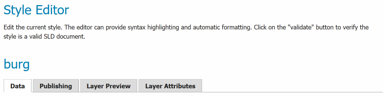
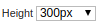
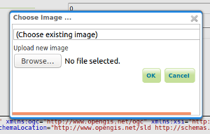

# Styles

This section will detail how to work with the styles pages in the [Web administration interface](../../webadmin/index.md). For more information on styles and syntax, please see the main section on [Styling](../index.md).

Styles are used to control the appearance of geospatial data. Styles for GeoServer are written in a number of different formats:

-   **Styled Layer Descriptor (SLD)**: An OGC standard for geospatial styling. Available by default.
-   **Cascading Style Sheets (CSS)**: A CSS-like syntax. Available via an [extension](../css/index.md).
-   **YSLD**: An SLD-equivalent based on [YAML](http://yaml.org) for improved authoring. Available via the [ysld extension](../ysld/index.md) .
-   **MBStyle**: A syntax based on [JSON](http://json.org) for improved interoperability. Available via the [mbstyle extension](../mbstyle/index.md) .

## Styles page {: #styling_webadmin_styles }

On the Styles page, you can [add a new style](index.md#styling_webadmin_add), [remove a style](index.md#styling_webadmin_remove), or [view or edit an existing style](index.md#styling_webadmin_edit).

*Styles page*

### Add a Style {: #styling_webadmin_add }

The buttons for adding and removing a style can be found at the top of the **Styles** page.

*Adding or removing a style*

To add a new style, click **Add a new style** button. You will be redirected to the new style page, which is the same as the Style Editor [Data](index.md#styling_webadmin_edit_data) tab.

The editor page provides several options for submitting a new style:

-   **Type** the style definition directly into the editor.

-   **Generate** a new default style based on an internal template:

    
    *Generating a new default style.*

-   **Copy** the contents of an existing style into the editor:

    
    *Copying an existing Style from GeoServer*

-   **Upload** a local file that contains the style:

    
    *Uploading an file from the local system*

    !!! note

When creating a style, only the **Data** tab will be available. Click **Apply** on the new style to stay on the Style Editor page and gain access to all tabs.

### Remove a Style {: #styling_webadmin_remove }

To remove a style, click the check box next to the style. Multiple styles can be selected at the same time. Click the **Remove selected style(s)** link at the top of the page. You will be asked for confirmation:

*Confirmation prompt for removing styles*

Click **OK** to remove the selected style(s).

## Style Editor {: #styling_webadmin_edit }

On the Styles page, click a style name to open the **Style Editor**.

The Style Editor page presents the [style definition](index.md#styling_webadmin_edit_definition). The page contains four tabs with many configuration options:

-   [Data](index.md#styling_webadmin_edit_data): Includes basic style information, the ability to generate a style, and legend details
-   [Publishing](index.md#styling_webadmin_edit_publishing): Displays which layers are using this style
-   [Layer Preview](index.md#styling_webadmin_edit_preview): Previews the style with an associated layer while editing
-   [Layer Attributes](index.md#styling_webadmin_edit_attributes): Displays a list of attributes for the associated layer

*Style Editor tabs*

At the bottom of the Style Editor page is a number of options:

| Option       | Description                                                                                                                                                                                                                                |
|--------------|--------------------------------------------------------------------------------------------------------------------------------------------------------------------------------------------------------------------------------------------|
| **Validate** | Will test the current style for correctness according to the **Format** option selected. For SLD styles, it will check compliance against the SLD schema. Mind, the parser might be able to read and work with a formally incorrect style. |
| **Save**     | Makes the changes to the style and returns to the Styles page                                                                                                                                                                              |
| **Apply**    | Makes the changes to the style and remain on the Style Editor page. This is useful to update the [Layer Preview](index.md#styling_webadmin_edit_preview) tab.                                                                             |
| **Cancel**   | Cancels all changes to the style and returns to the Styles page                                                                                                                                                                            |

*Style Editor options*

### Style definition {: #styling_webadmin_edit_definition }

On all tabs, the Style Editor will display the style definition at the bottom, allowing for direct editing of the style. Switch between the tabs in order to facilitate style creation and editing.

*Style editor*

The style editor supports line numbering, automatic indentation, and real-time syntax highlighting. You can also increase or decrease the font size of the editor.

| Button                                    | Description                                                                                                                                                                                                                               |
|-------------------------------------------|-------------------------------------------------------------------------------------------------------------------------------------------------------------------------------------------------------------------------------------------|
|       | Undo                                                                                                                                                                                                                                      |
|       | Redo                                                                                                                                                                                                                                      |
|       | Go to line                                                                                                                                                                                                                                |
|       | Find in style text (CTRL-F)                                                                                                                                                                                                               |
|  | Find next occurrence in style text (CTRL-G/Cmd-G)                                                                                                                                                                                         |
|    | Find and replace in style text (CTRL-SHIFT-F/Cmd-Option-F). First enter the search term, press ENTER, then type the replace term and press ENTER again. It is also possible to run "replace all" using CTRL-SHIFT-R/Cmd-Shift-Option-F. |
|   | Auto-format the editor contents                                                                                                                                                                                                           |
|   | Change the font size in the editor                                                                                                                                                                                                        |
|      | Insert image into style (choose existing or upload)                                                                                                                                                                                       |
|     | Change height of style editor (disabled in full screen mode)                                                                                                                                                                              |

During editing and especially after editing is complete, you will want to check validation of the syntax. This can be done by clicking the **Validate** button at the bottom.

If no errors are found, you will see this message:

*No validation errors*

If any validation errors are found, they will be displayed:

*Validation error message*

### Style Editor: Data tab {: #styling_webadmin_edit_data }

The Data tab includes basic style information, the ability to generate a style, and legend details.

The **Style Data** area has mandatory basic style information:

| Option        | Description                                                                                                            |
|---------------|------------------------------------------------------------------------------------------------------------------------|
| **Name**      | Name of the style                                                                                                      |
| **Workspace** | Workspace in which the style is contained. Styles can be inside workspaces, but can also be "global" (no workspace). |
| **Format**    | Format of the style. Options are **SLD**, **CSS**, and **YSLD**, **MBStyle** depending on availability.                |

*Style Data area*

The **Style Content** area allows you to generate a style, copy an existing style, or upload an existing style:

| Option                       | Description                                                                                                                                                                                           |
|------------------------------|-------------------------------------------------------------------------------------------------------------------------------------------------------------------------------------------------------|
| **Generate a default style** | Selects a generic style based on geometry. Options are **Point**, **Line**, **Polygon**, **Raster**, and **Generic**. Click **Generate** when selected.                                               |
| **Copy from existing style** | Selects an existing style in GeoServer and copy its contents to this style. Any style in GeoServer is available as an option. Not all styles will work with all layers. Click **Copy** when selected. |
| **Upload a style file**      | Selects a plain text file on your local system to add as the style. Click **Upload** when selected.                                                                                                   |

*Style Content area*

The **Legend** area allows you to add, modify, or delete a custom style, and preview the legend for the style. By default GeoServer will generate a legend based on your style file, but this can be customized here:

| Option                              | Description                                                                                                                                                                                                                   |
|-------------------------------------|-------------------------------------------------------------------------------------------------------------------------------------------------------------------------------------------------------------------------------|
| **Add legend**                      | Allows you to use a custom legend                                                                                                                                                                                             |
| **Online Resource**                 | Path to the custom legend graphic to use. Can be a URL or a local path (relative to the style file path). See [Structure of the data directory](../../datadirectory/structure.md) for a description of the styles directory. |
| **Auto-detect image size and type** | Populates the **Width**, **Height**, and **Format** options for the **Online Resource**                                                                                                                                       |
| **Width**                           | Width of the custom legend graphic                                                                                                                                                                                            |
| **Height**                          | Height of the custom legend graphic                                                                                                                                                                                           |
| **Format**                          | Mime type of the custom legend graphic                                                                                                                                                                                        |
| **Discard legend**                  | Will remove the settings for the custom legend graphic and will instead use the default generated legend.                                                                                                                     |
| **Preview legend**                  | Previews the legend based on the current settings                                                                                                                                                                             |
| **Choose Image**                    | Insert image into style (choose existing or upload)                                                                                                                                                                           |

*Legend area*

*Choose Image Dialog*

### Style Editor: Publishing tab {: #styling_webadmin_edit_publishing }

The Publishing tab displays a list of all layers on the server, with the purpose of showing which layers are associated with the current style. Layers can set a single default style and have any number of additional styles. If this style is set to be either of these options for a layer, it will be shown with a check box in the table.

| Option         | Description                                                                   |
|----------------|-------------------------------------------------------------------------------|
| **Workspace**  | Workspace of the layer                                                        |
| **Layer**      | Name of the layer                                                             |
| **Default**    | Shows whether the style being edited is the default for a given layer         |
| **Associated** | Shows whether the style being edited is an additional style for a given layer |

*Publishing tab*

### Style Editor: Layer Preview tab {: #styling_webadmin_edit_preview }

It is very common to have to iterate your styles and test how the visualization changes over time. The Layer Preview tab allows you to make changes to the style and see them without having to navigate away from the page.

The Layer Preview tab shows a single image. GeoServer tries to identify which layer should be shown (for example, a layer for which this style is the default), but if the layer being previewed is not the desired one, click the layer name above the preview box and select a layer.

*Layer Preview tab*

### Style Editor: Layer Attributes tab {: #styling_webadmin_edit_attributes }

Most styles utilize the specific values of certain attributes of the associated layer in order to create more detailed and useful styles. (For example: styling all large cities different from small cities based on a particular attribute.)

The Layer Attributes tab will display a list of attributes for the given associated layer. GeoServer tries to identify which layer should be shown (for example, a layer for which this style is the default), but if the layer being previewed is not the desired one, click the layer name above the table and select a layer.

| Option           | Description                                                                                                           |
|------------------|-----------------------------------------------------------------------------------------------------------------------|
| **name**         | Name of the attribute                                                                                                 |
| **type**         | Type of the attribute. Can be a numeric (such as "Long"), a string ("String"), or a geometry (such as "Point"). |
| **sample**       | Sample value of the attribute taken from the data                                                                     |
| **min**          | Minimum value of the attribute in the data set, if applicable                                                         |
| **max**          | Minimum value of the attribute in the data set, if applicable                                                         |
| **computeStats** | Click **Compute** to calculate the **min** and **max** values for that attribute, if applicable                       |

*Layer Attributes tab*

### Style Editor: full screen side by side mode

The style editor page has now a "outwards arrows" button on the top right side of the window:

*The new fullscreen functionality*

Pressing it will cause the editor and preview to go side by side and use the entire browser window space:

*Side by side style editing*

The button turns into a "inwards arrows" icon, pressing it resumes the original editing mode.
