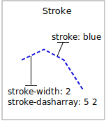
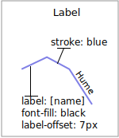

# Lines

We will start our tour of CSS styling by looking at the representation of lines.


*LineString Geometry*

Review of line symbology:

-   Lines are used to represent physical details that are too small to be represented at the current scale. Line work can also be used to model non-physical ideas such as network connectivity, or the boundary between land-use classifications. **The visual width of lines do not change depending on scale.**
-   Lines are recording as LineStrings or Curves depending on the geometry model used.
-   SLD uses a **LineSymbolizer** record how the shape of a line is drawn. The primary characteristic documented is the **Stroke** used to draw each segment between vertices.
-   Labeling of line work is anchored to the midpoint of the line. GeoServer provides an option to allow label rotation aligned with line segments.

For our exercises we are going to be using simple CSS documents, often consisting of a single rule, in order to focus on the properties used for line symbology.

Each exercise makes use of the `ne:roads` layer.

Reference:

-   [Line Symbology](../../css/properties.md#css_properties_line) (User Manual | CSS Property Listing)
-   [Lines](../../css/cookbook/line.md) (User Manual | CSS Cookbook)
-   [LineString](../../sld/reference/linesymbolizer.md) (User Manual | SLD Reference )

## Stroke

The only mandatory property for representation of linework is **stroke**. This is a **key property**; its presence triggers the generation of an appropriate LineSymbolizer.


*Basic Stroke Properties*

The use of **stroke** as a key property prevents CSS from having the idea of a default line color (as the **stroke** information must be supplied each time).

1.  Navigate to the **CSS Styles** page.

2.  Click **Choose a different layer** and select ``ne:roads`` from the list.

3.  Click **Create a new style** and choose the following:

    Workspace for new layer:

    :   ``No workspace``

    New style name:

    :   ``line_example``

4.  Replace the generated CSS definition with the following **stroke** example:

    ``` css
    ```

    /* @title Line
    :   * @abstract Example line symbolization */

        * {

        :   stroke: blue;

        }

5.  Click **Submit** and then the **Map** tab for an initial preview.

    You can use this tab to follow along as the style is edited, it will refresh each time **Submit** is pressed.

    

6.  You can look at the **SLD** tab at any time to see the generated SLD. Currently it is showing a straight forward LineSymbolizer generated from the CSS **stroke** property:

    ``` xml
    ```

    <sld:UserStyle>

    :   <sld:Name>Default Styler</sld:Name> <sld:FeatureTypeStyle> <sld:Name>name</sld:Name> <sld:Rule> <sld:Title>Line</sld:Title> <sld:Abstract>Example line symboloization</sld:Abstract> <sld:LineSymbolizer> <sld:Stroke> <sld:CssParameter name="stroke">#0000ff</sld:CssParameter> </sld:Stroke> </sld:LineSymbolizer> </sld:Rule> </sld:FeatureTypeStyle>

    </sld:UserStyle>

7.  Additional properties cane be used fine-tune appearance. Use **stroke-width** to specify the width of the line.

    ``` {.css emphasize-lines="6"}
    ```

    /* @title Line
    :   * @abstract Example line symbolization */

        * {

        :   stroke: blue; stroke-width: 2px;

        }

8.  The **stroke-dasharray** is used to define breaks rendering the line as a dot dash pattern.

    ``` {.css emphasize-lines="7"}
    ```

    /* @title Line
    :   * @abstract Example line symbolization */

        * {

        :   stroke: blue; stroke-width: 2px; stroke-dasharray: 5 2;

        }

9.  Check the **Map** tab to preview the result.

    

!!! note

    The GeoServer rendering engine is quite sophisticated and allows the use of units of measure (such as ``m`` or ``ft``). While we are using pixels in this example, real world units will be converted using the current scale.

## Z-Index

The next exercise shows how to work around a limitation when using multiple strokes to render a line.


*Use of Z-Index*

1.  Providing two strokes is often used to provide a contrasting edge (called casing) to thick line work.

    Update `line_example` with the following:

    ``` css
    ```

    * {

    :   stroke: black, #8080E6; stroke-width: 5px, 3px;

    }

2.  If you look carefully you can see a problem with our initial attempt. The junctions of each line show that the casing outlines each line individually, making the lines appear randomly overlapped. Ideally we would like to control this process, only making use of this effect for overpasses.

    

3.  The **z-index** parameter allows a draw order to be supplied. This time all the thick black lines are dawn first (at z-index 0) followed by the thinner blue lines (at z-index 1).

    ``` css
    ```

    * {

    :   stroke: black, #8080E6; stroke-width: 5px, 3px; z-index: 0, 1;

    }

4.  If you look carefully you can see the difference.

    

5.  By using **z-index** we have been able to simulate line casing.

    

## Label

Our next example is significant as it introduces the how text labels are generated.


*Use of Label Property*

This is also our first example making use of a dynamic style (where the value of a property is defined by an attribute from your data).

1.  To enable LineString labeling we will need to use the key properties for both **stroke** and **label**.

    Update `line_example` with the following:

    ``` {.css emphasize-lines="2,3"}
    ```

    * {

    :   stroke: blue; label: [name];

    }

2.  The SLD standard documents the default label position for each kind of Geometry. For LineStrings the initial label is positioned on the midway point of the line.

    

3.  We have used an expression to calculate a property value for label. The **label** property is generated dynamically from the ``name`` attribute. Expressions are supplied within square brackets, making use of Constraint Query Language (CQL) syntax.

    ``` {.css emphasize-lines="3"}
    ```

    * {

    :   stroke: blue; label: [name];

    }

4.  Additional properties can be supplied to fine-tune label presentation:

    ``` css
    ```

    * {

    :   stroke: blue; label: [name]; font-fill: black; label-offset: 7px;

    }

5.  The **font-fill** property is set to ``black`` provides the label color.

    ``` {.css emphasize-lines="4"}
    ```

    * {

    :   stroke: blue; label: [name]; font-fill: black; label-offset: 7px;

    }

6.  The **label-offset** property is used to adjust the starting position used for labeling.

    Normally the displacement offset is supplied using two numbers (allowing an x and y offset from the midway point used for LineString labeling).

    When labeling a LineString there is a special twist: by specifying a single number for **label-offset** we can ask the rendering engine to position our label a set distance away from the LineString.

    ``` {.css emphasize-lines="5"}
    ```

    * {

    :   stroke: blue; label: [name]; font-fill: black; label-offset: 7px;

    }

7.  When used in this manner the rotation of the label will be adjusted automatically to match the LineString.

    

## How Labeling Works

The rendering engine collects all the generated labels during the rendering of each layer. Then, during labeling, the engine sorts through the labels performing collision avoidance (to prevent labels overlapping). Finally the rendering engine draws the labels on top of the map. Even with collision avoidance you can spot areas where labels are so closely spaced that the result is hard to read.

To take greater control over the GeoServer rendering engine we can use extra parameters.

1.  The ability to take control of the labeling process is exactly the kind of hint a extra parameter is intended for.

    Update `line_example` with the following:

    ``` css
    ```

    * {

    :   stroke: blue; label: [name]; font-fill: black; label-offset: 7px; label-padding: 10;

    }

2.  The parameter **label-padding** provides additional space around our label for use in collision avoidance.

    ``` {.css emphasize-lines="6"}
    ```

    * {

    :   stroke: blue; label: [name]; font-fill: black; label-offset: 7px; label-padding: 10;

    }

3.  Each label is now separated from its neighbor, improving legibility.

    

## Scale

This section explores the use of attribute selectors and the ``@scale`` selector together to simplify the road dataset for display.

1.  Replace the ``line_example`` CSS definition with:

    ``` css
    ```

    [scalerank < 4] {

    :   stroke: black;

    }

2.  And use the **Map** tab to preview the result.

    

3.  The **scalerank** attribute is provided by the Natural Earth dataset to allow control of the level of detail based on scale. Our selector short-listed all content with scalerank 4 or lower, providing a nice quick preview when we are zoomed out.

4.  In addition to testing feature attributes, selectors can also be used to check the state of the rendering engine.

    Replace your CSS with the following:

    ``` css
    ```

    [@scale > 35000000] {

    :   stroke: black;

    } [@scale < 35000000] { stroke: blue; }

5.  As you adjust the scale in the **Map** preview (using the mouse scroll wheel) the color will change between black and blue. You can read the current scale in the bottom right corner, and the legend will change to reflect the current style.

    

6.  Putting these two ideas together allows control of level detail based on scale:

    ``` css
    ```

    [@scale < 9000000] [scalerank > 7] {

    :   stroke: #888888;

    }

    [@scale < 17000000] [scalerank = 7] {

    :   stroke: #777777;

    }

    [@scale < 35000000] [scalerank = 6] {

    :   stroke: #444444;

    }

    [@scale > 9000000] [@scale < 70000000] [scalerank = 5] {

    :   stroke: #000055;

    } [@scale < 9000000] [scalerank = 5] { stroke: #000055; stroke-width: 2 }

    [@scale > 35000000] [scalerank < 4] {

    :   stroke: black;

    } [@scale > 9000000] [@scale <= 35000000] [scalerank < 4] { stroke: black; stroke-width: 2 } [@scale <= 9000000] [scalerank < 4] { stroke: black; stroke-width: 4 }

7.  As shown above selectors can be combined in the same rule:

    -   Selectors separated by blank-space are combined CQL Filter AND
    -   Selectors separated by a comma are combined using CQL Filter OR

    Our first rule [[@scale < 9000000] [scalerank > 7]]{.title-ref} checks that the scale is less than 9M AND scalerank is greater than 7.

    

## Bonus

Finished early? Here are some opportunities to explore what we have learned, and extra challenges requiring creativity and research.

In a classroom setting please divide the challenges between teams (this allows us to work through all the material in the time available).

!!! abstract "Instructor Notes"

    As usual the Explore section invites readers to reapply the material covered in a slightly different context or dataset.
    
    The use of selectors using the roads **type** attribute provides this opportunity.

### Explore Follow Line Option

Options can be used to enable some quite useful effects, while still providing a style that can be used by other applications.

1.  Update ``line_example`` with the following:

    ``` css
    ```

    * {

    :   stroke: #ededff; stroke-width: 10; label: [level] " " [name]; font-fill: black; label-follow-line: true;

    }

2.  The property **stroke-width** has been used to make our line thicker in order to provide a backdrop for our label.

    ``` {.css emphasize-lines="3"}
    ```

    * {

    :   stroke: #ededff; stroke-width: 10; label: [level] " " [name]; font-fill: black; label-follow-line: true;

    }

3.  The **label** property combines combine several CQL expressions together for a longer label.

    ``` {.css emphasize-lines="4"}
    ```

    * {

    :   stroke: #ededff; stroke-width: 10; label: [level] " " [name]; font-fill: black; label-follow-line: true;

    }

    The combined **label** property:

        [level] " " [name]

    Is internally represented with the **Concatenate** function:

        [Concatenate(level,' #', name)] 

4.  The property **label-follow-line** provides the ability of have a label exactly follow a LineString character by character.

    ``` {.css emphasize-lines="6"}
    ```

    * {

    :   stroke: #ededff; stroke-width: 10; label: [level] " " [name]; font-fill: black; label-follow-line: true;

    }

5.  The result is a new appearance for our roads.

    

### Challenge SLD Generation {: #css.line.q0 }

1.  Generate the SLD for the following CSS.

    ``` css
    * {
      stroke: black;
    }
    ```

    What is unusual about the SLD code for this example?

2.  Challenge: What is unusual about the generated SLD? Can you explain why it still works as expected?

    !!! note

        Answer `provided <css.line.a0>`{.interpreted-text role="ref"} at the end of the workbook.

### Challenge Classification {: #css.line.q1 }

1.  The roads **type** attribute provides classification information.

    You can **Layer Preview** to inspect features to determine available values for type.

2.  **Challenge:** Create a new style adjust road appearance based on **type**.

    

    Hint: The available values are 'Major Highway','Secondary Highway','Road' and 'Unknown'.

    !!! note

        Answer `provided <css.line.a1>`{.interpreted-text role="ref"} at the end of the workbook.

### Challenge SLD Z-Index Generation {: #css.line.q2 }

1.  Review the SLD generated by the **z-index** example.

    ``` css
    ```

    * {

    :   stroke: black, #8080E6; stroke-width: 5px, 3px; z-index: 0, 1;

    }

2.  *Challenge:* There is an interesting trick in the generated SLD, can you explain how it works?

    !!! note

        Answer `provided <css.line.a2>`{.interpreted-text role="ref"} at the end of the workbook.

### Challenge Label Shields {: #css.line.q3 }

1.  The traditional presentation of roads in the US is the use of a shield symbol, with the road number marked on top.

    

2.  *Challenge:* Have a look at the documentation and reproduce this technique.

    !!! note

        Answer `provided <css.line.a3>`{.interpreted-text role="ref"} at the end of the workbook.
